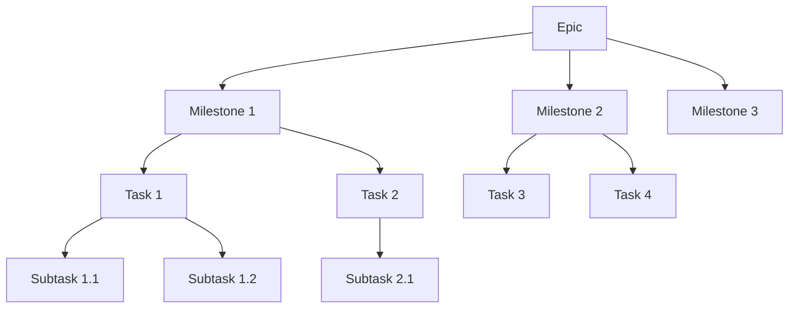
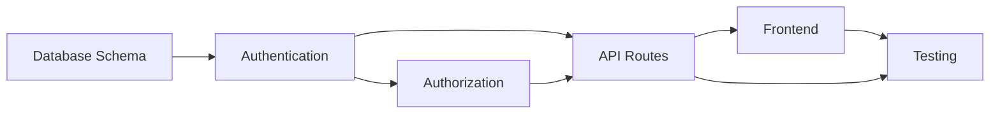

# 05 — Planning Framework

## Why Planning Exists

Without planning, AI produces code that works but does not fit. It solves the immediate question but creates architectural debt, misses edge cases, and breaks things that were not in scope.

Planning is not overhead. Planning is the difference between code that works and software that ships.

## Work Breakdown Structure

Every project decomposes into a hierarchy:



### Definitions

| Level | Definition | Timeframe | Example |
|-------|-----------|-----------|---------|
| Epic | A major feature or system | Weeks to months | "Build user management system" |
| Milestone | A deliverable phase of an epic | Days to weeks | "Authentication and authorization" |
| Task | A unit of work within a milestone | Hours to days | "Implement login endpoint" |
| Subtask | A specific action within a task | Minutes to hours | "Add JWT signing to login handler" |
| Review | Verification of completed work | Minutes | "Verify build passes and tests pass" |
| Release | Deployment of verified work | Minutes to hours | "Deploy to production" |

## Estimation

### Time Estimation

Estimate tasks using these reference points:

| Size | Description | Typical Duration |
|------|-------------|-----------------|
| XS | Single line change, no logic | < 5 minutes |
| S | Simple change, clear path | 5–15 minutes |
| M | Moderate complexity, some research needed | 15–60 minutes |
| L | Multiple components, integration required | 1–4 hours |
| XL | New feature, architecture decisions needed | 4–8 hours |
| XXL | Full module or system, phased delivery | 8+ hours |

### How to Estimate

1. Identify the smallest deliverable unit
2. Count the number of files that need changes
3. Check if the change requires new patterns or follows existing ones
4. Check if the change requires database schema modifications
5. Check if the change requires documentation updates
6. Multiply by the complexity factor

**Complexity factors:**
- New pattern (not in codebase): 2x
- Database schema change: 1.5x
- Cross-module integration: 1.5x
- Security-sensitive: 1.5x
- External API integration: 2x

### When Estimation is Wrong

If the actual time exceeds 2x the estimate, stop and re-evaluate. The original plan was based on incorrect assumptions. Re-analyze before continuing.

## Prioritization

### Priority Levels

| Priority | Description | When to Use |
|----------|-------------|-------------|
| P0 | Critical — blocks everything | Production down, security breach, data loss |
| P1 | High — must be in this release | Core feature broken, regulatory requirement |
| P2 | Medium — should be in this release | Important feature, significant UX improvement |
| P3 | Low — can be deferred | Nice-to-have, optimization, cosmetic |
| P4 | Backlog — future consideration | Idea, technical debt, future enhancement |

### Priority Rules

- P0 tasks are always worked on immediately, interrupting other work
- P1 tasks take precedence over P2 and below
- P2 tasks are the default priority for new work
- P3 tasks are only worked on when P0–P2 are clear
- P4 tasks are never worked on unless explicitly requested

## Dependency Analysis

Before starting any task, the AI must analyze dependencies:

### Upstream Dependencies

What does this task depend on?

```
Task: Implement user dashboard
Dependencies:
  - User authentication must be complete
  - User profile API must exist
  - Dashboard layout component must be defined
```

### Downstream Dependencies

What depends on this task?

```
Task: Implement user dashboard
Dependents:
  - Analytics dashboard (reuses dashboard layout)
  - Admin panel (reuses user data fetching)
  - Mobile app (consumes dashboard API)
```

### Dependency Rules

- Never start a task with unmet upstream dependencies
- Always consider downstream impact before changing public interfaces
- If a dependency is blocked, escalate immediately
- Document all dependencies in the task description

## Milestone Planning

### Milestone Structure

Every milestone must have:

1. **Goal** — What is delivered
2. **Scope** — What is included and excluded
3. **Dependencies** — What must be complete first
4. **Tasks** — The specific work items
5. **Criteria** — How completion is verified
6. **Risks** — What might go wrong

### Milestone Example

```
## Milestone: Authentication System

### Goal
Users can register, log in, and access protected resources.

### Scope
Included:
- Email/password registration
- Email/password login
- JWT token management
- Protected route middleware
- Logout flow

Excluded:
- Social login (future milestone)
- Two-factor authentication (future milestone)
- OAuth integration (future milestone)

### Dependencies
- Database schema for users table
- Password hashing library

### Tasks
1. Database schema for users (S)
2. Registration endpoint (M)
3. Login endpoint (M)
4. JWT token service (M)
5. Auth middleware (M)
6. Protected route integration (L)
7. Logout flow (S)

### Criteria
- [ ] User can register with email/password
- [ ] User can log in and receive JWT
- [ ] Protected routes return 401 without valid JWT
- [ ] Logout invalidates the token
- [ ] Build succeeds with zero errors
- [ ] All existing tests pass

### Risks
- JWT secret management in production
- Token expiry edge cases
- Session management complexity
```

## Task Breakdown

### Task Structure

Every task must have:

1. **Description** — What to do
2. **Files** — What files are affected
3. **Approach** — How to do it
4. **Verification** — How to confirm it works
5. **Time estimate** — How long it should take

### Task Example

```
## Task: Implement login endpoint

### Description
Create POST /api/auth/login that accepts email and password,
validates credentials, and returns a JWT token.

### Files
- pages/api/auth/login.js (new)
- lib/services/AuthService.js (new)
- lib/validation.js (add loginSchema)
- lib/auth.js (add signToken)

### Approach
1. Create Zod schema for login input
2. Create AuthService with login method
3. Create API route handler
4. Add JWT signing to auth lib
5. Test with valid and invalid credentials

### Verification
- POST with valid credentials returns 200 + token
- POST with invalid credentials returns 400
- POST with missing fields returns 400
- Build succeeds

### Time estimate: M (30–60 minutes)
```

## Dependency Graph

For complex projects, visualize the dependency graph:



This helps identify the critical path — the longest sequence of dependent tasks that determines the minimum project duration.

## See Also

- [01-philosophy.md](./01-philosophy.md) — The workflow that planning supports
- [04-communication-protocol.md](./04-communication-protocol.md) — How to report plan progress
- [06-development-rules.md](./06-development-rules.md) — Rules for implementation
- [09-release-process.md](./09-release-process.md) — How milestones feed into releases
- [templates/milestone-plan.md](./templates/milestone-plan.md) — Reusable milestone template
- [templates/task-breakdown.md](./templates/task-breakdown.md) — Reusable task template
