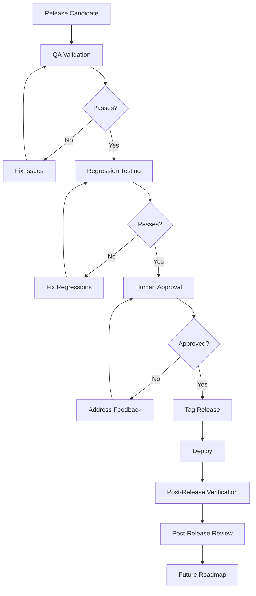

# 09 — Release Process

## Why Release Process Exists

Releases are the highest-risk moment in software engineering. Code that worked in development may fail in production. Features that looked correct may have edge cases. Integrations that passed testing may break under load.

The release process exists to catch these issues before they reach users.

## Release Workflow



## Phase 1: Release Candidate

A release candidate is a version that the AI believes is ready for production. It must meet all criteria before being presented to the human.

### Release Candidate Criteria

- [ ] All planned features are implemented
- [ ] All planned fixes are applied
- [ ] Build succeeds with zero errors
- [ ] Lint passes (or warnings are documented)
- [ ] All tests pass
- [ ] No known P0 or P1 bugs
- [ ] All quality gates from [06-development-rules.md](./06-development-rules.md) pass
- [ ] All review types from [07-review-process.md](./07-review-process.md) pass
- [ ] Documentation is updated from [08-documentation-standards.md](./08-documentation-standards.md)
- [ ] Changelog is updated
- [ ] Release notes are prepared

### Release Candidate Report

```
## Release Candidate Report

### Version: X.Y.Z
### Date: YYYY-MM-DD

### Changes Since Last Release
- [Feature 1]: Brief description
- [Fix 1]: Brief description
- [Breaking Change 1]: Brief description and migration path

### Verification Results
| Check | Result |
|-------|--------|
| Build | PASS/FAIL |
| Lint | PASS/FAIL |
| Tests | PASS/FAIL |
| Security Review | PASS/FAIL |
| Performance Review | PASS/FAIL |
| Documentation | PASS/FAIL |

### Known Issues
- [Issue 1]: Description and severity

### Risks
- [Risk 1]: Description and mitigation

### Migration Notes
- [Breaking Change 1]: What changed and how to adapt

### Recommendation
APPROVE / REJECT / CONDITIONAL APPROVE
```

## Phase 2: QA Validation

QA validation verifies that the release candidate meets quality standards.

### QA Checklist

**Build:**
- [ ] Production build succeeds
- [ ] No build warnings (or warnings are documented)
- [ ] All pages/routes are generated
- [ ] Bundle size is acceptable

**Functionality:**
- [ ] All new features work as specified
- [ ] All fixes resolve the reported issues
- [ ] No regressions in existing features
- [ ] Edge cases are handled
- [ ] Error messages are clear and helpful

**Security:**
- [ ] Authentication works correctly
- [ ] Authorization is enforced
- [ ] CSRF protection is active
- [ ] No sensitive data is exposed
- [ ] Security headers are configured

**Performance:**
- [ ] Page load times are acceptable
- [ ] API response times are acceptable
- [ ] No memory leaks
- [ ] No unnecessary network requests

**Accessibility:**
- [ ] Keyboard navigation works
- [ ] Screen reader compatibility
- [ ] Color contrast meets standards
- [ ] Form labels are present

**Documentation:**
- [ ] API documentation is current
- [ ] Changelog is accurate
- [ ] README reflects current state
- [ ] Deployment guide is current

## Phase 3: Regression Testing

Regression testing verifies that existing functionality is not broken.

### Regression Checklist

- [ ] All existing tests pass
- [ ] Critical user flows still work
- [ ] API contracts are preserved
- [ ] Database migrations are backward compatible
- [ ] No breaking changes without migration path
- [ ] Performance is not degraded

### Regression Report

```
## Regression Report

### Test Results
| Test Suite | Tests | Passed | Failed | Skipped |
|-----------|-------|--------|--------|---------|
| Unit | X | X | 0 | 0 |
| Integration | X | X | 0 | 0 |
| E2E | X | X | 0 | 0 |

### Manual Verification
| Flow | Status | Notes |
|------|--------|-------|
| Login | PASS | — |
| Create item | PASS | — |
| Edit item | PASS | — |
| Delete item | PASS | — |
| Search | PASS | — |
| Pagination | PASS | — |

### Verdict
PASS — No regressions detected.
```

## Phase 4: Human Approval

The human reviews the release candidate and either approves, rejects, or requests changes.

### Approval Criteria

The human should verify:
- The release includes what was requested
- The changes are understandable
- The risks are acceptable
- The timing is appropriate

### If Rejected

The human provides specific feedback. The AI addresses the feedback and produces a new release candidate.

## Phase 5: Tag and Release

Once approved, the release is tagged and deployed.

### Tagging Convention

```
v{major}.{minor}.{patch}

Examples:
v1.0.0 — First major release
v1.1.0 — New feature added
v1.1.1 — Bug fix
v2.0.0 — Breaking change
```

### Version Numbering

| Change Type | Version Bump | Example |
|------------|-------------|---------|
| Breaking change | Major (X.0.0) | v1.0.0 → v2.0.0 |
| New feature | Minor (x.Y.0) | v1.0.0 → v1.1.0 |
| Bug fix | Patch (x.y.Z) | v1.0.0 → v1.0.1 |

### Deployment Verification

After deployment, verify:
- [ ] Application is accessible
- [ ] Health checks pass
- [ ] Critical flows work
- [ ] No errors in logs
- [ ] Performance is acceptable

## Phase 6: Post-Release Review

After the release has been live for a defined period (typically 24–72 hours):

### Post-Release Checklist

- [ ] No production errors
- [ ] No user-reported issues
- [ ] Performance metrics are stable
- [ ] Security monitoring shows no anomalies
- [ ] User feedback is collected

### Post-Release Review Report

```
## Post-Release Review

### Version: X.Y.Z
### Release Date: YYYY-MM-DD
### Review Date: YYYY-MM-DD

### Stability
- Errors since release: 0
- User-reported issues: 0
- Performance impact: None

### Lessons Learned
- What went well: [Description]
- What could improve: [Description]
- What to do differently next time: [Description]

### Action Items
- [Action 1]: Owner, due date
- [Action 2]: Owner, due date
```

## Phase 7: Future Roadmap

After the post-release review, plan the next iteration.

### Roadmap Planning

- Review accumulated feedback
- Prioritize new features
- Identify technical debt to address
- Plan next milestone

## Release Cadence

| Release Type | Frequency | Scope |
|-------------|-----------|-------|
| Major | Quarterly | Breaking changes, major features |
| Minor | Monthly | New features, improvements |
| Patch | As needed | Bug fixes, security updates |
| Hotfix | Immediate | Critical production issues |

## Hotfix Process

For critical production issues:

1. Identify the issue
2. Create a fix branch
3. Implement the minimal fix
4. Verify the fix resolves the issue
5. Verify no regressions
6. Get human approval (expedited)
7. Deploy immediately
8. Document in changelog
9. Post-release review

## See Also

- [01-philosophy.md](./01-philosophy.md) — The workflow that the release process completes
- [02-core-rules.md](./02-core-rules.md) — Golden rules that apply during release
- [07-review-process.md](./07-review-process.md) — Review types applied during QA
- [08-documentation-standards.md](./08-documentation-standards.md) — Documentation required for release
- [templates/release-checklist.md](./templates/release-checklist.md) — Reusable release checklist
