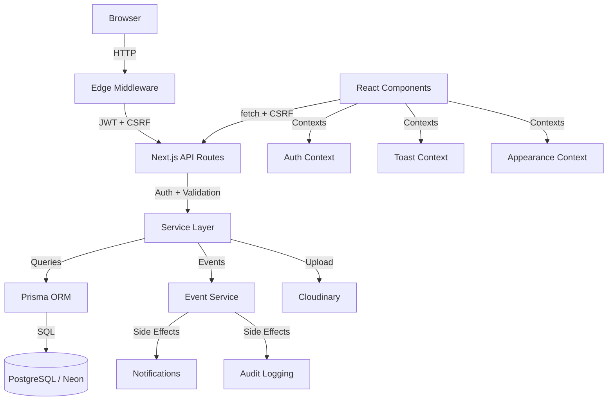
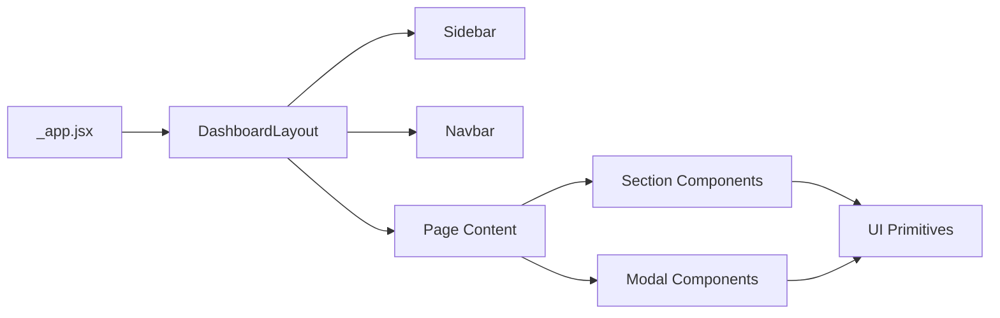
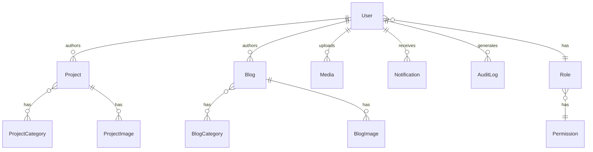
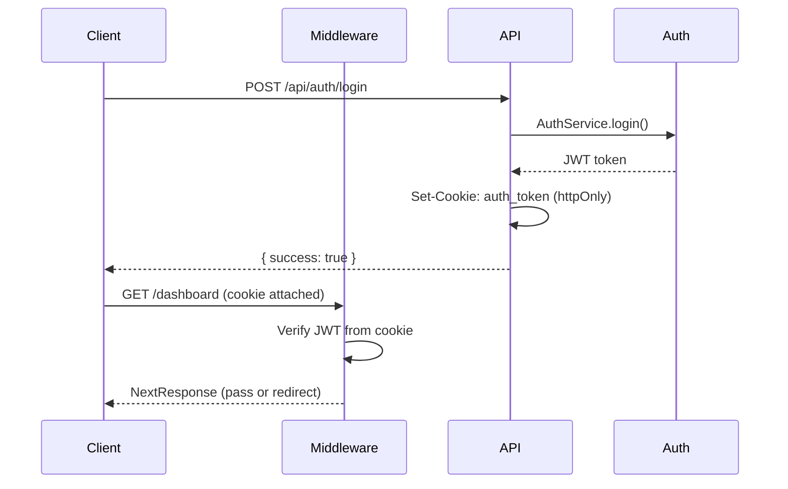
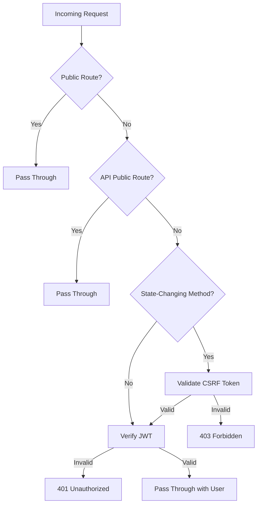
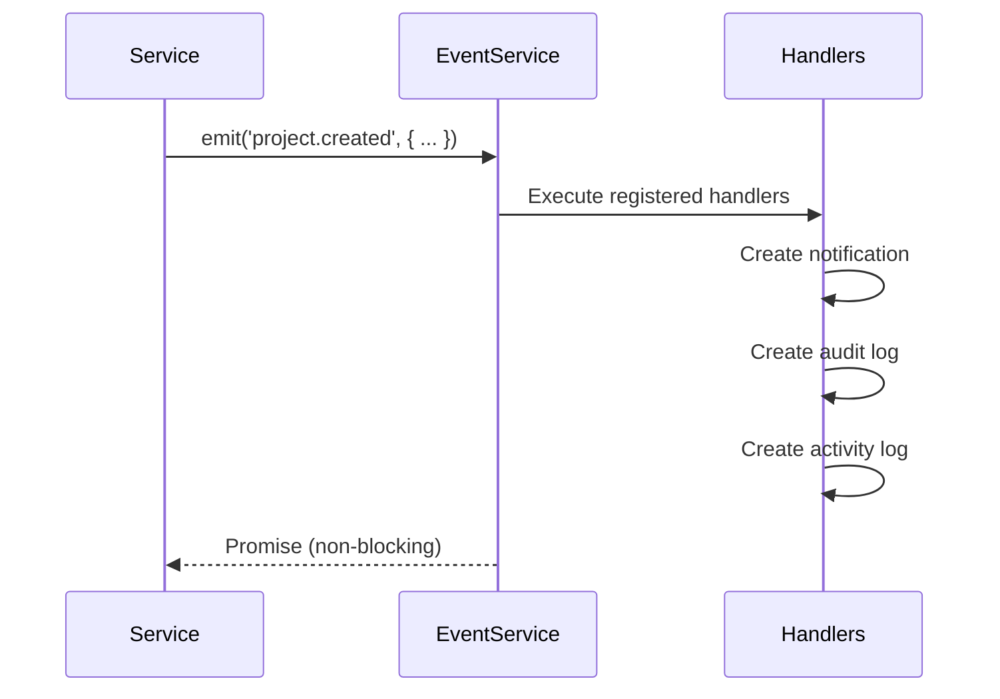
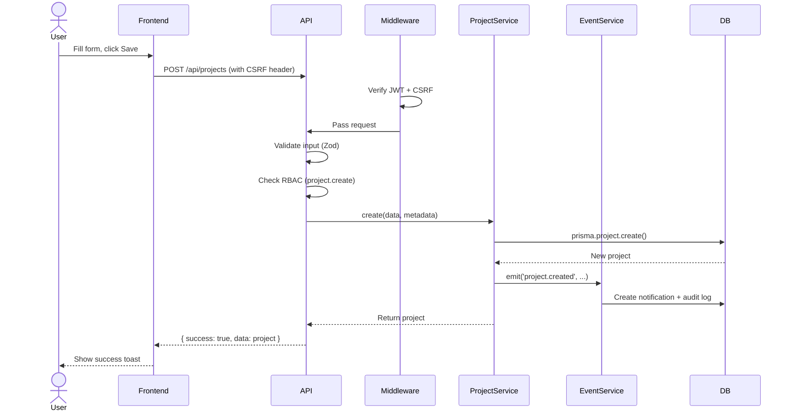

# Architecture

## Overview

TASKILY CMS uses a monolithic Next.js architecture with clear layer separation. The frontend and backend share a single repository and deploy as one unit, but code is organized so that each layer has a defined responsibility and never crosses boundaries.



---

## Frontend

### Technology
- React 18 with Next.js 14 Pages Router
- Tailwind CSS for styling
- Lucide React for icons
- Recharts for data visualization

### Rendering Strategy
- Dashboard pages: Static generation (`getStaticProps` or static component)
- Authentication pages: Static (login, register, forgot-password, verification)
- API routes: Dynamic server-side only

### State Management
No global state library. State is managed through:

| Mechanism | Purpose |
|-----------|---------|
| `AuthContext` | Current user, permissions, login/logout |
| `ToastContext` | Success/error/warning/info notifications |
| `AppearanceContext` | Theme (light/dark/auto) and accent color |
| `useState` / `useReducer` | Local component state |
| URL state | Query parameters for filters, search, pagination |

### Component Hierarchy



---

## Backend

### API Routes
All backend logic lives in `pages/api/`. Each route file exports a default handler function that:

1. Parses the request (body, query, params)
2. Authenticates via JWT cookie
3. Authorizes via RBAC permission check
4. Validates input via Zod schema
5. Calls the appropriate service method
6. Returns a standardized JSON response

### Response Format

Every API response follows this structure:

```json
{
  "success": true,
  "data": { ... },
  "message": "Success"
}
```

Error responses:

```json
{
  "success": false,
  "message": "Error description",
  "details": { ... }
}
```

### Status Codes

| Code | Usage |
|------|-------|
| 200 | Success |
| 201 | Created |
| 400 | Validation error |
| 401 | Unauthorized (no token or invalid token) |
| 403 | Forbidden (insufficient permissions) |
| 404 | Resource not found |
| 405 | Method not allowed |
| 500 | Internal server error |

---

## Service Layer

Services are the core business logic layer. Each domain entity has a corresponding service class with static methods.

```javascript
// Pattern used by all 16 services
export class ProjectService {
  static async findAll(options) { ... }
  static async findById(id) { ... }
  static async create(data, metadata) { ... }
  static async update(id, data, metadata) { ... }
  static async delete(id, metadata) { ... }
  static async restore(id, metadata) { ... }
  static async permanentDelete(id, metadata) { ... }
  static async bulkAction(action, ids, metadata) { ... }
}
```

### Service Inventory

| Service | Responsibility |
|---------|---------------|
| `AuthService` | Login, register, password reset, email verification |
| `UserService` | User CRUD, status management, password reset |
| `RoleService` | Role CRUD, permission assignment, role cloning |
| `ProjectService` | Project CRUD, image management, categories |
| `ProjectCategoryService` | Category CRUD, slug generation |
| `BlogService` | Blog CRUD, image management, categories |
| `BlogCategoryService` | Category CRUD, slug generation |
| `MediaService` | Upload, update, delete, folder management |
| `DashboardService` | Overview stats, charts, recent activity |
| `SettingsService` | System settings CRUD, groups |
| `NotificationService` | Notification CRUD, mark read, unread count |
| `AuditService` | Audit log querying, stats, export |
| `ActivityService` | Activity log creation |
| `EventService` | Event pub/sub, error handling |
| `CloudinaryService` | File upload, transformation, deletion |
| `GlobalSearchService` | Cross-module search |

### Barrel Export

All services are re-exported from `lib/services/index.js`:

```javascript
export { AuthService } from './AuthService';
export { UserService } from './UserService';
// ... 14 more services
```

API routes import from the barrel:

```javascript
import { UserService } from '@/lib/services';
```

---

## Database

### ORM
Prisma 5.x with PostgreSQL (Neon serverless).

### Schema Design Principles

| Principle | Implementation |
|-----------|---------------|
| UUID primary keys | `@id @default(uuid())` on all models |
| Soft delete | `deletedAt DateTime?` on entities that support trash |
| Timestamps | `createdAt` and `updatedAt` on all models |
| Cascade deletes | Image models cascade on parent delete |
| Restrict deletes | Users cannot be deleted if they have projects/blogs |
| Implicit many-to-many | Role-Permission, Project-Category, Blog-Category |
| Strategic indexes | Composite indexes on hot query paths |

### Database Models



### Key Models

- **User** — Authentication, profile, role assignment, status
- **Role** — Permission grouping, system role flag
- **Permission** — 62 granular permissions across 12 modules
- **Project** — Content entity with categories, images, SEO metadata
- **Blog** — Content entity with categories, images, SEO metadata
- **Media** — Cloudinary-backed file storage with metadata
- **Setting** — Key-value system configuration with groups
- **Notification** — User-scoped notifications with priority
- **AuditLog** — Action trail with old/new values, IP, user agent
- **ActivityLog** — Simplified activity tracking

---

## Authentication

### Strategy: HTTP-Only Cookies Only

No tokens in localStorage. No `Authorization` headers. JWT is stored in an HTTP-only cookie (`auth_token`).

### Flow



### Token Management

| Function | Location | Purpose |
|----------|----------|---------|
| `signToken(payload)` | `lib/auth.js` | Creates JWT with jose |
| `verifyToken(token)` | `lib/auth.js` | Decodes JWT (sync) |
| `setTokenCookie(res, token)` | `lib/auth.js` | Sets HTTP-only cookie |
| `removeTokenCookie(res)` | `lib/auth.js` | Clears cookie on logout |
| `getUserFromRequest(req)` | `lib/auth.js` | Extracts user from request |

### JWT Configuration

- Algorithm: HS256
- Expiry: Configurable via `JWT_EXPIRES_IN` (default: 7d)
- Cookie maxAge: Dynamically derived from `JWT_EXPIRES_IN`
- Cookie flags: `httpOnly`, `secure` (production), `sameSite: lax`

---

## Authorization (RBAC)

### Permission Structure

62 permissions organized across 12 modules:

| Module | Actions |
|--------|---------|
| projects | view, create, edit, delete, bulk_delete, restore, publish |
| blogs | view, create, edit, delete, bulk_delete, restore, publish |
| media | view, upload, edit, delete, bulk_delete |
| users | view, create, edit, delete, bulk_delete, change_status, reset_password |
| roles | view, create, edit, delete, clone, assign_permissions |
| settings | view, edit |
| dashboard | view, view_analytics |
| audit | view, export |
| notifications | view, mark_read, delete |
| categories | view, create, edit, delete |
| search | global |
| system | maintenance |

### Predefined Roles

| Role | Permissions |
|------|-------------|
| ADMIN | All 62 permissions |
| EDITOR | Content permissions (no role/user management) |
| AUTHOR | Content creation permissions |
| VIEWER | Read-only permissions |

### Permission Check Pattern

Every protected API route follows this pattern:

```javascript
const tokenPayload = getUserFromRequest(req);
if (!tokenPayload) return unauthorizedResponse(res);

const user = await UserService.findById(tokenPayload.id);
if (!user || user.status !== 'ACTIVE') return forbiddenResponse(res);

if (!hasPermission(user, 'module.action')) return forbiddenResponse(res);
```

---

## Middleware

Edge Runtime middleware runs before every request.

### Responsibilities

1. **Public route bypass** — Login, register, forgot-password, verification
2. **JWT verification** — Validates token from cookie using `jose`
3. **CSRF validation** — Checks `x-csrf-token` header matches `csrf_token` cookie on state-changing requests

### Request Lifecycle



---

## CSRF Protection

### Strategy: Double Submit Cookie Pattern

1. Server generates a random token and sets it as a readable cookie (`csrf_token`)
2. Client JavaScript reads the cookie and sends the value in `x-csrf-token` header
3. Middleware compares cookie value to header value

### Implementation

| File | Purpose |
|------|---------|
| `lib/csrf.js` | Token generation, cookie management, validation |
| `lib/patchFetchCsrf.js` | Global `window.fetch` patch that injects CSRF header |
| `middleware.js` | Server-side CSRF validation on POST/PUT/DELETE/PATCH |

### Why This Pattern

- HTTP-only auth cookie prevents XSS from stealing tokens
- CSRF cookie is readable by JavaScript (not httpOnly)
- Matching cookie + header proves the request originated from the same origin

---

## Validation

### Library: Zod

All input validation uses Zod schemas defined in `lib/validation.js`.

### Pattern

```javascript
// Schema definition
export const createProjectSchema = z.object({
  title: z.string().min(1).max(200),
  shortDescription: z.string().max(500).optional(),
  fullDescription: fullDescriptionSchema.optional(),
  status: z.enum(['DRAFT', 'PUBLISHED']).optional(),
  // ...
});

// API route usage
const validation = validateRequest(createProjectSchema, req.body);
if (!validation.success) {
  return validationErrorResponse(res, validation.errors);
}
```

### Shared Schemas

- `passwordSchema` — Reusable password validation (used by login, register, reset, change)
- `loginSchema`, `registerSchema` — Auth-specific
- CRUD schemas for each entity (create, update, bulk action)

---

## Event-Driven Architecture

### Purpose

Decouple side effects from core business logic. When a service creates, updates, or deletes an entity, it emits an event. Event handlers create notifications, audit logs, and activity logs asynchronously.

### Flow



### Event Types

| Event | Module |
|-------|--------|
| `project.created`, `project.updated`, `project.deleted`, `project.restored`, `project.published`, `project.permanently_deleted`, `project.bulk_action` | Projects |
| `blog.created`, `blog.updated`, `blog.deleted`, `blog.restored`, `blog.published`, `blog.permanently_deleted`, `blog.bulk_action` | Blogs |
| `media.uploaded`, `media.updated`, `media.deleted`, `media.bulk_action` | Media |
| `user.created`, `user.updated`, `user.deleted`, `user.restored`, `user.status_changed` | Users |
| `role.created`, `role.updated`, `role.deleted`, `role.cloned` | Roles |
| `settings.updated` | Settings |

### Error Handling

Event handler errors are caught and logged via `EventService.logError()`. They never propagate to the caller.

---

## Notifications

Notifications are user-scoped records created by event handlers. They appear in the navbar dropdown and notification panel.

### Properties
- `type` — Category (e.g., `project.created`)
- `title` — Human-readable title
- `message` — Description
- `priority` — LOW, MEDIUM, HIGH
- `readAt` — Timestamp when read (null = unread)
- `entityType` / `entityId` — Link to the related entity

### Real-Time Count
The `NotificationBadge` component polls `/api/notifications/unread-count` to display the unread count.

---

## Audit Logging

Every state-changing operation creates an `AuditLog` entry with:

| Field | Purpose |
|-------|---------|
| `action` | CREATE, UPDATE, DELETE, RESTORE |
| `module` | projects, blogs, users, roles, media, settings |
| `entityType` / `entityId` | What was changed |
| `oldValues` / `newValues` | JSON diff of changes |
| `ipAddress` | Client IP (from `x-forwarded-for`) |
| `userAgent` | Browser user agent |
| `userId` | Who performed the action |

### RBAC Enforcement
Audit endpoints require `audit.view` permission. Only administrators can access the full audit trail.

---

## Media Management

### Storage: Cloudinary

All file uploads go through Cloudinary. The database stores metadata and Cloudinary public IDs.

### Upload Flow

1. Client sends `FormData` to `/api/media/upload`
2. `CloudinaryService` uploads to Cloudinary
3. `MediaService` creates database record
4. `EventService` emits `media.uploaded`
5. Notification and audit log created

### Media Picker
A reusable modal component (`MediaPicker.jsx`) that provides:
- Grid/list view of uploaded files
- Search and filter by format
- Folder navigation
- Multi-select capability

---

## Global Search

`GlobalSearchService` queries across Projects, Blogs, Media, Users, and Roles in parallel. Results are grouped by entity type and returned with relevance scoring.

### Search Scope

| Entity | Searchable Fields |
|--------|-------------------|
| Projects | title, slug, description |
| Blogs | title, slug, content, excerpt |
| Media | fileName, originalName, altText |
| Users | name, email |
| Roles | name, description |

---

## Settings

System settings are stored as key-value pairs in the `Setting` model, organized by group.

### Groups
- `general` — App name, tagline, language, timezone
- `branding` — Logo, colors, favicon
- `email` — SMTP configuration
- `seo` — Meta titles, descriptions, analytics ID
- `social` — Social media links
- `security` — Session timeout, 2FA, login attempts
- `maintenance` — Maintenance mode, allowed IPs
- `contact` — Contact information

### Caching
Settings are cached in memory by `SettingsService`. Changes invalidate the cache.

---

## Error Handling

### Backend

Every API route wraps its logic in try/catch:

```javascript
try {
  // ... business logic
} catch (error) {
  console.error('Route error:', error);
  return errorResponse(res, 'Human-readable message', 500);
}
```

### Event Errors
Event handler errors are caught by `EventService` and logged without affecting the caller.

### Dashboard Isolation
`DashboardService.getOverview()` uses per-query error isolation — each of the 14 dashboard queries is wrapped in `Promise.resolve(...).catch(() => null)` so one failing query doesn't kill the entire dashboard.

### Frontend
- `useApi` hook handles HTTP errors and non-JSON responses
- Toast notifications for user-facing errors
- Graceful degradation for missing data (empty states)

---

## Security

### Headers (next.config.js)

| Header | Value |
|--------|-------|
| `X-Frame-Options` | DENY |
| `X-Content-Type-Options` | nosniff |
| `Referrer-Policy` | strict-origin-when-cross-origin |
| `Permissions-Policy` | camera=(), microphone=(), geolocation=() |
| `Cross-Origin-Opener-Policy` | same-origin |
| `Cross-Origin-Resource-Policy` | same-origin |
| `X-DNS-Prefetch-Control` | off |
| `Strict-Transport-Security` | max-age=63072000 (production only) |
| `X-Powered-By` | Removed (`poweredByHeader: false`) |

### Authentication Security
- Passwords hashed with bcryptjs
- JWT in HTTP-only cookies (not accessible via JavaScript)
- Token expiry synchronized with cookie maxAge
- Suspended users blocked at middleware and service levels

### Input Security
- Zod validation on all API inputs
- Parameterized queries via Prisma (no SQL injection)
- CSRF Double Submit Cookie pattern on state-changing requests

---

## Shared Utilities

### `lib/utils.js`

Centralized utility functions used across the codebase:

| Export | Purpose |
|--------|---------|
| `slugify(text)` | URL-safe slug generation |
| `generateVerificationToken()` | Crypto random token |
| `formatFileSize(bytes)` | Human-readable file sizes |
| `STATUS_COLORS` | Tailwind class map for entity statuses |
| `IMAGE_FORMATS` / `VIDEO_FORMATS` | Allowed format lists |
| `LANGUAGE_OPTIONS` / `TIMEZONE_OPTIONS` | Settings dropdown data |
| `getCategoryName(cat)` | Normalize category (string or object) |
| `getRelativeTime(date)` | "2 hours ago" formatting |
| `formatDate(date)` | Full date formatting |
| `formatDateShort(date)` | Short date formatting |
| `formatDateTime(date)` | Date + time formatting |

### `lib/api.js`

Standardized API response helpers:

| Function | HTTP Status |
|----------|-------------|
| `successResponse(res, data, message, statusCode)` | 200 (configurable) |
| `errorResponse(res, message, statusCode, details)` | 500 (configurable) |
| `paginatedResponse(res, data, pagination)` | 200 |
| `validationErrorResponse(res, errors)` | 400 |
| `unauthorizedResponse(res)` | 401 |
| `forbiddenResponse(res)` | 403 |
| `notFoundResponse(res)` | 404 |
| `methodNotAllowed(res)` | 405 |

---

## Data Flow: Creating a Project



---

## Architecture Decisions

| Decision | Rationale |
|----------|-----------|
| **Pages Router over App Router** | Stable, well-documented, sufficient for dashboard use case |
| **JavaScript over TypeScript** | Faster iteration for this project size; Prisma generates types regardless |
| **Static methods on service classes** | No instance state needed; easier testing; clear import pattern |
| **HTTP-only cookies over Authorization header** | Immune to XSS token theft |
| **jose over jsonwebtoken** | Works in both Edge Runtime (middleware) and Node.js |
| **Zod over Joi/express-validator** | Schema-first, excellent TypeScript inference, lightweight |
| **Cloudinary over S3** | Built-in transformations, CDN, simpler API |
| **Neon over Supabase/PlanetScale** | Serverless PostgreSQL with branching, generous free tier |
| **Tailwind over CSS modules** | Rapid prototyping, consistent design system, small bundle |
| **Event-driven side effects** | Decouples audit/notification from business logic |
