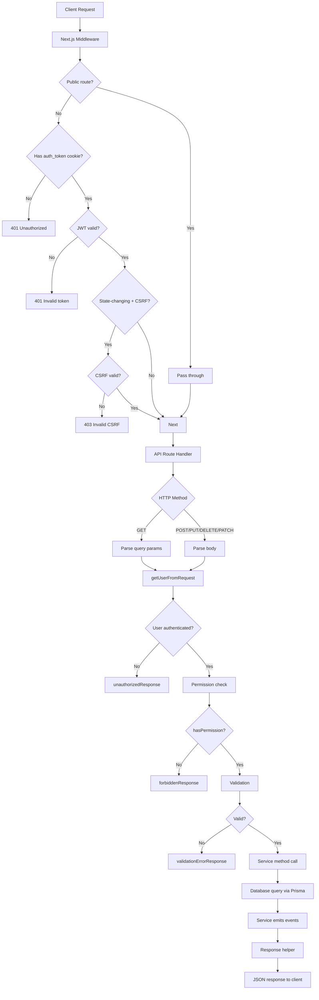
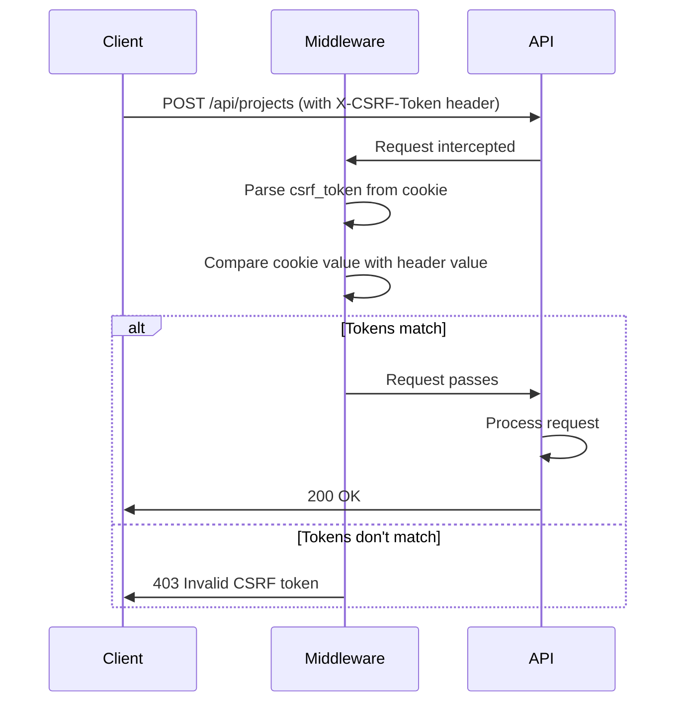
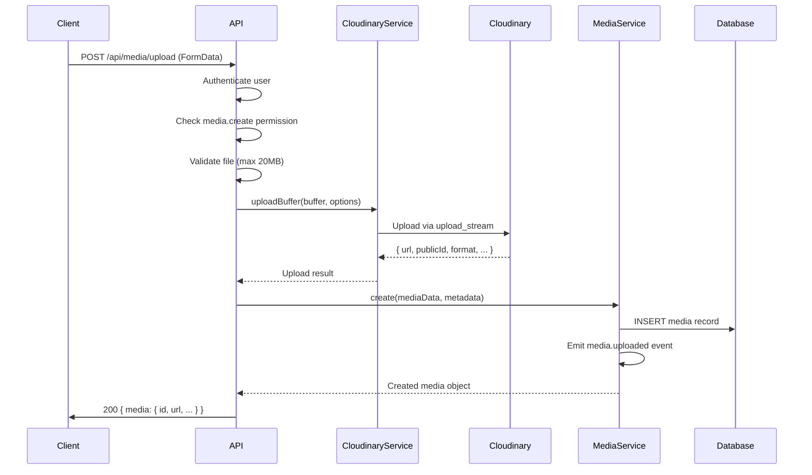
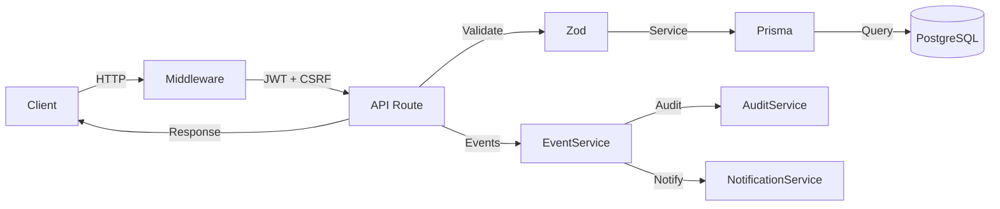
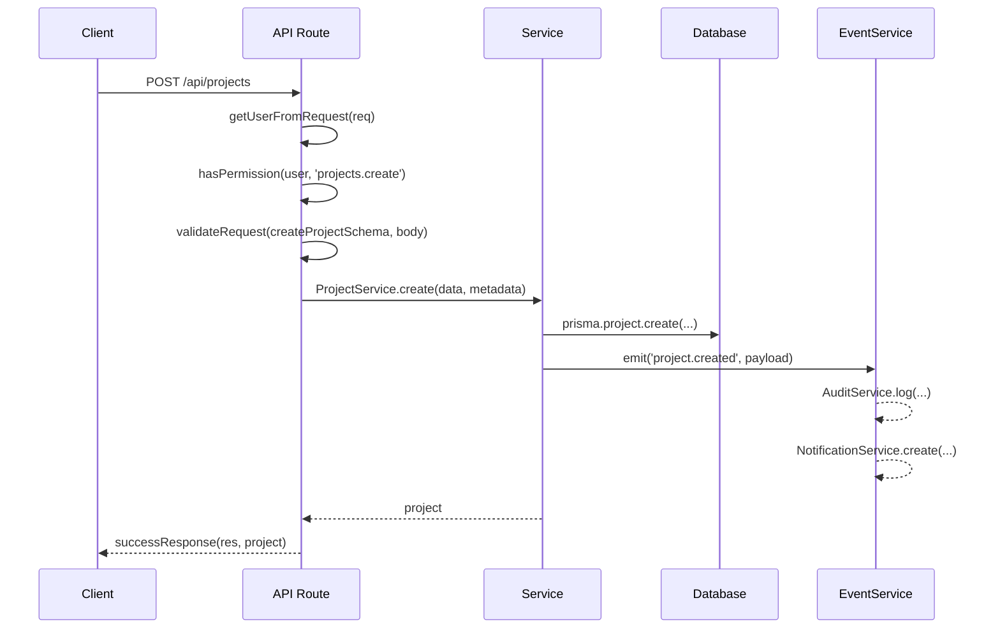
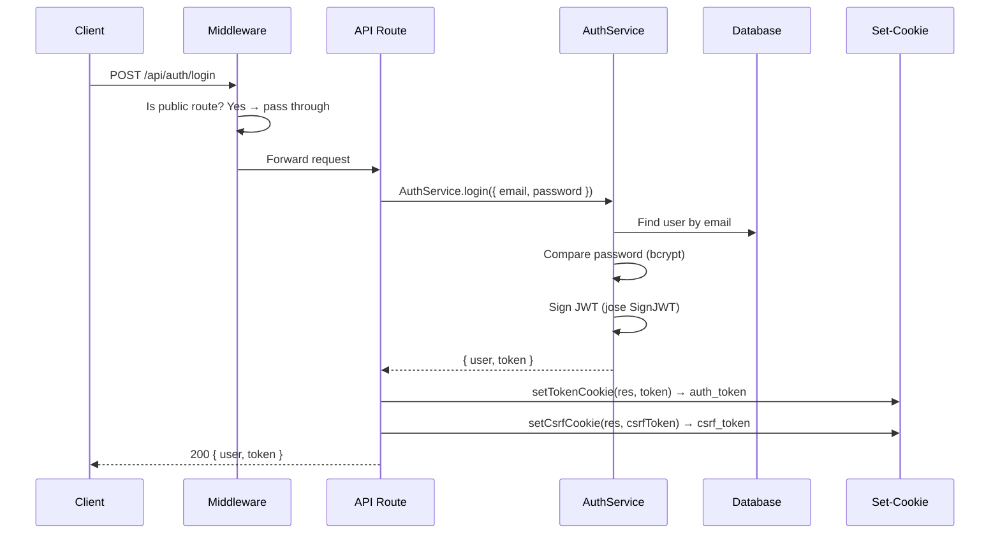

# 06 — API Reference

> Complete reference for every REST API endpoint in TASKILY CMS.
> All routes use Next.js Pages Router conventions under `pages/api/`.

---

## Table of Contents

- [API Philosophy](#api-philosophy)
- [Conventions](#conventions)
- [Request Lifecycle](#request-lifecycle)
- [Response Format](#response-format)
- [Response Helpers](#response-helpers)
- [Pagination](#pagination)
- [Sorting](#sorting)
- [Search & Filtering](#search--filtering)
- [Validation](#validation)
- [Error Handling](#error-handling)
- [Status Codes](#status-codes)
- [CSRF Protection](#csrf-protection)
- [File Uploads](#file-uploads)
- [API Routes by Module](#api-routes-by-module)
  - [Authentication API](#authentication-api)
  - [Projects API](#projects-api)
  - [Project Categories API](#project-categories-api)
  - [Blogs API](#blogs-api)
  - [Blog Categories API](#blog-categories-api)
  - [Media API](#media-api)
  - [Users API](#users-api)
  - [Roles API](#roles-api)
  - [Settings API](#settings-api)
  - [Notifications API](#notifications-api)
  - [Audit Log API](#audit-log-api)
  - [Dashboard API](#dashboard-api)
  - [Global Search API](#global-search-api)
- [Architecture Diagrams](#architecture-diagrams)

---

## API Philosophy

The TASKILY API follows these principles:

1. **Convention over configuration** — Routes mirror the database schema structure.
2. **Uniform responses** — Every endpoint returns `{ success, message, data?, details? }`.
3. **Service-layer delegation** — API routes are thin controllers; business logic lives in `lib/services/`.
4. **Event-driven side effects** — Services emit events through `EventService` for audit logging and notifications.
5. **Cookie-only authentication** — No `Authorization` header; tokens travel in HTTP-only cookies only.
6. **Zod validation** — Every mutating endpoint validates input with Zod schemas before touching the database.
7. **Middleware-enforced CSRF** — All state-changing requests (`POST`, `PUT`, `DELETE`, `PATCH`) require a valid CSRF token.

---

## Conventions

| Convention | Detail |
|---|---|
| **Base path** | `/api/` |
| **Router** | Next.js Pages Router (`pages/api/`) |
| **HTTP methods** | `GET` (read), `POST` (create), `PUT` (update), `DELETE` (delete), `PATCH` (partial update) |
| **Content-Type** | `application/json` for all requests and responses |
| **File uploads** | `multipart/form-data` (media upload only) |
| **ID format** | UUID v4 (`xxxxxxxx-xxxx-4xxx-yxxx-xxxxxxxxxxxx`) |
| **Timestamps** | ISO 8601 strings in UTC |
| **Soft deletes** | `deletedAt` field set to timestamp; records not physically removed |
| **Pagination** | Query params: `page`, `perPage` (max 100) |
| **Sorting** | Query params: `sort`, `order` (`asc`/`desc`) |
| **Search** | Query param: `search` (case-insensitive substring match) |
| **Status enums** | UPPERCASE: `DRAFT`, `PUBLISHED` (projects, blogs) |
| **User status enums** | UPPERCASE: `ACTIVE`, `INACTIVE`, `SUSPENDED` |
| **Permission checks** | `hasPermission(user, 'module.action')` in API routes |
| **Request metadata** | `extractRequestMetadata(req, actorId)` for IP and user-agent |

---

## Folder Organization

```
pages/api/
├── auth/                    # Authentication endpoints
│   ├── login.js             # POST  /api/auth/login
│   ├── register.js          # POST  /api/auth/register
│   ├── logout.js            # POST  /api/auth/logout
│   ├── me.js                # GET   /api/auth/me
│   ├── forgot-password.js   # POST  /api/auth/forgot-password
│   └── reset-password.js    # POST  /api/auth/reset-password
├── projects/                # Project CRUD
│   ├── index.js             # GET (list) + POST (create)
│   ├── stats.js             # GET project statistics
│   ├── trash.js             # GET trashed projects
│   ├── bulk.js              # POST bulk actions
│   ├── [id].js              # GET/PUT/DELETE single project
│   └── [id]/
│       ├── images.js        # POST/DELETE images
│       └── reorder.js       # PUT reorder images
├── project-categories/      # Project category CRUD
│   ├── index.js             # GET (list) + POST (create)
│   └── [id].js              # GET/PUT/DELETE single category
├── blogs/                   # Blog CRUD
│   ├── index.js             # GET (list) + POST (create)
│   ├── stats.js             # GET blog statistics
│   ├── trash.js             # GET trashed blogs
│   ├── bulk.js              # POST bulk actions
│   ├── [id].js              # GET/PUT/DELETE single blog
│   └── [id]/
│       ├── images.js        # POST/DELETE images
│       └── reorder.js       # PUT reorder images
├── blog-categories/         # Blog category CRUD
│   ├── index.js             # GET (list) + POST (create)
│   └── [id].js              # GET/PUT/DELETE single category
├── media/                   # Media library
│   ├── index.js             # GET (list)
│   ├── upload.js            # POST upload file
│   ├── stats.js             # GET media statistics
│   ├── folders.js           # GET folder list
│   ├── picker.js            # GET media picker (select)
│   ├── bulk.js              # POST bulk actions
│   └── [id].js              # GET/PUT/DELETE single media
├── users/                   # User management
│   ├── index.js             # GET (list) + POST (create)
│   ├── stats.js             # GET user statistics
│   ├── bulk.js              # POST bulk actions
│   ├── [id].js              # GET/PUT/DELETE single user
│   └── [id]/
│       ├── status.js        # PUT change user status
│       ├── reset-password.js  # PUT admin reset password
│       └── force-password-change.js  # PUT toggle force change
├── roles/                   # Role management
│   ├── index.js             # GET (list) + POST (create)
│   ├── stats.js             # GET role statistics
│   ├── permissions.js       # GET all permissions
│   ├── permissions-by-module.js  # GET permissions grouped by module
│   ├── [id].js              # GET/PUT/DELETE single role
│   └── [id]/
│       └── clone.js         # POST clone role
├── settings/                # System settings
│   ├── index.js             # GET/PUT settings
│   ├── profile.js           # PUT update profile
│   ├── smtp-test.js         # POST test SMTP
│   ├── system-info.js       # GET system information
│   └── maintenance.js       # GET/PUT maintenance mode
├── notifications/           # User notifications
│   ├── index.js             # GET (list)
│   ├── unread-count.js      # GET unread count
│   ├── mark-all-read.js     # PUT mark all as read
│   └── [id].js              # GET/PUT/DELETE single notification
├── audit/                   # Audit log
│   ├── index.js             # GET (list)
│   ├── stats.js             # GET audit statistics
│   └── [id].js              # GET single audit entry
├── dashboard/               # Dashboard data
│   ├── stats.js             # GET dashboard statistics
│   └── overview.js          # GET full dashboard overview
└── search.js                # GET global search
```

---

## Request Lifecycle

Every API request follows this strict pipeline:



### Step-by-step

| Step | Layer | File | Description |
|---|---|---|---|
| 1 | Middleware | `middleware.js` | Edge Runtime: validates JWT in `auth_token` cookie, validates CSRF for state-changing methods |
| 2 | Route handler | `pages/api/**/*.js` | Matches HTTP method, delegates to service |
| 3 | Authentication | `lib/auth.js` | `getUserFromRequest(req)` decodes JWT to extract `userId`, `roleId`, `role` |
| 4 | Authorization | `lib/api.js` | `hasPermission(user, 'module.action')` checks permission array |
| 5 | Validation | `lib/validation.js` | `validateRequest(schema, data)` runs Zod schema validation |
| 6 | Service | `lib/services/*.js` | Business logic, database queries via Prisma |
| 7 | Events | `lib/services/EventService.js` | Emit events for audit logging and notifications (fire-and-forget) |
| 8 | Response | `lib/api.js` | Standardized JSON response via helper functions |

---

## Response Format

Every API endpoint returns a consistent JSON structure:

### Success Response

```json
{
  "success": true,
  "message": "Success",
  "data": { ... }
}
```

### Success Response with Pagination

```json
{
  "success": true,
  "message": "Success",
  "data": {
    "items": [ ... ],
    "pagination": {
      "page": 1,
      "perPage": 10,
      "total": 42,
      "totalPages": 5,
      "hasNext": true,
      "hasPrev": false
    }
  }
}
```

### Error Response

```json
{
  "success": false,
  "message": "Error description",
  "details": [ ... ]
}
```

---

## Response Helpers

All response helpers are defined in `lib/api.js`:

| Helper | Signature | Status | Description |
|---|---|---|---|
| `successResponse` | `(res, data, message, statusCode)` | 200 | Standard success response |
| `errorResponse` | `(res, message, statusCode, details)` | 500 | Generic error response |
| `paginatedResponse` | `(res, data, pagination, message, statusCode)` | 200 | Paginated list response |
| `validationErrorResponse` | `(res, errors)` | 400 | Validation error with field-level details |
| `unauthorizedResponse` | `(res, message)` | 401 | Authentication required |
| `forbiddenResponse` | `(res, message)` | 403 | Insufficient permissions |
| `notFoundResponse` | `(res, message)` | 404 | Resource not found |
| `methodNotAllowed` | `(res)` | 405 | HTTP method not allowed |

### `extractRequestMetadata`

```js
extractRequestMetadata(req, actorId)
// Returns: { actorId, ipAddress, userAgent }
```

Extracts IP address (supports `x-forwarded-for` for reverse proxies) and User-Agent header. Passed to service methods as `metadata` for audit logging.

---

## Pagination

All list endpoints support cursor-less offset pagination.

### Query Parameters

| Parameter | Type | Default | Range | Description |
|---|---|---|---|---|
| `page` | integer | `1` | ≥ 1 | Page number (1-indexed) |
| `perPage` | integer | `10` | 1–100 | Items per page |

### Implementation

```js
// lib/pagination.js
parsePagination(query) → { page, perPage, skip }
buildPagination(total, page, perPage) → { page, perPage, total, totalPages, hasNext, hasPrev }
```

### Response Structure

```json
{
  "pagination": {
    "page": 1,
    "perPage": 10,
    "total": 42,
    "totalPages": 5,
    "hasNext": true,
    "hasPrev": false
  }
}
```

> **Note:** Maximum `perPage` is capped at 100 at both the utility level and service level to prevent excessive database loads.

---

## Sorting

All list endpoints support sorting by whitelisted fields.

### Query Parameters

| Parameter | Type | Default | Description |
|---|---|---|---|
| `sort` | string | `createdAt` | Field name to sort by |
| `order` | string | `desc` | Sort direction: `asc` or `desc` |

### Allowed Sort Fields by Module

| Module | Allowed Fields |
|---|---|
| Projects | `createdAt`, `updatedAt`, `title`, `year`, `publishedAt` |
| Blogs | `createdAt`, `updatedAt`, `title`, `publishedAt` |
| Media | `createdAt`, `updatedAt`, `fileName`, `fileSize`, `format` |
| Users | `name`, `email`, `createdAt`, `status`, `lastLoginAt`, `updatedAt` |
| Roles | `createdAt` (fixed ascending) |
| Notifications | `createdAt` (fixed descending) |
| Audit Logs | `createdAt` (fixed descending) |

> **Note:** Fields not in the allowed list default to `createdAt`. Invalid `order` values default to `desc`.

---

## Search & Filtering

### Search

All list endpoints support case-insensitive substring search via the `search` query parameter.

```
GET /api/projects?search=office
```

**Search behavior varies by module:**

| Module | Searched Fields |
|---|---|
| Projects | `title`, `client`, `location`, `shortDescription` |
| Blogs | `title`, `excerpt`, `slug` |
| Media | `fileName`, `altText`, `caption`, `folder`, `originalName` |
| Users | `name`, `email` |

### Filtering

| Module | Filter Parameters | Example |
|---|---|---|
| Projects | `status`, `featured`, `categoryId`, `year` | `?status=PUBLISHED&featured=true&year=2024` |
| Blogs | `status`, `featured`, `categoryId` | `?status=DRAFT` |
| Media | `format`, `folder` | `?format=jpg&folder=uploads` |
| Users | `status`, `roleId` | `?status=ACTIVE&roleId=abc-123` |
| Audit Logs | `module`, `action`, `entityType`, `userId`, `startDate`, `endDate` | `?module=projects&action=CREATE` |

---

## Validation

All mutating endpoints use Zod schemas from `lib/validation.js`.

### Validation Helper

```js
const result = validateRequest(schema, data);
if (!result.success) {
  return validationErrorResponse(res, result.errors);
}
// result.data contains sanitized/validated data
```

### Error Format

```json
{
  "success": false,
  "message": "Validation failed",
  "details": [
    { "field": "title", "message": "Title is required" },
    { "field": "email", "message": "Invalid email address" }
  ]
}
```

### Password Requirements

The `passwordSchema` enforces:

| Rule | Regex | Minimum |
|---|---|---|
| Length | — | 8 characters |
| Uppercase | `/[A-Z]/` | 1 required |
| Lowercase | `/[a-z]/` | 1 required |
| Number | `/[0-9]/` | 1 required |

---

## Error Handling

Services throw `Error` objects with descriptive messages. API routes catch errors and return appropriate HTTP responses:

```js
try {
  const project = await ProjectService.create(data);
  return successResponse(res, project, 'Project created');
} catch (error) {
  if (error.message === 'One or more categories not found') {
    return errorResponse(res, error.message, 400);
  }
  if (error.message === 'Project not found') {
    return notFoundResponse(res, error.message);
  }
  return errorResponse(res, 'Internal Server Error', 500);
}
```

> **Pattern:** Each service method throws specific error messages. The API route catches and maps them to the appropriate HTTP status code.

---

## Status Codes

| Code | Meaning | When Used |
|---|---|---|
| `200` | OK | Successful GET, PUT, DELETE |
| `201` | Created | Successful POST (resource created) |
| `400` | Bad Request | Validation failure, business rule violation |
| `401` | Unauthorized | Missing or invalid JWT token |
| `403` | Forbidden | Insufficient permissions, invalid CSRF |
| `404` | Not Found | Resource does not exist |
| `405` | Method Not Allowed | HTTP method not supported on endpoint |
| `500` | Internal Server Error | Unexpected server errors |

---

## CSRF Protection

### Double Submit Cookie Pattern

| Component | Value | Storage |
|---|---|---|
| Cookie name | `csrf_token` | Browser cookie (readable by JS) |
| Header name | `X-CSRF-Token` | Request header (auto-attached by fetch patch) |
| Token length | 32 bytes (64 hex chars) | Cryptographically random |
| Cookie maxAge | 86400 seconds (24 hours) | Browser managed |
| Cookie sameSite | `strict` | Prevents cross-origin sending |
| Cookie httpOnly | `false` | Must be readable by JavaScript |
| Cookie secure | `true` in production | HTTPS only in production |

### Flow



### Client-Side Auto-Attachment

The global `fetch` patch (`lib/patchFetchCsrf.js`) automatically attaches the `X-CSRF-Token` header to all state-changing requests:

```js
// Imported in _app.jsx — runs once on page load
// Patches window.fetch to read csrf_token cookie and attach header
if (STATE_CHANGING_METHODS.has(method) && csrfToken) {
  init.headers = { ...init.headers, 'X-CSRF-Token': csrfToken };
}
```

### Public API Routes (No CSRF Required)

| Route | Method |
|---|---|
| `/api/auth/login` | POST |
| `/api/auth/register` | POST |
| `/api/auth/forgot-password` | POST |
| `/api/auth/reset-password` | POST |

---

## File Uploads

### Upload Endpoint

```
POST /api/media/upload
Content-Type: multipart/form-data
```

### Upload Flow



### Upload Constraints

| Constraint | Value |
|---|---|
| Max file size | 20 MB |
| Allowed formats | Images, videos, documents (Cloudinary `auto` detection) |
| Storage provider | Cloudinary |
| Folder | Configurable (default: `taskily`) |
| Resource type | `auto` (Cloudinary auto-detects) |

### Upload Response

```json
{
  "success": true,
  "message": "File uploaded successfully",
  "data": {
    "id": "uuid",
    "fileName": "photo.jpg",
    "originalName": "photo.jpg",
    "url": "https://res.cloudinary.com/...",
    "secureUrl": "https://res.cloudinary.com/...",
    "publicId": "taskily/abc123",
    "format": "jpg",
    "width": 1920,
    "height": 1080,
    "fileSize": 245000,
    "mimeType": "image",
    "altText": null,
    "caption": null,
    "folder": "taskily"
  }
}
```

---

## API Routes by Module

---

### Authentication API

Base: `/api/auth/`

| Endpoint | Method | Permission | Auth Required | CSRF | Description |
|---|---|---|---|---|---|
| `/api/auth/login` | POST | None | No | No | Authenticate user, set cookies |
| `/api/auth/register` | POST | None | No | No | Register new user |
| `/api/auth/logout` | POST | None | Yes | Yes | Clear auth cookie |
| `/api/auth/me` | GET | None | Yes | No | Get current user profile |
| `/api/auth/forgot-password` | POST | None | No | No | Generate reset token |
| `/api/auth/reset-password` | POST | None | No | No | Reset password with token |

#### POST `/api/auth/login`

**Request:**
```json
{
  "email": "admin@taskily.com",
  "password": "Admin123!"
}
```

**Response (200):**
```json
{
  "success": true,
  "message": "Login successful",
  "data": {
    "user": {
      "id": "...",
      "name": "Admin User",
      "email": "admin@taskily.com",
      "role": { "name": "ADMIN", "permissions": [...] },
      "permissions": ["dashboard.read", "projects.create", ...]
    },
    "token": "eyJ..."
  }
}
```

**Side effects:**
- Sets `auth_token` cookie (HTTP-only, secure, sameSite: lax, maxAge: JWT_EXPIRES_IN)
- Sets `csrf_token` cookie (readable, secure, sameSite: strict, maxAge: 24h)
- Updates `lastLoginAt` timestamp

#### POST `/api/auth/register`

**Request:**
```json
{
  "name": "John Doe",
  "email": "john@example.com",
  "password": "SecurePass1!",
  "confirmPassword": "SecurePass1!"
}
```

**Response (201):** Same structure as login.

**Side effects:**
- Assigns default `VIEWER` role
- Generates email verification token
- Sets auth cookies

#### POST `/api/auth/logout`

**Response (200):**
```json
{ "success": true, "message": "Logged out successfully" }
```

**Side effects:**
- Clears `auth_token` cookie (maxAge: 0)
- Clears `csrf_token` cookie (maxAge: 0)

#### GET `/api/auth/me`

**Response (200):**
```json
{
  "success": true,
  "data": {
    "id": "...",
    "name": "Admin User",
    "email": "admin@taskily.com",
    "role": { "name": "ADMIN", "permissions": [...] },
    "permissions": ["dashboard.read", ...]
  }
}
```

#### POST `/api/auth/forgot-password`

**Request:** `{ "email": "user@example.com" }`
**Response (200):** `{ "message": "If an account exists, a reset link has been sent" }`

> **Note:** Always returns 200 with the same message regardless of whether the email exists, preventing user enumeration.

#### POST `/api/auth/reset-password`

**Request:** `{ "token": "...", "password": "NewPass1!", "confirmPassword": "NewPass1!" }`
**Response (200):** `{ "message": "Password reset successful" }`

---

### Projects API

Base: `/api/projects/`

| Endpoint | Method | Permission | Description |
|---|---|---|---|
| `/api/projects` | GET | `projects.read` | List projects (paginated, filterable) |
| `/api/projects` | POST | `projects.create` | Create new project |
| `/api/projects/stats` | GET | `projects.read` | Get project statistics |
| `/api/projects/trash` | GET | `projects.read` | List trashed projects |
| `/api/projects/bulk` | POST | `projects.delete` (varies) | Bulk actions |
| `/api/projects/[id]` | GET | `projects.read` | Get single project |
| `/api/projects/[id]` | PUT | `projects.update` | Update project |
| `/api/projects/[id]` | DELETE | `projects.delete` | Soft delete project |
| `/api/projects/[id]/images` | POST | `projects.update` | Add image to project |
| `/api/projects/[id]/images` | DELETE | `projects.update` | Remove image from project |
| `/api/projects/[id]/reorder` | PUT | `projects.update` | Reorder project images |

#### List Projects — `GET /api/projects`

**Query Parameters:**

| Param | Type | Default | Description |
|---|---|---|---|
| `page` | number | `1` | Page number |
| `perPage` | number | `12` | Items per page |
| `search` | string | `""` | Search title, client, location, description |
| `status` | string | `""` | Filter: `DRAFT` or `PUBLISHED` |
| `featured` | boolean | `null` | Filter featured projects |
| `categoryId` | string | `""` | Filter by category UUID |
| `year` | number | `null` | Filter by year |
| `sort` | string | `createdAt` | Sort field |
| `order` | string | `desc` | Sort direction |

**Response (200):**
```json
{
  "success": true,
  "data": {
    "items": [
      {
        "id": "...",
        "title": "Office Building",
        "slug": "office-building",
        "shortDescription": "...",
        "coverImage": "https://...",
        "status": "PUBLISHED",
        "featured": false,
        "client": "Acme Corp",
        "location": "New York",
        "year": 2024,
        "createdAt": "2024-01-15T10:00:00Z",
        "author": { "id": "...", "name": "Admin", "avatar": "..." },
        "categories": [{ "id": "...", "name": "Commercial" }],
        "images": [...],
        "_count": { "images": 5 }
      }
    ],
    "pagination": { ... }
  }
}
```

#### Create Project — `POST /api/projects`

**Request:**
```json
{
  "title": "New Project",
  "shortDescription": "A brief description",
  "fullDescription": "<p>Rich text content</p>",
  "coverImage": "https://res.cloudinary.com/...",
  "featured": false,
  "status": "DRAFT",
  "client": "Client Name",
  "location": "City, Country",
  "year": 2024,
  "metaTitle": "SEO Title",
  "metaDescription": "SEO description",
  "categoryIds": ["uuid-1", "uuid-2"],
  "images": [
    {
      "url": "https://res.cloudinary.com/...",
      "publicId": "taskily/abc",
      "altText": "Image description",
      "caption": "Caption text",
      "sortOrder": 0
    }
  ]
}
```

**Service:** `ProjectService.create()`
**Events emitted:** `project.created`

#### Bulk Actions — `POST /api/projects/bulk`

**Request:**
```json
{
  "ids": ["uuid-1", "uuid-2"],
  "action": "publish"
}
```

**Available actions:** `publish`, `unpublish`, `delete`, `restore`, `permanentDelete`, `feature`, `unfeature`

| Action | Required Permission | Effect |
|---|---|---|
| `publish` | `projects.publish` | Set status to PUBLISHED |
| `unpublish` | `projects.update` | Set status to DRAFT |
| `delete` | `projects.delete` | Soft delete |
| `restore` | `projects.delete` | Restore from trash |
| `permanentDelete` | `projects.delete` | Permanently remove |
| `feature` | `projects.update` | Mark as featured |
| `unfeature` | `projects.update` | Unmark as featured |

---

### Project Categories API

Base: `/api/project-categories/`

| Endpoint | Method | Permission | Description |
|---|---|---|---|
| `/api/project-categories` | GET | `project-categories.read` | List categories |
| `/api/project-categories` | POST | `project-categories.create` | Create category |
| `/api/project-categories/[id]` | GET | `project-categories.read` | Get single category |
| `/api/project-categories/[id]` | PUT | `project-categories.update` | Update category |
| `/api/project-categories/[id]` | DELETE | `project-categories.delete` | Soft delete category |

**Delete constraint:** Cannot delete a category that is assigned to active projects.

---

### Blogs API

Base: `/api/blogs/`

| Endpoint | Method | Permission | Description |
|---|---|---|---|
| `/api/blogs` | GET | `blogs.read` | List blogs (paginated) |
| `/api/blogs` | POST | `blogs.create` | Create blog post |
| `/api/blogs/stats` | GET | `blogs.read` | Get blog statistics |
| `/api/blogs/trash` | GET | `blogs.read` | List trashed blogs |
| `/api/blogs/bulk` | POST | Varies | Bulk actions |
| `/api/blogs/[id]` | GET | `blogs.read` | Get single blog |
| `/api/blogs/[id]` | PUT | `blogs.update` | Update blog |
| `/api/blogs/[id]` | DELETE | `blogs.delete` | Soft delete blog |
| `/api/blogs/[id]/images` | POST | `blogs.update` | Add image |
| `/api/blogs/[id]/images` | DELETE | `blogs.update` | Remove image |
| `/api/blogs/[id]/reorder` | PUT | `blogs.update` | Reorder images |

**Blog-specific features:**
- Custom slug support (auto-generated from title if not provided)
- Slug uniqueness enforced (with collision handling: `slug-2`, `slug-3`, etc.)
- `publishedAt` auto-set when status changes to `PUBLISHED`

**Bulk actions:** `publish`, `unpublish`, `delete`, `restore`, `permanentDelete`, `feature`, `unfeature`

---

### Blog Categories API

Base: `/api/blog-categories/`

| Endpoint | Method | Permission | Description |
|---|---|---|---|
| `/api/blog-categories` | GET | `blog-categories.read` | List categories |
| `/api/blog-categories` | POST | `blog-categories.create` | Create category |
| `/api/blog-categories/[id]` | GET | `blog-categories.read` | Get single category |
| `/api/blog-categories/[id]` | PUT | `blog-categories.update` | Update category |
| `/api/blog-categories/[id]` | DELETE | `blog-categories.delete` | Soft delete category |

**Delete constraint:** Cannot delete a category that is assigned to active blogs.

---

### Media API

Base: `/api/media/`

| Endpoint | Method | Permission | Description |
|---|---|---|---|
| `/api/media` | GET | `media.read` | List media files |
| `/api/media/upload` | POST | `media.create` | Upload file to Cloudinary |
| `/api/media/stats` | GET | `media.read` | Get media statistics |
| `/api/media/folders` | GET | `media.read` | List folders |
| `/api/media/picker` | GET | `media.read` | Media picker for selection |
| `/api/media/bulk` | POST | Varies | Bulk actions |
| `/api/media/[id]` | GET | `media.read` | Get single media |
| `/api/media/[id]` | PUT | `media.update` | Update metadata |
| `/api/media/[id]` | DELETE | `media.delete` | Soft delete media |

**Media-specific query parameters:**

| Param | Description |
|---|---|
| `format` | Filter by format (jpg, png, mp4, pdf, etc.) |
| `folder` | Filter by folder name |

**Bulk actions:** `delete`, `restore`, `move`, `updateAltText`, `updateCaption`

**Usage tracking:** `MediaService.getUsedIn(mediaId)` checks where a media file is referenced across projects and blogs.

---

### Users API

Base: `/api/users/`

| Endpoint | Method | Permission | Description |
|---|---|---|---|
| `/api/users` | GET | `users.read` | List users (paginated) |
| `/api/users` | POST | `users.create` | Create user |
| `/api/users/stats` | GET | `users.read` | Get user statistics |
| `/api/users/bulk` | POST | Varies | Bulk actions |
| `/api/users/[id]` | GET | `users.read` | Get single user |
| `/api/users/[id]` | PUT | `users.update` | Update user |
| `/api/users/[id]` | DELETE | `users.delete` | Soft delete user |
| `/api/users/[id]/status` | PUT | `users.manage` | Change user status |
| `/api/users/[id]/reset-password` | PUT | `users.manage` | Admin reset password |
| `/api/users/[id]/force-password-change` | PUT | `users.manage` | Toggle force password change |

**User-specific query parameters:**

| Param | Description |
|---|---|
| `status` | Filter by status: `ACTIVE`, `INACTIVE`, `SUSPENDED` |
| `roleId` | Filter by role UUID |

**Bulk actions:** `activate`, `deactivate`, `suspend`, `delete`, `restore`

**Note:** `UserService.findById()` throws `Error('User not found')` — it does not return null.

---

### Roles API

Base: `/api/roles/`

| Endpoint | Method | Permission | Description |
|---|---|---|---|
| `/api/roles` | GET | `roles.read` | List all roles with permissions |
| `/api/roles` | POST | `roles.create` | Create role |
| `/api/roles/stats` | GET | `roles.read` | Get role statistics |
| `/api/roles/permissions` | GET | `roles.read` | Get all permissions |
| `/api/roles/permissions-by-module` | GET | `roles.read` | Get permissions grouped by module |
| `/api/roles/[id]` | GET | `roles.read` | Get single role |
| `/api/roles/[id]` | PUT | `roles.update` | Update role |
| `/api/roles/[id]` | DELETE | `roles.delete` | Delete role |
| `/api/roles/[id]/clone` | POST | `roles.clone` | Clone role |

**System role protection:** Roles with `isSystem: true` (ADMIN, EDITOR, AUTHOR, VIEWER) cannot be modified or deleted.

**Delete constraint:** Cannot delete a role that has assigned users.

**Role names:** Automatically uppercased on creation and update.

---

### Settings API

Base: `/api/settings/`

| Endpoint | Method | Permission | Description |
|---|---|---|---|
| `/api/settings` | GET | `settings.read` | Get all settings |
| `/api/settings` | PUT | `settings.update` | Update settings |
| `/api/settings/profile` | PUT | Authenticated | Update own profile |
| `/api/settings/smtp-test` | POST | `settings.update` | Test SMTP connection |
| `/api/settings/system-info` | GET | `settings.read` | Get system info |
| `/api/settings/maintenance` | GET | `settings.read` | Get maintenance status |
| `/api/settings/maintenance` | PUT | `settings.maintenance` | Toggle maintenance mode |

**Settings groups:** `general`, `branding`, `seo`, `contact`, `social`, `email`, `localization`, `security`, `maintenance`, `display`

**Sensitive fields:** `smtpPassword` is masked in API responses (returned as `••••••••`).

**Query parameter:** `?group=seo` to filter settings by group.

---

### Notifications API

Base: `/api/notifications/`

| Endpoint | Method | Permission | Description |
|---|---|---|---|
| `/api/notifications` | GET | `notifications.read` | List user's notifications |
| `/api/notifications/unread-count` | GET | `notifications.read` | Get unread count |
| `/api/notifications/mark-all-read` | PUT | `notifications.read` | Mark all as read |
| `/api/notifications/[id]` | GET | `notifications.read` | Get single notification |
| `/api/notifications/[id]` | PUT | `notifications.read` | Mark single as read |
| `/api/notifications/[id]` | DELETE | `notifications.delete` | Soft delete notification |

**Query parameters:**

| Param | Description |
|---|---|
| `type` | Filter: `content`, `user`, `system` |
| `priority` | Filter: `LOW`, `MEDIUM`, `HIGH` |
| `unreadOnly` | Boolean — only unread notifications |

**Note:** Notifications are user-scoped — each user only sees their own notifications.

---

### Audit Log API

Base: `/api/audit/`

| Endpoint | Method | Permission | Description |
|---|---|---|---|
| `/api/audit` | GET | `audit.view` | List audit logs |
| `/api/audit/stats` | GET | `audit.view` | Get audit statistics |
| `/api/audit/[id]` | GET | `audit.view` | Get single audit entry |

**Query parameters:**

| Param | Description |
|---|---|
| `module` | Filter: `projects`, `blogs`, `media`, `users`, `roles`, `settings` |
| `action` | Filter: `CREATE`, `UPDATE`, `DELETE`, `RESTORE`, `PUBLISH` |
| `entityType` | Filter: `Project`, `Blog`, `Media`, `User`, `Role`, `Setting` |
| `userId` | Filter by actor UUID |
| `startDate` | ISO date — start of date range |
| `endDate` | ISO date — end of date range |

> **Note:** The audit module uses `audit.view` and `audit.export` permissions — NOT `audit.read`.

---

### Dashboard API

Base: `/api/dashboard/`

| Endpoint | Method | Permission | Description |
|---|---|---|---|
| `/api/dashboard/stats` | GET | `dashboard.read` | Get dashboard statistics |
| `/api/dashboard/overview` | GET | `dashboard.read` | Get full dashboard overview |

#### GET `/api/dashboard/overview`

Returns a comprehensive dashboard payload with per-query error isolation (uses `Promise.allSettled` via `safeQuery` helper):

```json
{
  "stats": { "projects": {...}, "blogs": {...}, "media": {...}, "users": {...} },
  "recentProjects": [...],
  "recentBlogs": [...],
  "recentActivity": [...],
  "recentUsers": [...],
  "recentMedia": [...],
  "contentSummary": {...},
  "activityTrend": [...],
  "categoryBreakdown": {...},
  "storageBreakdown": {...},
  "systemHealth": { "database": "connected", "cloudinary": "configured", ... },
  "userGrowth": [...],
  "recentNotifications": [...],
  "recentAuditLogs": [...]
}
```

> **Resilience:** Each sub-query is wrapped in `safeQuery()` which catches individual failures and returns `null` instead of failing the entire dashboard.

---

### Global Search API

Base: `/api/search`

| Endpoint | Method | Permission | Description |
|---|---|---|---|
| `/api/search` | GET | Authenticated | Search across all modules |

**Query Parameters:**

| Param | Description |
|---|---|
| `q` | Search query string (min 2 characters) |

**Response:**
```json
{
  "success": true,
  "data": {
    "groups": {
      "projects": [...],
      "blogs": [...],
      "media": [...],
      "users": [...],
      "roles": [...],
      "categories": [...],
      "activity": [...]
    },
    "totalResults": 15,
    "query": "office"
  }
}
```

**Search limits:** Each module returns a maximum of 5 results.

**Permission-aware:** Each search method checks the user's permissions before returning results. Users without `projects.read` won't see project results, etc.

---

## Architecture Diagrams

### Request Lifecycle (Simplified)



### CRUD Lifecycle



### Authentication Flow



---

## See Also

- [07 — Authentication](./07-authentication.md) — JWT lifecycle, cookie strategy, security
- [08 — Permission System](./08-permission-system.md) — RBAC, permissions, authorization
- [09 — Services](./09-services.md) — Service layer reference
- [10 — Event System](./10-event-system.md) — EventService, events, listeners
