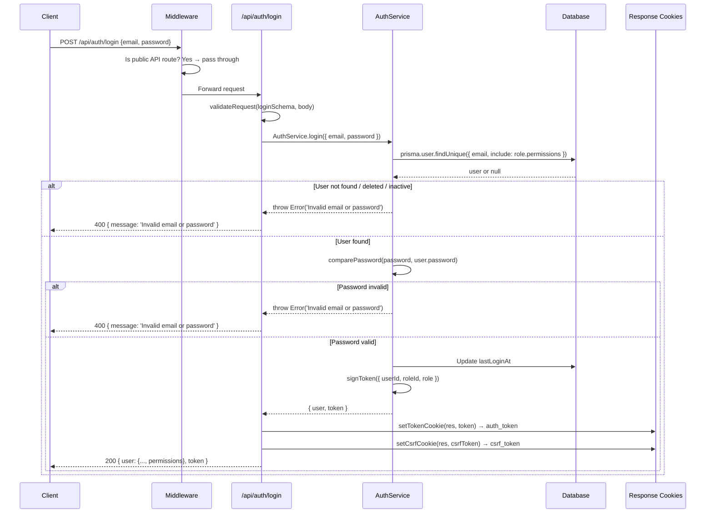
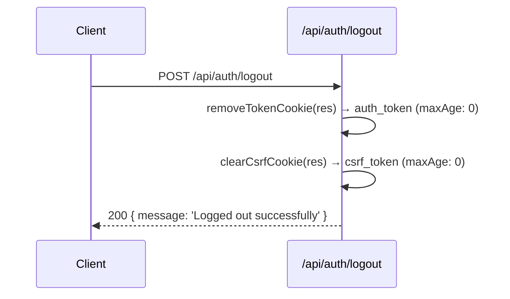
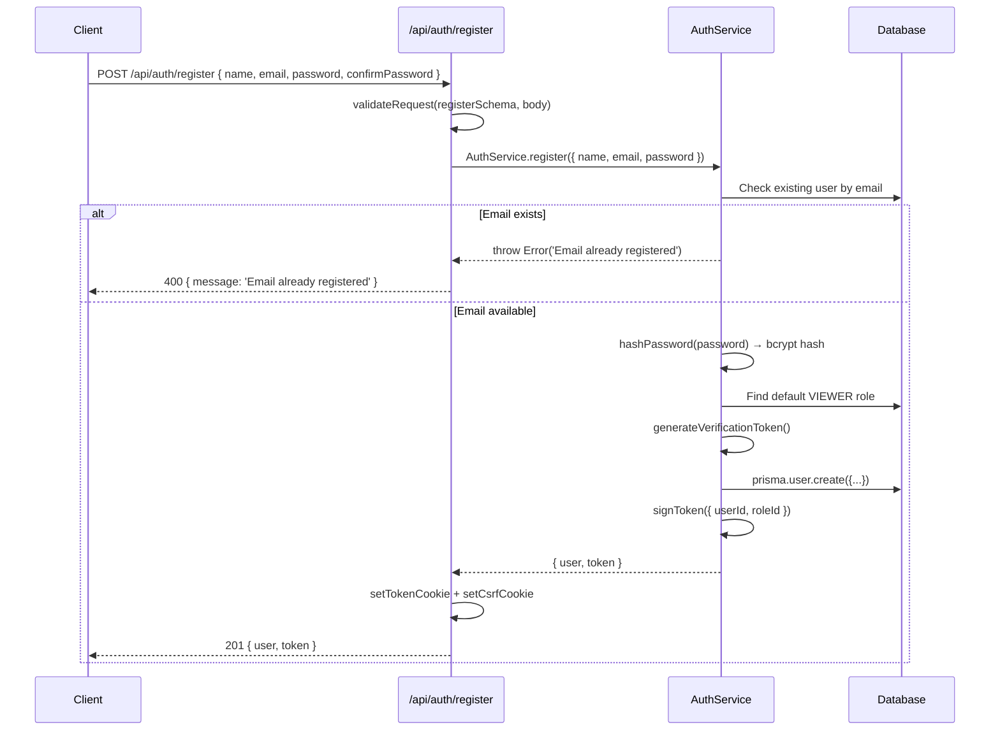
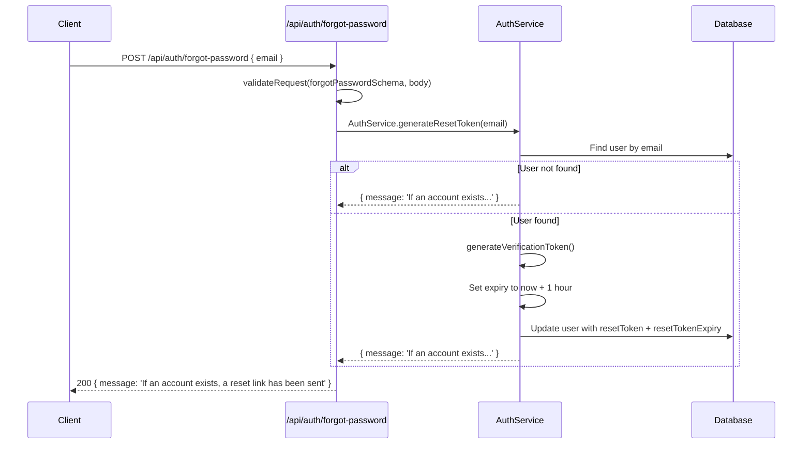
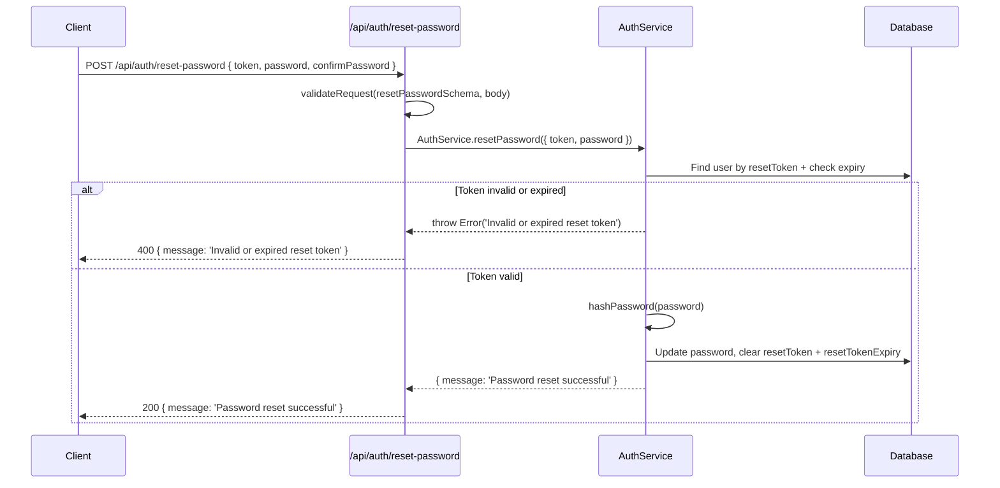
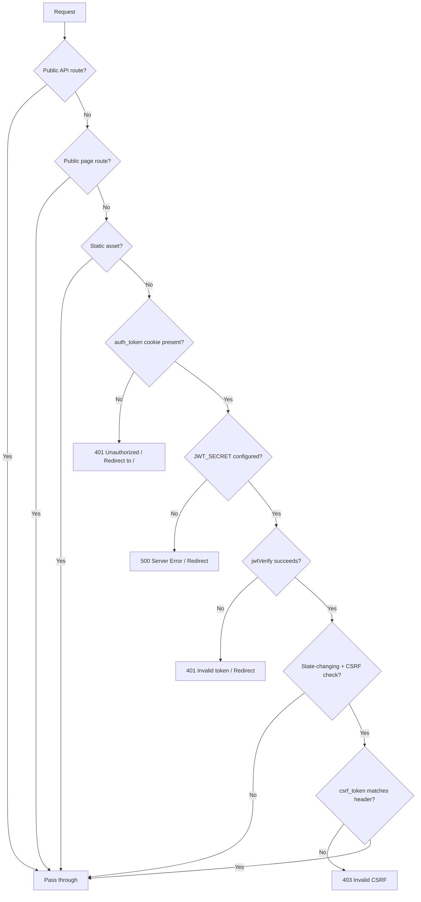
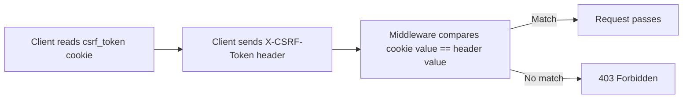
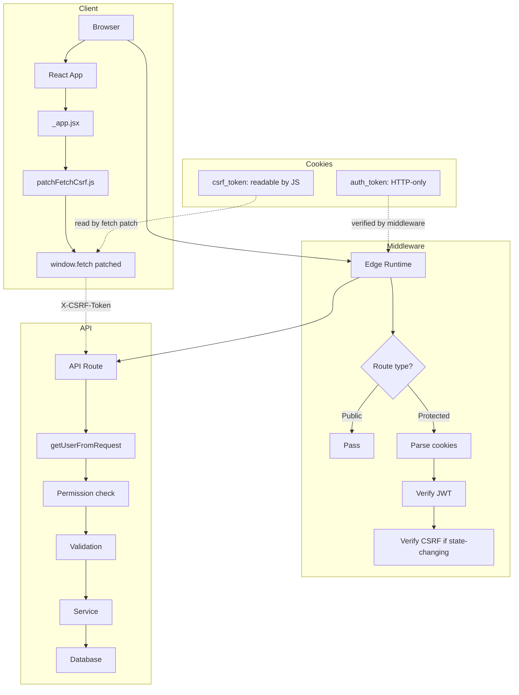
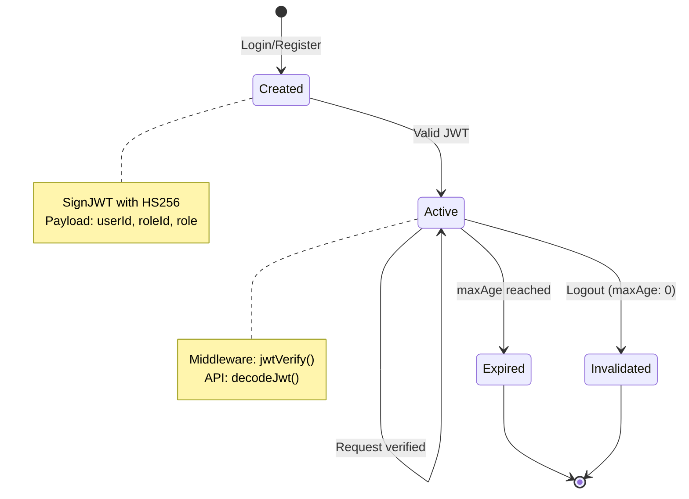

# 07 — Authentication

> Complete documentation of the TASKILY CMS authentication architecture,
> JWT lifecycle, cookie strategy, CSRF protection, and security considerations.

---

## Table of Contents

- [Authentication Philosophy](#authentication-philosophy)
- [Cookie Strategy](#cookie-strategy)
- [JWT Lifecycle](#jwt-lifecycle)
- [Token Creation (Sign)](#token-creation-sign)
- [Token Verification (Verify)](#token-verification-verify)
- [Token Decoding (Decode)](#token-decoding-decode)
- [Cookie Creation & Removal](#cookie-creation--removal)
- [Login Flow](#login-flow)
- [Logout Flow](#logout-flow)
- [Registration Flow](#registration-flow)
- [Forgot Password Flow](#forgot-password-flow)
- [Reset Password Flow](#reset-password-flow)
- [Email Verification](#email-verification)
- [Middleware Verification](#middleware-verification)
- [Protected & Public Routes](#protected--public-routes)
- [CSRF Protection](#csrf-protection)
- [Security Headers](#security-headers)
- [Threat Mitigation](#threat-mitigation)
- [Architectural Decisions](#architectural-decisions)
- [Diagrams](#diagrams)

---

## Authentication Philosophy

TASKILY uses a **cookie-only authentication strategy** with **Double Submit CSRF protection**. Every architectural decision prioritizes security without sacrificing developer ergonomics.

### Core Principles

1. **No tokens in localStorage** — Prevents XSS token theft.
2. **No Authorization header** — Cookies are automatically sent by the browser; no manual header management needed.
3. **HTTP-only cookies** — Tokens cannot be read by JavaScript.
4. **jose library** — Modern, standards-compliant JWT implementation (not the older `jsonwebtoken` library).
5. **Middleware-level verification** — JWT is verified in Edge Runtime before the request reaches the API route.
6. **CSRF Double Submit** — Readable cookie + matching header prevents CSRF without server-side session storage.

---

## Cookie Strategy

### Auth Token Cookie

| Property | Value |
|---|---|
| Name | `auth_token` |
| Value | JWT string (signed with HS256) |
| HttpOnly | `true` — JavaScript cannot read this cookie |
| Secure | `true` in production (HTTPS only) |
| SameSite | `lax` — Sent on top-level navigation and same-site requests |
| MaxAge | `JWT_EXPIRES_IN` env var (default: 7 days) |
| Path | `/` |

### CSRF Token Cookie

| Property | Value |
|---|---|
| Name | `csrf_token` |
| Value | 32-byte random hex string (64 characters) |
| HttpOnly | `false` — JavaScript MUST be able to read this cookie |
| Secure | `true` in production |
| SameSite | `strict` — Only sent on same-site requests |
| MaxAge | 86400 seconds (24 hours) |
| Path | `/` |

### Why No localStorage?

| Concern | localStorage | HTTP-only Cookie |
|---|---|---|
| XSS attacks | Token fully exposed to injected scripts | Token inaccessible to JavaScript |
| CSRF attacks | Not sent automatically (no CSRF risk from cookies) | Sent automatically (mitigated by Double Submit) |
| Token theft | Trivial with XSS | Impossible with XSS alone |
| Expiry control | Client-side only | Server-enforced via MaxAge |
| Mobile support | Inconsistent | Universal |

> **Decision:** The XSS risk of localStorage outweighs the CSRF risk of cookies. CSRF is mitigated by the Double Submit Cookie pattern, making cookies the safer choice.

---

## JWT Lifecycle

### Libraries Used

| Library | Version | Purpose |
|---|---|---|
| `jose` | Installed | Token signing (`SignJWT`), verification (`jwtVerify`), decoding (`decodeJwt`) |
| `cookie` | 2.0.1 | Cookie serialization (`stringifySetCookie`) and parsing (`parseCookie`) |

> **Historical note:** The project previously used `jsonwebtoken` for some operations. This has been fully removed — `jose` is the sole JWT library.

### JWT Configuration

| Parameter | Value | Source |
|---|---|---|
| Algorithm | HS256 | Hardcoded in `SignJWT.setProtectedHeader({ alg: 'HS256' })` |
| Secret | `JWT_SECRET` env var | `process.env.JWT_SECRET` |
| Expiration | `JWT_EXPIRES_IN` env var | Default: `7d` (7 days) |
| Issued At | Automatic | `.setIssuedAt()` |
| Expiration Time | Computed | `.setExpirationTime(JWT_EXPIRES_IN)` |

### JWT Payload

```json
{
  "userId": "uuid-string",
  "roleId": "uuid-string",
  "role": "ADMIN",
  "iat": 1700000000,
  "exp": 1700604800
}
```

| Field | Description |
|---|---|
| `userId` | User's UUID (primary identifier) |
| `roleId` | User's role UUID |
| `role` | Role name string (e.g., `ADMIN`) — included for quick permission checks |
| `iat` | Issued-at timestamp (automatic) |
| `exp` | Expiration timestamp (automatic) |

---

## Token Creation (Sign)

**File:** `lib/auth.js` → `signToken(payload)`

```js
import { SignJWT } from 'jose';

export async function signToken(payload) {
  return new SignJWT(payload)
    .setProtectedHeader({ alg: 'HS256' })
    .setIssuedAt()
    .setExpirationTime(JWT_EXPIRES_IN)
    .sign(getJwtSecretKey());
}
```

### How it works

1. Creates a new `SignJWT` instance with the payload
2. Sets the protected header to `HS256` (HMAC-SHA256)
3. Sets `iat` (issued at) to current time
4. Sets `exp` (expiration) based on `JWT_EXPIRES_IN` (default: 7 days)
5. Signs using the `JWT_SECRET_KEY` (TextEncoder-encoded secret)

### Expiration Parsing

The `parseExpiresInSeconds()` helper supports multiple formats:

| Format | Example | Result |
|---|---|---|
| Days | `7d` | 604800 seconds |
| Hours | `24h` | 86400 seconds |
| Minutes | `30m` | 1800 seconds |
| Seconds | `3600` | 3600 seconds (raw number) |

---

## Token Verification (Verify)

**File:** `middleware.js` (Edge Runtime)

```js
import { jwtVerify } from 'jose';

const JWT_SECRET = process.env.JWT_SECRET;
const JWT_SECRET_KEY = JWT_SECRET ? new TextEncoder().encode(JWT_SECRET) : null;

try {
  await jwtVerify(token, JWT_SECRET_KEY);
} catch {
  // Invalid or expired token
}
```

> **Important:** `jwtVerify` is used in middleware only. It cryptographically verifies the signature AND checks expiration. This is different from `decodeJwt` which only decodes without verification.

### Verification steps

1. Parse the `auth_token` cookie from the request
2. Encode `JWT_SECRET` as `TextEncoder` key (cached at module scope)
3. Call `jwtVerify(token, key)` — verifies signature + expiration
4. If verification fails (expired, tampered, malformed) → return 401

---

## Token Decoding (Decode)

**File:** `lib/auth.js` → `verifyToken(token)` and `getUserFromRequest(req)`

```js
import { decodeJwt } from 'jose';

export function verifyToken(token) {
  try {
    return decodeJwt(token);
  } catch (error) {
    return null;
  }
}

export function getUserFromRequest(req) {
  const token = getTokenFromRequest(req);
  if (!token) return null;
  return verifyToken(token);
}
```

> **Critical distinction:** `decodeJwt` does NOT verify the signature. It only decodes the payload. Signature verification is done by `jwtVerify` in the middleware. By the time `getUserFromRequest` runs in the API route, the middleware has already verified the token.

### What `getUserFromRequest` returns

```js
{
  userId: "uuid",
  roleId: "uuid",
  role: "ADMIN",
  iat: 1700000000,
  exp: 1700604800
}
```

This decoded payload is what API routes use for authorization checks.

---

## Cookie Creation & Removal

### Setting Cookies

**File:** `lib/auth.js` → `setTokenCookie(res, token)`

```js
import { stringifySetCookie } from 'cookie';

export function setTokenCookie(res, token) {
  const cookie = stringifySetCookie({
    name: 'auth_token',
    value: token,
    httpOnly: true,
    secure: process.env.NODE_ENV === 'production',
    sameSite: 'lax',
    maxAge: parseExpiresInSeconds(JWT_EXPIRES_IN),
    path: '/',
  }, {});
  res.setHeader('Set-Cookie', cookie);
}
```

### Clearing Cookies

**File:** `lib/auth.js` → `removeTokenCookie(res)`

```js
export function removeTokenCookie(res) {
  const cookie = stringifySetCookie({
    name: 'auth_token',
    value: '',
    httpOnly: true,
    secure: process.env.NODE_ENV === 'production',
    sameSite: 'lax',
    maxAge: 0,  // Immediately expires the cookie
    path: '/',
  }, {});
  res.setHeader('Set-Cookie', cookie);
}
```

> **Pattern:** To clear a cookie, set `maxAge: 0`. The browser immediately removes it.

### CSRF Cookie Management

**File:** `lib/csrf.js`

```js
export function setCsrfCookie(res, token) {
  const cookie = stringifySetCookie({
    name: 'csrf_token',
    value: token,
    httpOnly: false,   // Must be readable by JavaScript
    secure: process.env.NODE_ENV === 'production',
    sameSite: 'strict',
    maxAge: 60 * 60 * 24,  // 24 hours
    path: '/',
  }, {});
  res.setHeader('Set-Cookie', cookie);
}
```

---

## Login Flow



### Login Response

```json
{
  "success": true,
  "message": "Login successful",
  "data": {
    "user": {
      "id": "uuid",
      "name": "Admin User",
      "email": "admin@taskily.com",
      "status": "ACTIVE",
      "role": {
        "id": "uuid",
        "name": "ADMIN",
        "permissions": [...]
      },
      "permissions": ["dashboard.read", "projects.create", ...]
    },
    "token": "eyJ..."
  }
}
```

### Error Messages

Login uses a **generic error message** for all failure cases to prevent user enumeration:

| Condition | Response |
|---|---|
| Email not found | `Invalid email or password` |
| User soft-deleted | `Invalid email or password` |
| User inactive/suspended | `Invalid email or password` |
| Wrong password | `Invalid email or password` |

> **Security:** The same error message for all failure cases prevents attackers from determining whether an email address is registered.

---

## Logout Flow



**Implementation:**
```js
// pages/api/auth/logout.js
import { removeTokenCookie } from '@/lib/auth';
import { clearCsrfCookie } from '@/lib/csrf';
import { successResponse } from '@/lib/api';

export default function handler(req, res) {
  if (req.method !== 'POST') return methodNotAllowed(res);

  removeTokenCookie(res);
  clearCsrfCookie(res);

  return successResponse(res, null, 'Logged out successfully');
}
```

---

## Registration Flow



### Registration Behavior

- Default role: `VIEWER` (assigned automatically)
- Email verification token generated (but email sending not implemented — documented as future improvement)
- User created with `emailVerified: false` by default
- Cookies set immediately (user is logged in after registration)

---

## Forgot Password Flow



> **Security:** The response is identical whether the email exists or not, preventing user enumeration attacks.

---

## Reset Password Flow



### Reset Token Properties

| Property | Value |
|---|---|
| Length | 32 bytes (64 hex chars) — via `generateVerificationToken()` |
| Expiry | 1 hour from creation |
| Storage | `User.resetToken` field in database |
| Single use | Cleared after successful password reset |

---

## Email Verification

**File:** `lib/services/AuthService.js` → `verifyEmail(token)`

```js
static async verifyEmail(token) {
  const user = await prisma.user.findFirst({
    where: { verificationToken: token },
  });
  if (!user) throw new Error('Invalid verification token');

  await prisma.user.update({
    where: { id: user.id },
    data: { emailVerified: true, verificationToken: null },
  });

  return { message: 'Email verified successfully' };
}
```

> **Status:** Email verification is implemented at the service level but email sending is not currently wired up. This is documented as a future improvement.

---

## Middleware Verification

**File:** `middleware.js` — Edge Runtime

### Verification Steps



### Middleware Configuration

```js
export const config = {
  matcher: ['/((?!_next/static|_next/image|favicon.ico).*)'],
};
```

This matcher ensures the middleware runs on all routes except Next.js static assets and favicon.

### JWT Secret Key Caching

```js
const JWT_SECRET = process.env.JWT_SECRET;
const JWT_SECRET_KEY = JWT_SECRET ? new TextEncoder().encode(JWT_SECRET) : null;
```

The secret key is encoded once at module scope and reused across all requests. This avoids repeated TextEncoder operations on every request.

---

## Protected & Public Routes

### Public Page Routes

These routes do NOT require authentication:

| Route | Description |
|---|---|
| `/` | Login page |
| `/register` | Registration page |
| `/forgot-password` | Forgot password page |
| `/verification` | Email verification page |

### Public API Routes

These API routes bypass both JWT and CSRF verification:

| Route | Method | Description |
|---|---|---|
| `/api/auth/login` | POST | User login |
| `/api/auth/register` | POST | User registration |
| `/api/auth/forgot-password` | POST | Request password reset |
| `/api/auth/reset-password` | POST | Reset password with token |

### Protected Routes

All other routes require:
1. A valid `auth_token` cookie (JWT verified by middleware)
2. For state-changing methods (POST, PUT, DELETE, PATCH): a valid CSRF token

---

## CSRF Protection

### Double Submit Cookie Pattern



### Implementation

**Generation:** `lib/csrf.js`

```js
export function generateCsrfToken() {
  const array = new Uint8Array(32);
  crypto.getRandomValues(array);
  return Array.from(array, (b) => b.toString(16).padStart(2, '0')).join('');
}
```

**Global Fetch Patch:** `lib/patchFetchCsrf.js`

```js
// Automatically attaches X-CSRF-Token header to state-changing requests
if (typeof window !== 'undefined' && !window.__csrfFetchPatched) {
  window.__csrfFetchPatched = true;
  const originalFetch = window.fetch.bind(window);
  window.fetch = async function csrfFetch(input, init = {}) {
    const method = (init.method || 'GET').toUpperCase();
    const csrfToken = getCsrfToken();  // Reads from document.cookie

    if (STATE_CHANGING_METHODS.has(method) && csrfToken) {
      init.headers = { ...init.headers, 'X-CSRF-Token': csrfToken };
    }
    return originalFetch(input, init);
  };
}
```

**Middleware validation:**

```js
function validateCsrf(req, cookies) {
  const cookieToken = cookies[CSRF_COOKIE_NAME];
  const headerToken = req.headers.get(CSRF_HEADER_NAME);
  if (!cookieToken || !headerToken) return false;
  return cookieToken === headerToken;
}
```

### When CSRF Is Checked

| Method | CSRF Required |
|---|---|
| GET | No |
| POST | Yes |
| PUT | Yes |
| DELETE | Yes |
| PATCH | Yes |

### When CSRF Is NOT Checked

| Condition | Reason |
|---|---|
| Public API routes | No authentication required |
| GET requests | Read-only, no state change |
| Public page routes | No API calls |

---

## Security Headers

**File:** `next.config.js`

| Header | Value | Purpose |
|---|---|---|
| `X-DNS-Prefetch-Control` | `on` | DNS prefetching for performance |
| `Strict-Transport-Security` | `max-age=63072000; includeSubDomains; preload` | Force HTTPS (production only) |
| `X-Frame-Options` | `SAMEORIGIN` | Prevent clickjacking |
| `X-Content-Type-Options` | `nosniff` | Prevent MIME sniffing |
| `Referrer-Policy` | `strict-origin-when-cross-origin` | Control referrer information |
| `Permissions-Policy` | `camera=(), microphone=(), geolocation=()` | Disable unused browser features |
| `X-XSS-Protection` | `0` | Disable legacy XSS filter (modern CSP preferred) |
| `X-Powered-By` | Removed | Hide framework fingerprint |

---

## Threat Mitigation

### Replay Attack Prevention

| Measure | Implementation |
|---|---|
| JWT expiration | Tokens expire after `JWT_EXPIRES_IN` (default: 7 days) |
| `iat` claim | Issued-at timestamp in every token |
| Middleware verification | Every request verifies JWT validity |

### CSRF Prevention

| Measure | Implementation |
|---|---|
| Double Submit Cookie | Cookie + header must match |
| SameSite: strict | CSRF cookie not sent cross-origin |
| State-changing check | Only POST/PUT/DELETE/PATCH require CSRF |

### XSS Considerations

| Measure | Implementation |
|---|---|
| HTTP-only cookies | JWT not accessible via `document.cookie` |
| `nosniff` header | Prevents MIME-based attacks |
| `X-Frame-Options` | Prevents iframe injection |
| No `innerHTML` reliance | React escapes by default |

### User Enumeration Prevention

| Measure | Implementation |
|---|---|
| Generic login errors | Same message for all failures |
| Generic forgot-password response | Same message whether email exists or not |
| Consistent timing | Database queries run regardless of user existence |

---

## Architectural Decisions

### Why `jose` Instead of `jsonwebtoken`?

| Aspect | `jsonwebtoken` | `jose` |
|---|---|---|
| Standard | Node.js-specific | Web Standards (WebCrypto) |
| Edge Runtime | Requires polyfills | Native support |
| Actively maintained | Less active | Active |
| API style | Callback-heavy | Promise-based |
| Size | Larger | Smaller |

> `jose` was chosen because it works natively in Next.js Edge Runtime (middleware), follows Web Standards, and is actively maintained.

### Why HS256 Instead of RS256?

| Aspect | HS256 | RS256 |
|---|---|---|
| Key type | Symmetric (shared secret) | Asymmetric (public/private) |
| Performance | Faster (HMAC) | Slower (RSA) |
| Complexity | Simpler | More complex |
| Use case | Single-service | Multi-service |

> **Decision:** For a single Next.js application, HS256 is sufficient and simpler. RS256 would be appropriate if multiple services need to verify tokens independently.

### Why Module-Scope JWT Secret Caching?

```js
let JWT_SECRET_KEY = null;
function getJwtSecretKey() {
  if (!JWT_SECRET_KEY) {
    JWT_SECRET_KEY = new TextEncoder().encode(JWT_SECRET);
  }
  return JWT_SECRET_KEY;
}
```

> `TextEncoder.encode()` is called once and cached. In Edge Runtime, this avoids re-encoding the secret on every request. The middleware has its own cached copy at module scope.

---

## Diagrams

### Complete Authentication Architecture



### Token Lifecycle



---

## See Also

- [06 — API Reference](./06-api-reference.md) — All endpoints, request/response formats
- [08 — Permission System](./08-permission-system.md) — Authorization after authentication
- [05 — Coding Principles](./05-coding-principles.md) — Security practices
