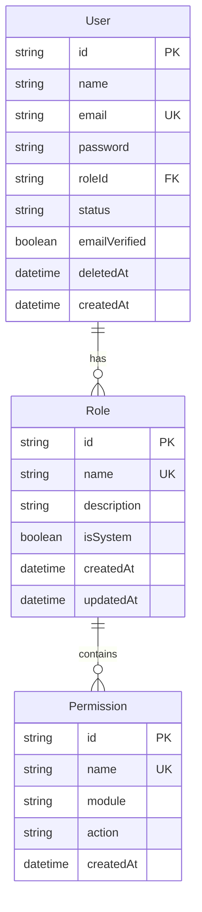
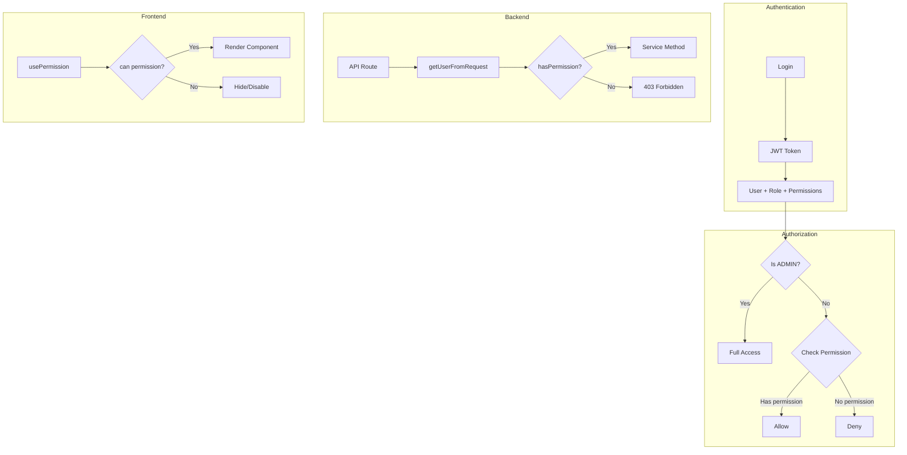
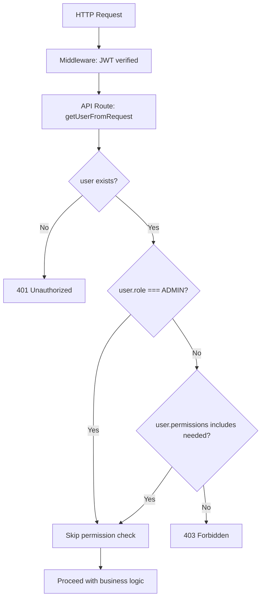
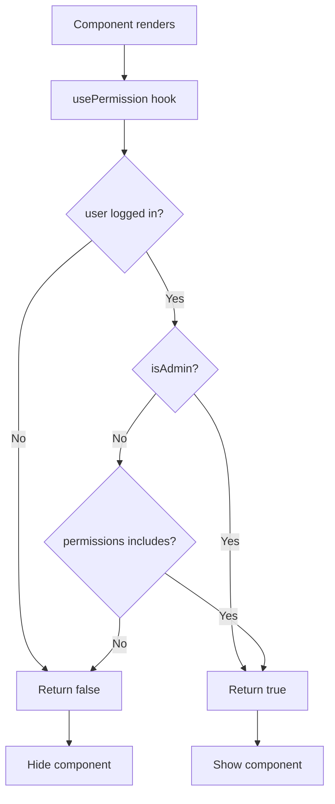

# 08 — Permission System

> Complete documentation of the TASKILY CMS Role-Based Access Control (RBAC) system,
> permission naming conventions, backend/frontend authorization, and extension guide.

---

## Table of Contents

- [Permission Philosophy](#permission-philosophy)
- [System Overview](#system-overview)
- [Database Relationships](#database-relationships)
- [Permission Naming Convention](#permission-naming-convention)
- [Complete Permission List](#complete-permission-list)
- [Default Roles](#default-roles)
- [Role Permission Matrix](#role-permission-matrix)
- [Backend Authorization](#backend-authorization)
- [Frontend Authorization](#frontend-authorization)
- [Adding a New Permission](#adding-a-new-permission)
- [Adding a New Role](#adding-a-new-role)
- [Protecting API Routes](#protecting-api-routes)
- [Protecting Frontend Pages](#protecting-frontend-pages)
- [Protecting Buttons & Actions](#protecting-buttons--actions)
- [System Role Protection](#system-role-protection)
- [Audit Permissions](#audit-permissions)
- [Best Practices](#best-practices)
- [Diagrams](#diagrams)

---

## Permission Philosophy

TASKILY implements a fine-grained **Role-Based Access Control (RBAC)** system with the following principles:

1. **Principle of least privilege** — Users receive only the permissions they need.
2. **Module-action granularity** — Each permission maps to a specific module and action.
3. **Role-based grouping** — Permissions are grouped into roles for easier management.
4. **Backend + frontend enforcement** — Permissions are checked in both API routes and UI components.
5. **ADMIN bypass** — The ADMIN role has implicit access to everything without explicit permission checks.
6. **System role immutability** — Default roles (ADMIN, EDITOR, AUTHOR, VIEWER) cannot be modified or deleted.

---

## System Overview



### Key Characteristics

| Characteristic | Detail |
|---|---|
| Relationship type | Many-to-many (Role ↔ Permission) via implicit join table |
| Permission format | `module.action` (e.g., `projects.create`) |
| Total permissions | 62 |
| Total default roles | 4 (ADMIN, EDITOR, AUTHOR, VIEWER) |
| All roles are system roles | Yes (`isSystem: true`) |
| ADMIN bypass | Yes — ADMIN users skip all permission checks |

---

## Database Relationships

```
User ──(many-to-one)──> Role ──(many-to-many)──> Permission
```

### Schema (Prisma)

```prisma
model Role {
  id          String       @id @default(uuid())
  name        String       @unique
  description String?
  isSystem    Boolean      @default(false)
  permissions Permission[]
  users       User[]
  createdAt   DateTime     @default(now())
  updatedAt   DateTime     @updatedAt
}

model Permission {
  id        String   @id @default(uuid())
  name      String   @unique  // e.g., "projects.create"
  module    String             // e.g., "projects"
  action    String             // e.g., "create"
  roles     Role[]
  createdAt DateTime @default(now())
}

model User {
  id       String  @id @default(uuid())
  name     String
  email    String  @unique
  password String
  roleId   String
  role     Role    @relation(fields: [roleId], references: [id])
  // ...
}
```

### Implicit Many-to-Many

Prisma uses an implicit many-to-many join table between `Role` and `Permission`. This means:

- No explicit join model required
- Prisma handles the join table automatically
- Permission assignment uses `{ set: [...] }` for full replacement

---

## Permission Naming Convention

All permissions follow the `module.action` pattern:

```
<module>.<action>
```

### Module Names

| Module | Description |
|---|---|
| `dashboard` | Dashboard access |
| `projects` | Project management |
| `project-categories` | Project category management |
| `blogs` | Blog management |
| `blog-categories` | Blog category management |
| `media` | Media library |
| `users` | User management |
| `roles` | Role management |
| `settings` | System settings |
| `notifications` | Notification management |
| `audit` | Audit log viewing |

### Action Names

| Action | Description |
|---|---|
| `read` | View/list items |
| `create` | Create new items |
| `update` | Modify existing items |
| `delete` | Soft delete items |
| `publish` | Change status to PUBLISHED |
| `manage` | Full management (users, roles) |
| `clone` | Duplicate items (roles) |
| `restore` | Restore soft-deleted items |
| `view` | View-only access (audit) |
| `export` | Export data (audit) |
| `maintenance` | Toggle maintenance mode |
| `system-info` | View system information |

---

## Complete Permission List

### Dashboard

| Permission | Module | Action | Description |
|---|---|---|---|
| `dashboard.read` | dashboard | read | View dashboard statistics and overview |

### Projects

| Permission | Module | Action | Description |
|---|---|---|---|
| `projects.create` | projects | create | Create new projects |
| `projects.read` | projects | read | View project list and details |
| `projects.update` | projects | update | Edit project details, images, categories |
| `projects.delete` | projects | delete | Soft delete / restore projects |
| `projects.publish` | projects | publish | Publish / unpublish projects |

### Project Categories

| Permission | Module | Action | Description |
|---|---|---|---|
| `project-categories.create` | project-categories | create | Create new project categories |
| `project-categories.read` | project-categories | read | View project categories |
| `project-categories.update` | project-categories | update | Edit project categories |
| `project-categories.delete` | project-categories | delete | Delete project categories |

### Blogs

| Permission | Module | Action | Description |
|---|---|---|---|
| `blogs.create` | blogs | create | Create new blog posts |
| `blogs.read` | blogs | read | View blog list and details |
| `blogs.update` | blogs | update | Edit blog posts |
| `blogs.delete` | blogs | delete | Soft delete / restore blogs |
| `blogs.publish` | blogs | publish | Publish / unpublish blogs |

### Blog Categories

| Permission | Module | Action | Description |
|---|---|---|---|
| `blog-categories.create` | blog-categories | create | Create new blog categories |
| `blog-categories.read` | blog-categories | read | View blog categories |
| `blog-categories.update` | blog-categories | update | Edit blog categories |
| `blog-categories.delete` | blog-categories | delete | Delete blog categories |

### Media

| Permission | Module | Action | Description |
|---|---|---|---|
| `media.create` | media | create | Upload new media files |
| `media.read` | media | read | View media library |
| `media.update` | media | update | Edit media metadata |
| `media.delete` | media | delete | Soft delete media files |
| `media.restore` | media | restore | Restore soft-deleted media |

### Users

| Permission | Module | Action | Description |
|---|---|---|---|
| `users.create` | users | create | Create new user accounts |
| `users.read` | users | read | View user list and profiles |
| `users.update` | users | update | Edit user details |
| `users.delete` | users | delete | Soft delete users |
| `users.restore` | users | restore | Restore soft-deleted users |
| `users.manage` | users | manage | Change status, admin password reset, force password change |

### Roles

| Permission | Module | Action | Description |
|---|---|---|---|
| `roles.create` | roles | create | Create new roles |
| `roles.read` | roles | read | View roles and permissions |
| `roles.update` | roles | update | Edit role details and permissions |
| `roles.delete` | roles | delete | Delete custom roles |
| `roles.clone` | roles | clone | Duplicate existing roles |
| `roles.manage` | roles | manage | Full role management |

### Settings

| Permission | Module | Action | Description |
|---|---|---|---|
| `settings.read` | settings | read | View system settings |
| `settings.update` | settings | update | Modify system settings |
| `settings.maintenance` | settings | maintenance | Toggle maintenance mode |
| `settings.system-info` | settings | system-info | View system information |

### Notifications

| Permission | Module | Action | Description |
|---|---|---|---|
| `notifications.read` | notifications | read | View own notifications |
| `notifications.manage` | notifications | manage | Manage notification settings |
| `notifications.delete` | notifications | delete | Delete notifications |

### Audit Log

| Permission | Module | Action | Description |
|---|---|---|---|
| `audit.view` | audit | view | View audit log entries |
| `audit.export` | audit | export | Export audit log data |

> **Important:** The audit module uses `audit.view` and `audit.export` — NOT `audit.read`.

---

## Default Roles

### ADMIN

| Property | Value |
|---|---|
| Description | Full system access |
| System Role | Yes |
| Permissions | All 62 permissions |
| Bypass | Yes — ADMIN role bypasses all permission checks |

### EDITOR

| Property | Value |
|---|---|
| Description | Can manage all content |
| System Role | Yes |
| Permissions | All except: `roles.*`, `users.manage`, `users.restore`, `users.delete`, `settings.maintenance`, `audit.view`, `audit.export` |

**EDITOR has:**
- All project permissions (create, read, update, delete, publish)
- All blog permissions
- All media permissions
- User read/update/create (but not delete, restore, or manage)
- Settings read/update (but not maintenance)
- Notification permissions
- Project and blog category permissions

**EDITOR does NOT have:**
- `roles.*` (any role management)
- `users.delete`, `users.restore`, `users.manage`
- `settings.maintenance`
- `audit.view`, `audit.export`

### AUTHOR

| Property | Value |
|---|---|
| Description | Can create and edit own content |
| System Role | Yes |
| Permissions | 14 permissions (see list below) |

**AUTHOR permissions:**
```
dashboard.read
projects.create, projects.read, projects.update
blogs.create, blogs.read, blogs.update
media.create, media.read, media.update
project-categories.read
blog-categories.read
settings.read
notifications.read
```

### VIEWER

| Property | Value |
|---|---|
| Description | Read-only access |
| System Role | Yes |
| Permissions | 8 permissions (see list below) |

**VIEWER permissions:**
```
dashboard.read
projects.read
blogs.read
media.read
project-categories.read
blog-categories.read
settings.read
notifications.read
```

---

## Role Permission Matrix

| Permission | ADMIN | EDITOR | AUTHOR | VIEWER |
|---|:---:|:---:|:---:|:---:|
| `dashboard.read` | ✅ | ✅ | ✅ | ✅ |
| `projects.create` | ✅ | ✅ | ✅ | ❌ |
| `projects.read` | ✅ | ✅ | ✅ | ✅ |
| `projects.update` | ✅ | ✅ | ✅ | ❌ |
| `projects.delete` | ✅ | ✅ | ❌ | ❌ |
| `projects.publish` | ✅ | ✅ | ❌ | ❌ |
| `project-categories.create` | ✅ | ✅ | ❌ | ❌ |
| `project-categories.read` | ✅ | ✅ | ✅ | ✅ |
| `project-categories.update` | ✅ | ✅ | ❌ | ❌ |
| `project-categories.delete` | ✅ | ✅ | ❌ | ❌ |
| `blogs.create` | ✅ | ✅ | ✅ | ❌ |
| `blogs.read` | ✅ | ✅ | ✅ | ✅ |
| `blogs.update` | ✅ | ✅ | ✅ | ❌ |
| `blogs.delete` | ✅ | ✅ | ❌ | ❌ |
| `blogs.publish` | ✅ | ✅ | ❌ | ❌ |
| `blog-categories.create` | ✅ | ✅ | ❌ | ❌ |
| `blog-categories.read` | ✅ | ✅ | ✅ | ✅ |
| `blog-categories.update` | ✅ | ✅ | ❌ | ❌ |
| `blog-categories.delete` | ✅ | ✅ | ❌ | ❌ |
| `media.create` | ✅ | ✅ | ✅ | ❌ |
| `media.read` | ✅ | ✅ | ✅ | ✅ |
| `media.update` | ✅ | ✅ | ✅ | ❌ |
| `media.delete` | ✅ | ✅ | ❌ | ❌ |
| `media.restore` | ✅ | ✅ | ❌ | ❌ |
| `users.create` | ✅ | ✅ | ❌ | ❌ |
| `users.read` | ✅ | ✅ | ❌ | ❌ |
| `users.update` | ✅ | ✅ | ❌ | ❌ |
| `users.delete` | ✅ | ❌ | ❌ | ❌ |
| `users.restore` | ✅ | ❌ | ❌ | ❌ |
| `users.manage` | ✅ | ❌ | ❌ | ❌ |
| `roles.create` | ✅ | ❌ | ❌ | ❌ |
| `roles.read` | ✅ | ❌ | ❌ | ❌ |
| `roles.update` | ✅ | ❌ | ❌ | ❌ |
| `roles.delete` | ✅ | ❌ | ❌ | ❌ |
| `roles.clone` | ✅ | ❌ | ❌ | ❌ |
| `roles.manage` | ✅ | ❌ | ❌ | ❌ |
| `settings.read` | ✅ | ✅ | ✅ | ✅ |
| `settings.update` | ✅ | ✅ | ❌ | ❌ |
| `settings.maintenance` | ✅ | ❌ | ❌ | ❌ |
| `settings.system-info` | ✅ | ✅ | ❌ | ❌ |
| `notifications.read` | ✅ | ✅ | ✅ | ✅ |
| `notifications.manage` | ✅ | ✅ | ❌ | ❌ |
| `notifications.delete` | ✅ | ✅ | ❌ | ❌ |
| `audit.view` | ✅ | ❌ | ❌ | ❌ |
| `audit.export` | ✅ | ❌ | ❌ | ❌ |

---

## Backend Authorization

### Permission Check Function

**File:** `lib/api.js` (conceptual — checks done inline in API routes)

```js
// In API routes, permission checks use hasPermission(user, 'module.action')
const user = getUserFromRequest(req);
if (!hasPermission(user, 'projects.create')) {
  return forbiddenResponse(res, 'Insufficient permissions');
}
```

### How Backend Checks Work

1. **Middleware** verifies JWT token is valid (Edge Runtime)
2. **API route** calls `getUserFromRequest(req)` to decode the JWT
3. **API route** checks `user.role` or `user.permissions` array
4. **ADMIN role** bypasses all checks

### Service-Level Checks

Some services add additional checks:

```js
// GlobalSearchService — permission-aware search
static async searchProjects(query, user) {
  if (!user.permissions?.includes('projects.read') && user.roleName !== 'ADMIN') {
    return [];  // Return empty if no permission
  }
  // ... perform search
}
```

### Metadata for Audit

```js
const metadata = extractRequestMetadata(req, user.userId);
// { actorId: 'uuid', ipAddress: '192.168.1.1', userAgent: 'Mozilla/...' }
```

This metadata is passed to service methods and included in event payloads for audit logging.

---

## Frontend Authorization

### `usePermission` Hook

**File:** `hooks/usePermission.js`

```js
import { useAuth } from '@/contexts/AuthContext';

export function usePermission() {
  const { user, hasPermission, hasAnyPermission, isAdmin } = useAuth();

  const can = useCallback((permission) => {
    if (!user) return false;
    if (isAdmin()) return true;       // ADMIN bypass
    return hasPermission(permission);
  }, [user, isAdmin, hasPermission]);

  const canAny = useCallback((permissions) => {
    if (!user) return false;
    if (isAdmin()) return true;
    return hasAnyPermission(permissions);
  }, [user, isAdmin, hasAnyPermission]);

  const canAll = useCallback((permissions) => {
    if (!user) return false;
    if (isAdmin()) return true;
    return permissions.every((p) => user.permissions?.includes(p));
  }, [user, isAdmin]);

  const cannot = useCallback((permission) => !can(permission), [can]);

  const role = user?.role?.name || null;

  return { can, canAny, canAll, cannot, role, isAdmin: isAdmin() };
}
```

### Hook API

| Method | Signature | Description |
|---|---|---|
| `can` | `(permission: string) => boolean` | Check if user has a specific permission |
| `canAny` | `(permissions: string[]) => boolean` | Check if user has ANY of the given permissions |
| `canAll` | `(permissions: string[]) => boolean` | Check if user has ALL of the given permissions |
| `cannot` | `(permission: string) => boolean` | Inverse of `can` |
| `role` | `string \| null` | Current user's role name |
| `isAdmin` | `boolean` | Whether current user is ADMIN |

### Usage Examples

```jsx
import { usePermission } from '@/hooks/usePermission';

function ProjectActions() {
  const { can, cannot } = usePermission();

  return (
    <div>
      {can('projects.create') && (
        <button>Create Project</button>
      )}

      {can('projects.delete') && (
        <button>Delete Project</button>
      )}

      {cannot('projects.publish') && (
        <span>Ask an editor to publish</span>
      )}
    </div>
  );
}
```

### Conditional Rendering Patterns

```jsx
// Single permission check
{can('projects.create') && <Button>Create</Button>}

// Multiple permission check (any)
{canAny(['projects.delete', 'projects.publish']) && <ActionMenu />}

// Role-based check
{role === 'ADMIN' && <AdminPanel />}

// Negative check
{cannot('users.manage') && <AccessDenied />}
```

---

## Adding a New Permission

### Step 1: Define the Permission

Add to `prisma/seed.js`:

```js
const PERMISSIONS = [
  // ... existing permissions
  { name: 'projects.archive', module: 'projects', action: 'archive' },
];
```

### Step 2: Assign to Roles

Update the role assignments in the seed file:

```js
// ADMIN gets all permissions automatically
// EDITOR gets it:
const editorPermNames = PERMISSIONS.filter(p =>
  // ... existing filters
  p.name !== 'projects.archive'  // or include it
).map(p => p.name);
```

### Step 3: Run the Seed

```bash
npx prisma db seed
```

### Step 4: Use in API Routes

```js
// pages/api/projects/archive.js
import { hasPermission } from '@/lib/api';

export default async function handler(req, res) {
  const user = getUserFromRequest(req);
  if (!hasPermission(user, 'projects.archive')) {
    return forbiddenResponse(res);
  }
  // ...
}
```

### Step 5: Use in Frontend

```jsx
const { can } = usePermission();
{can('projects.archive') && <ArchiveButton />}
```

---

## Adding a New Role

### Step 1: Define the Role

```js
const ROLES = [
  // ... existing roles
  { name: 'MODERATOR', description: 'Can moderate content and manage media', isSystem: false },
];
```

> **Note:** Set `isSystem: false` for custom roles to allow editing and deletion.

### Step 2: Assign Permissions

```js
const moderatorPermNames = [
  'dashboard.read',
  'projects.read', 'projects.update',
  'blogs.read', 'blogs.update',
  'media.create', 'media.read', 'media.update', 'media.delete',
  'notifications.read',
];

await prisma.role.update({
  where: { id: roleMap['MODERATOR'] },
  data: {
    permissions: {
      set: moderatorPermNames.map(name => ({ id: permissionMap[name] })),
    },
  },
});
```

### Step 3: Run the Seed

```bash
npx prisma db seed
```

> **Note:** If the role already exists, `upsert` will skip creation but the permission assignment will be updated.

---

## Protecting API Routes

### Standard Pattern

```js
import { getUserFromRequest, successResponse, forbiddenResponse, methodNotAllowed } from '@/lib/api';
import { hasPermission } from '@/lib/utils'; // or inline check

export default async function handler(req, res) {
  if (req.method !== 'POST') return methodNotAllowed(res);

  const user = getUserFromRequest(req);
  if (!user) return unauthorizedResponse(res);

  if (!hasPermission(user, 'projects.create')) {
    return forbiddenResponse(res, 'Insufficient permissions');
  }

  // ... proceed with business logic
}
```

### Permission Mapping by Endpoint

| Endpoint | Method | Required Permission |
|---|---|---|
| `POST /api/projects` | POST | `projects.create` |
| `GET /api/projects` | GET | `projects.read` |
| `PUT /api/projects/[id]` | PUT | `projects.update` |
| `DELETE /api/projects/[id]` | DELETE | `projects.delete` |
| `POST /api/projects/bulk` (publish) | POST | `projects.publish` |
| `POST /api/projects/bulk` (delete) | POST | `projects.delete` |

---

## Protecting Frontend Pages

### Route-Level Protection

```jsx
// pages/dashboard/projects.jsx
import { usePermission } from '@/hooks/usePermission';
import { useRouter } from 'next/router';
import { useEffect } from 'react';

export default function ProjectsPage() {
  const { can } = usePermission();
  const router = useRouter();

  useEffect(() => {
    if (!can('projects.read')) {
      router.push('/dashboard');
    }
  }, [can, router]);

  if (!can('projects.read')) return null;

  return <div>Projects content</div>;
}
```

---

## Protecting Buttons & Actions

### Component-Level Protection

```jsx
import { usePermission } from '@/hooks/usePermission';

function ProjectCard({ project }) {
  const { can } = usePermission();

  return (
    <div>
      <h3>{project.title}</h3>

      {can('projects.update') && (
        <button onClick={() => edit(project.id)}>Edit</button>
      )}

      {can('projects.delete') && (
        <button onClick={() => deleteProject(project.id)}>Delete</button>
      )}

      {can('projects.publish') && project.status === 'DRAFT' && (
        <button onClick={() => publish(project.id)}>Publish</button>
      )}
    </div>
  );
}
```

---

## System Role Protection

System roles (`isSystem: true`) cannot be modified or deleted.

### In RoleService

```js
// RoleService.update()
if (role.isSystem) {
  throw new Error('Cannot modify system roles');
}

// RoleService.delete()
if (role.isSystem) {
  throw new Error('Cannot delete system roles');
}
```

### In RoleService.delete()

```js
// Cannot delete roles with assigned users
if (role._count.users > 0) {
  throw new Error('Cannot delete role with assigned users');
}
```

---

## Audit Permissions

The audit module uses **unique permission names**:

| Permission | Module | Action | Description |
|---|---|---|---|
| `audit.view` | audit | view | View audit log entries |
| `audit.export` | audit | export | Export audit log data |

> **Note:** These are NOT `audit.read` and `audit.export`. The naming convention was intentionally chosen to distinguish read-only viewing from full data export.

---

## Best Practices

### Do

- **Always check permissions in API routes** — Never rely on frontend-only checks
- **Use the `usePermission` hook** — Consistent permission checking in React
- **Use `can()` for single permissions** — Simple, readable
- **Use `canAny()` for multiple alternatives** — "Can do A OR B"
- **Use `canAll()` for multiple requirements** — "Must have A AND B"
- **Assign minimum required permissions** — Follow least privilege
- **Use system roles as templates** — Clone them for custom roles

### Don't

- **Don't skip backend permission checks** — Frontend can be bypassed
- **Don't hardcode role names in permission checks** — Use `module.action` strings
- **Don't modify system roles** — Clone them instead
- **Don't create overly broad permissions** — Prefer fine-grained control
- **Don't assume ADMIN** — Always check permissions; ADMIN bypass handles it

---

## Diagrams

### RBAC Architecture



### Permission Check Flow (API)



### Permission Check Flow (Frontend)



---

## See Also

- [07 — Authentication](./07-authentication.md) — JWT and session management
- [06 — API Reference](./06-api-reference.md) — Permission requirements per endpoint
- [09 — Services](./09-services.md) — Service-level authorization
- [10 — Event System](./10-event-system.md) — Audit logging of permission changes
