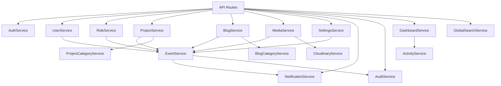
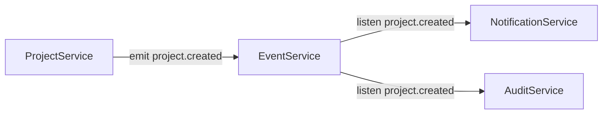
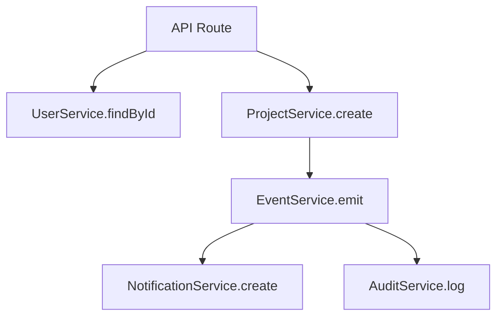
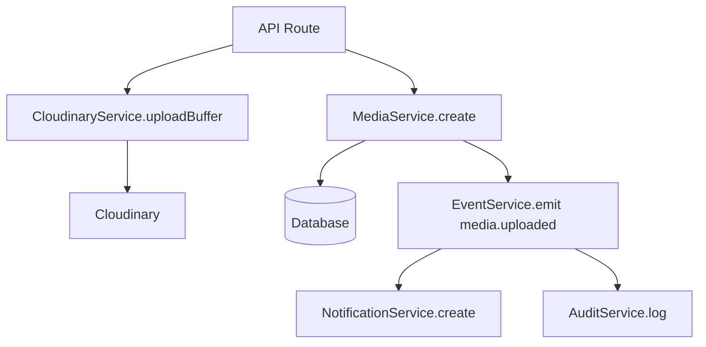

# 09 — Services

> Complete reference for every service in the TASKILY CMS service layer.
> Services contain all business logic; API routes are thin controllers that delegate to them.

---

## Table of Contents

- [Service Architecture](#service-architecture)
- [Service Registry](#service-registry)
- [AuthService](#authservice)
- [UserService](#userservice)
- [RoleService](#roleservice)
- [ProjectService](#projectservice)
- [ProjectCategoryService](#projectcategoryservice)
- [BlogService](#blogservice)
- [BlogCategoryService](#blogcategoryservice)
- [MediaService](#mediaservice)
- [CloudinaryService](#cloudinaryservice)
- [SettingsService](#settingsservice)
- [NotificationService](#notificationservice)
- [AuditService](#auditservice)
- [DashboardService](#dashboardservice)
- [ActivityService](#activityservice)
- [GlobalSearchService](#globalsearchservice)
- [EventService](#eventservice)
- [Service Interactions](#service-interactions)

---

## Service Architecture

### Design Principles

1. **Static methods only** — All services use `static` methods; no instantiation required.
2. **Thin controllers** — API routes handle HTTP concerns; services handle business logic.
3. **Event-driven** — Services emit events via `EventService` for audit logging and notifications.
4. **Fire-and-forget** — Event emissions use `.catch(EventService.logError)` to never block the response.
5. **Error throwing** — Services throw `Error` objects with descriptive messages; they don't return error responses.
6. **Metadata passing** — Services accept a `metadata` parameter for audit logging (actorId, ipAddress, userAgent).

### Service Pattern

```js
class ExampleService {
  static async findAll({ page, perPage, search, ... }) {
    // 1. Build Prisma where clause
    // 2. Execute query with pagination
    // 3. Return { items, total }
  }

  static async findById(id) {
    // 1. Find record
    // 2. Throw if not found
    // 3. Return record
  }

  static async create(data, metadata = {}) {
    // 1. Validate business rules
    // 2. Create record via Prisma
    // 3. Emit event via EventService
    // 4. Return created record
  }

  static async update(id, data, metadata = {}) {
    // 1. Find existing record
    // 2. Validate business rules
    // 3. Update record via Prisma
    // 4. Emit event
    // 5. Return updated record
  }

  static async delete(id, metadata = {}) {
    // 1. Find record
    // 2. Soft delete (set deletedAt)
    // 3. Emit event
    // 4. Return confirmation
  }
}
```

---

## Service Registry

**File:** `lib/services/index.js`

```js
export { AuthService } from './AuthService';
export { UserService } from './UserService';
export { RoleService } from './RoleService';
export { SettingsService } from './SettingsService';
export { ActivityService } from './ActivityService';
export { CloudinaryService } from './CloudinaryService';
export { DashboardService } from './DashboardService';
export { ProjectService } from './ProjectService';
export { ProjectCategoryService } from './ProjectCategoryService';
export { BlogService } from './BlogService';
export { BlogCategoryService } from './BlogCategoryService';
export { MediaService } from './MediaService';
export { GlobalSearchService } from './GlobalSearchService';
export { EventService } from './EventService';
export { NotificationService } from './NotificationService';
export { AuditService } from './AuditService';
```

### Service Dependency Map



---

## AuthService

**File:** `lib/services/AuthService.js`
**Dependencies:** `prisma`, `lib/password.js`, `lib/auth.js`, `lib/utils.js`
**Events emitted:** None (login sets cookies directly)

### Responsibilities

- User registration with default role assignment
- Login with password verification and JWT generation
- Current user profile retrieval
- Password reset token generation and validation
- Email verification

### Methods

| Method | Parameters | Returns | Throws |
|---|---|---|---|
| `register` | `{ name, email, password }` | `{ user, token }` | `Email already registered`, `Default role not found` |
| `login` | `{ email, password }` | `{ user, token }` | `Invalid email or password` |
| `getMe` | `userId` | `user object with permissions` | `User not found` |
| `generateResetToken` | `email` | `{ message }` | Never throws |
| `resetPassword` | `{ token, password }` | `{ message }` | `Invalid or expired reset token` |
| `verifyEmail` | `token` | `{ message }` | `Invalid verification token` |

### Login Behavior

- Checks: user exists, not soft-deleted, status is `ACTIVE`, password matches
- All failure cases return the same generic error message (prevents user enumeration)
- Updates `lastLoginAt` on successful login
- Returns `user` with flattened `permissions` array and `token`

### Registration Behavior

- Assigns default `VIEWER` role
- Generates email verification token
- Hashes password with bcrypt (12 salt rounds)

---

## UserService

**File:** `lib/services/UserService.js`
**Dependencies:** `prisma`, `lib/password.js`, `EventService`
**Events emitted:** `user.created`, `user.updated`, `user.deleted`, `user.restored`, `user.status_changed`

### Responsibilities

- CRUD operations for user accounts
- Password management (admin reset, force change, self change)
- User status management (activate, deactivate, suspend)
- User statistics

### Methods

| Method | Parameters | Returns | Events |
|---|---|---|---|
| `findAll` | `{ page, perPage, search, status, roleId, sort, order }` | `{ users, total }` | None |
| `findById` | `id` | `user with permissions` | None (throws if not found) |
| `create` | `{ name, email, password, roleId, ... }, metadata` | `user` | `user.created` |
| `update` | `id, data, metadata` | `user` | `user.updated` |
| `delete` | `id, metadata` | `{ message }` | `user.deleted` |
| `restore` | `id, metadata` | `{ message }` | `user.restored` |
| `updateStatus` | `id, status, metadata` | `{ message }` | `user.status_changed` |
| `adminResetPassword` | `id, { newPassword }` | `{ message }` | None |
| `forcePasswordChange` | `id, enabled` | `{ message }` | None |
| `changePassword` | `id, { currentPassword, newPassword }` | `{ message }` | None |
| `getStats` | — | `stats object` | None |
| `getRecentUsers` | `limit` | `users[]` | None |
| `findByEmail` | `email` | `user or null` | None |

> **Important:** `findById()` throws `Error('User not found')` — it does NOT return null.

### Validation

- Email uniqueness checked on create and update
- Role existence checked before assignment
- Password hashed with bcrypt before storage

---

## RoleService

**File:** `lib/services/RoleService.js`
**Dependencies:** `prisma`, `EventService`
**Events emitted:** `role.created`, `role.updated`, `role.deleted`, `role.cloned`

### Responsibilities

- CRUD operations for roles
- Permission assignment
- Role cloning
- System role protection

### Methods

| Method | Parameters | Returns | Events |
|---|---|---|---|
| `findAll` | — | `roles[]` (with permissions + user count) | None |
| `findById` | `id` | `role with permissions` | None (throws if not found) |
| `create` | `{ name, description, permissionIds }, metadata` | `role` | `role.created` |
| `update` | `id, { name, description, permissionIds }, metadata` | `role` | `role.updated` |
| `delete` | `id, metadata` | `{ message }` | `role.deleted` |
| `clone` | `id, { name }, metadata` | `cloned role` | `role.cloned` |
| `getStats` | — | `role stats[]` | None |
| `getAllPermissions` | — | `permissions[]` | None |
| `getPermissionsByModule` | — | `{ module: permissions[] }` | None |

### Business Rules

- Role names automatically uppercased
- System roles (`isSystem: true`) cannot be modified or deleted
- Cannot delete roles with assigned users
- Clone creates a new non-system role with the same permissions

---

## ProjectService

**File:** `lib/services/ProjectService.js`
**Dependencies:** `prisma`, `lib/utils.js` (slugify), `EventService`
**Events emitted:** `project.created`, `project.updated`, `project.deleted`, `project.restored`, `project.published`, `project.bulk_action`, `project.permanently_deleted`

### Responsibilities

- Full CRUD for projects
- Image management (add, remove, reorder, set cover)
- Category assignment
- Slug generation with uniqueness
- Bulk operations
- Trash/restore/permanent delete

### Methods

| Method | Parameters | Returns | Events |
|---|---|---|---|
| `findAll` | `{ page, perPage, search, status, featured, categoryId, year, sort, order }` | `{ projects, total }` | None |
| `findById` | `id` | `project with relations` | None (throws if not found) |
| `findByIdOrThrow` | `id` | `project (minimal)` | None |
| `findBySlug` | `slug` | `project with relations` | None |
| `create` | `{ ...fields, authorId, categoryIds, images }, metadata` | `project` | `project.created` |
| `update` | `id, data, metadata` | `project` | `project.updated`, optionally `project.published` |
| `delete` | `id, metadata` | `{ message, title }` | `project.deleted` |
| `restore` | `id, metadata` | `project` | `project.restored` |
| `permanentDelete` | `id, metadata` | `{ message, title }` | `project.permanently_deleted` |
| `findDeleted` | `{ page, perPage, search, sort, order }` | `{ projects, total }` | None |
| `bulkAction` | `{ ids, action }, metadata` | `{ message, count }` | `project.bulk_action` |
| `publish` | `id` | `project` | `project.published` |
| `unpublish` | `id` | `project` | None |
| `setFeatured` | `id, featured` | `project` | None |
| `getStats` | — | `stats` | None |
| `addImage` | `projectId, imageData` | `image` | None |
| `removeImage` | `imageId, projectId` | `{ message }` | None |
| `reorderImages` | `projectId, imageIds[]` | `{ message }` | None |
| `setCoverImage` | `projectId, imageId` | `project` | None |

### Bulk Actions

| Action | Effect |
|---|---|
| `publish` | Set status to PUBLISHED, set publishedAt |
| `unpublish` | Set status to DRAFT, clear publishedAt |
| `delete` | Soft delete |
| `restore` | Restore from trash |
| `permanentDelete` | Permanently remove with all images |
| `feature` | Set featured: true |
| `unfeature` | Set featured: false |

### Slug Generation

```js
static async generateUniqueSlug(title, excludeId = null) {
  let slug = slugify(title);
  // Check uniqueness, append -2, -3, etc. if needed
}
```

---

## ProjectCategoryService

**File:** `lib/services/ProjectCategoryService.js`
**Dependencies:** `prisma`, `lib/utils.js` (slugify)
**Events emitted:** None

### Methods

| Method | Parameters | Returns |
|---|---|---|
| `findAll` | `{ includeDeleted }` | `categories[]` with project counts |
| `findById` | `id, { includeDeleted }` | `category` (throws if not found) |
| `findBySlug` | `slug` | `category` (throws if not found) |
| `create` | `{ name, description }` | `category` |
| `update` | `id, { name, description }` | `category` |
| `delete` | `id` | `{ message }` (throws if assigned to active projects) |
| `restore` | `id` | `category` (throws if name conflict) |
| `search` | `query` | `categories[]` |
| `generateUniqueSlug` | `name, excludeId` | `slug string` |

### Delete Constraint

Cannot delete a category that is assigned to any active (non-deleted) project. The error message includes the count:

```
Category 'Commercial' is assigned to 5 projects and cannot be deleted.
```

---

## BlogService

**File:** `lib/services/BlogService.js`
**Dependencies:** `prisma`, `lib/utils.js` (slugify), `EventService`
**Events emitted:** `blog.created`, `blog.updated`, `blog.deleted`, `blog.restored`, `blog.published`, `blog.bulk_action`, `blog.permanently_deleted`

### Responsibilities

- Full CRUD for blog posts
- Image management (add, remove, reorder, set cover)
- Category assignment
- Custom slug support (optional user-provided slug)
- Bulk operations

### Methods

| Method | Parameters | Returns | Events |
|---|---|---|---|
| `findAll` | `{ page, perPage, search, status, featured, categoryId, sort, order }` | `{ blogs, total }` | None |
| `findById` | `id` | `blog with relations` | None |
| `findBySlug` | `slug` | `blog with relations` | None |
| `create` | `{ title, slug, excerpt, content, ... }, metadata` | `blog` | `blog.created` |
| `update` | `id, data, metadata` | `blog` | `blog.updated`, optionally `blog.published` |
| `delete` | `id, metadata` | `{ message, title }` | `blog.deleted` |
| `restore` | `id, metadata` | `blog` | `blog.restored` |
| `permanentDelete` | `id, metadata` | `{ message, title }` | `blog.permanently_deleted` |
| `bulkAction` | `{ ids, action }, metadata` | `{ message, count }` | `blog.bulk_action` |
| `addImage` | `blogId, imageData` | `image` | None |
| `removeImage` | `imageId, blogId` | `{ message }` | None |
| `reorderImages` | `blogId, imageIds[]` | `{ message }` | None |
| `setCoverImage` | `blogId, imageId` | `blog` | None |

### Custom Slug Support

Unlike Projects, Blogs allow a user-provided slug:

```js
const slug = customSlug || await this.generateUniqueSlug(title);
```

If no slug is provided, it's auto-generated from the title.

---

## BlogCategoryService

**File:** `lib/services/BlogCategoryService.js`
**Dependencies:** `prisma`, `lib/utils.js` (slugify)
**Events emitted:** None

Identical structure to `ProjectCategoryService` but for blog categories.

### Methods

| Method | Parameters | Returns |
|---|---|---|
| `findAll` | `{ includeDeleted }` | `categories[]` with blog counts |
| `findById` | `id, { includeDeleted }` | `category` |
| `findBySlug` | `slug` | `category` |
| `create` | `{ name, description }` | `category` |
| `update` | `id, { name, description }` | `category` |
| `delete` | `id` | `{ message }` (throws if assigned to active blogs) |
| `restore` | `id` | `category` |
| `search` | `query` | `categories[]` |

---

## MediaService

**File:** `lib/services/MediaService.js`
**Dependencies:** `prisma`, `EventService`
**Events emitted:** `media.uploaded`, `media.updated`, `media.deleted`, `media.bulk_action`

### Responsibilities

- CRUD for media library records
- Folder management
- Format statistics
- Usage tracking (where a media file is referenced)
- Bulk operations

### Methods

| Method | Parameters | Returns | Events |
|---|---|---|---|
| `findAll` | `{ page, perPage, search, format, folder, sort, order, includeDeleted }` | `{ media, total }` | None |
| `findById` | `id` | `media with uploader` | None |
| `findByIdOrThrow` | `id` | `media (minimal)` | None |
| `create` | `{ fileName, url, format, ... }, metadata` | `media` | `media.uploaded` |
| `update` | `id, data, metadata` | `media` | `media.updated` |
| `delete` | `id, metadata` | `{ message }` | `media.deleted` |
| `restore` | `id` | `media` | None |
| `getStats` | — | `stats` | None |
| `getFolders` | — | `folders[]` | None |
| `getFormats` | — | `formats[]` | None |
| `bulkAction` | `{ ids, action, folder, metadata }, metadata` | `{ message, count }` | `media.bulk_action` |
| `getUsedIn` | `mediaId` | `usages[]` | None |
| `findByPublicId` | `publicId` | `media` | None |

### Usage Tracking

`getUsedIn(mediaId)` checks across:
- `ProjectImage` (gallery images)
- `BlogImage` (gallery images)
- `Project.coverImage`
- `Blog.coverImage`

Returns array of `{ type, id, title, field }` objects.

### Bulk Actions

| Action | Parameters | Effect |
|---|---|---|
| `delete` | — | Soft delete |
| `restore` | — | Restore from trash |
| `move` | `folder` | Move to different folder |
| `updateAltText` | `metadata.altText` | Update alt text |
| `updateCaption` | `metadata.caption` | Update caption |

---

## CloudinaryService

**File:** `lib/services/CloudinaryService.js`
**Dependencies:** `cloudinary` (v2 SDK)
**Events emitted:** None

### Responsibilities

- File upload to Cloudinary (URL, buffer, or stream)
- File replacement
- Single and bulk deletion
- Metadata retrieval
- Image transformation (thumbnails, responsive)

### Methods

| Method | Parameters | Returns |
|---|---|---|
| `upload` | `file, { folder, filename, transformation, resourceType }` | `{ url, publicId, format, width, height, bytes, ... }` |
| `uploadBuffer` | `buffer, options` | Same as upload |
| `uploadFromUrl` | `url, options` | Same as upload |
| `replace` | `publicId, file, options` | Same as upload |
| `delete` | `publicId` | Cloudinary result |
| `deleteMultiple` | `publicIds[]` | Cloudinary result |
| `getMetadata` | `publicId` | `{ url, publicId, format, width, height, ... }` |
| `generateThumbnail` | `publicId, { width, height, crop }` | URL string |
| `generateResponsive` | `publicId, { format }` | `{ sm, md, lg }` URLs |

### Configuration

```js
cloudinary.config({
  cloud_name: process.env.CLOUDINARY_CLOUD_NAME,
  api_key: process.env.CLOUDINARY_API_KEY,
  api_secret: process.env.CLOUDINARY_API_SECRET,
  secure: true,
});
```

### Upload Response

```js
{
  url: 'https://res.cloudinary.com/...',
  publicId: 'taskily/abc123',
  format: 'jpg',
  width: 1920,
  height: 1080,
  bytes: 245000,
  folder: 'taskily',
  originalFilename: 'photo.jpg',
  mimeType: 'image'
}
```

---

## SettingsService

**File:** `lib/services/SettingsService.js`
**Dependencies:** `prisma`, `EventService`
**Events emitted:** `settings.updated`

### Responsibilities

- System settings CRUD with caching
- Group-based settings organization
- Sensitive field masking
- Maintenance mode management
- System information retrieval
- Default settings seeding

### Methods

| Method | Parameters | Returns |
|---|---|---|
| `getAll` | `group?` | `{ key: value }` |
| `getAllWithMeta` | `group?` | `{ group: { label, description, settings } }` |
| `getGroup` | `group` | `{ meta, settings, fields }` |
| `getRawGroup` | `group` | `{ key: value }` (unmasked) |
| `update` | `settings[], userId?, ipAddress?, actorName?` | `{ message }` |
| `updateGroup` | `group, settings[], userId?, ipAddress?, actorName?` | `{ message }` |
| `getSystemInfo` | — | System info object |
| `isMaintenanceMode` | — | `boolean` |
| `getMaintenanceInfo` | — | `{ enabled, message, returnDate, allowAdmin }` |
| `seedDefaults` | — | `{ message }` |

### Settings Groups

| Group | Label | Description |
|---|---|---|
| `general` | General | Basic site configuration |
| `branding` | Branding | Logo, favicon, visual identity |
| `seo` | SEO | Search engine optimization |
| `contact` | Contact | Company contact information |
| `social` | Social Media | Social media profile links |
| `email` | Email | SMTP configuration |
| `localization` | Localization | Language, timezone, regional |
| `security` | Security | Auth and security policies |
| `maintenance` | Maintenance | Maintenance mode |
| `display` | Display | Pagination and display settings |

### Sensitive Fields

| Field | Masking |
|---|---|
| `smtpPassword` | Returned as `••••••••` in API responses |

### Event Emission

```js
EventService.emit('settings.updated', {
  actorId: userId,
  actorName: actorName,
  entityId: groups.join(','),
  changedKeys: settings.map(s => s.key),
  newValues: settings.reduce(...)
});
```

---

## NotificationService

**File:** `lib/services/NotificationService.js`
**Dependencies:** `prisma`
**Events emitted:** None (consumed by EventService handlers)

### Responsibilities

- Create, read, update, delete user notifications
- Mark as read (single and bulk)
- Unread count
- Statistics

### Methods

| Method | Parameters | Returns |
|---|---|---|
| `create` | `{ userId, type, title, message, entityType, entityId, priority, metadata }` | `notification` |
| `findAll` | `{ userId, page, perPage, type, priority, unreadOnly, search }` | `{ items, total, page, perPage }` |
| `findById` | `id, userId` | `notification or null` |
| `markAsRead` | `id, userId` | `updateMany result` |
| `markAllAsRead` | `userId` | `updateMany result` |
| `delete` | `id, userId` | `updateMany result` |
| `bulkDelete` | `ids[], userId` | `updateMany result` |
| `getUnreadCount` | `userId` | `number` |
| `getStats` | `userId` | `{ total, unread, today }` |
| `getRecent` | `userId, limit` | `notifications[]` |

### Notification Types

| Type | Value | Description |
|---|---|---|
| Content | `content` | Project/blog/media events |
| User | `user` | User management events |
| System | `system` | Settings and role events |

### Priority Levels

| Priority | Value | When Used |
|---|---|---|
| LOW | `LOW` | Content creation, media upload |
| MEDIUM | `MEDIUM` | Publishing, status changes, role changes |
| HIGH | `HIGH` | Not currently used (reserved for future) |

### User Scoping

All queries are scoped to a specific `userId` — users can only see their own notifications.

---

## AuditService

**File:** `lib/services/AuditService.js`
**Dependencies:** `prisma`
**Events emitted:** None (consumed by EventService handlers)

### Responsibilities

- Record all significant system actions
- Query audit logs with filtering
- Statistics and module breakdown

### Methods

| Method | Parameters | Returns |
|---|---|---|
| `log` | `{ userId, action, module, entityType, entityId, oldValues, newValues, ipAddress, userAgent, requestId }` | `auditLog` |
| `findAll` | `{ page, perPage, module, action, entityType, userId, search, startDate, endDate }` | `{ items, total, page, perPage }` |
| `findById` | `id` | `auditLog with user` |
| `getRecent` | `limit` | `auditLogs[]` |
| `getStats` | — | `{ today, thisWeek, thisMonth, total }` |
| `getModuleCounts` | — | `[{ module, count }]` |
| `getByEntity` | `entityType, entityId` | `auditLogs[]` |

### Audit Log Structure

```js
{
  id: 'uuid',
  userId: 'uuid',
  action: 'CREATE',        // CREATE, UPDATE, DELETE, RESTORE, PUBLISH
  module: 'projects',      // projects, blogs, media, users, roles, settings
  entityType: 'Project',   // Project, Blog, Media, User, Role, Setting
  entityId: 'uuid',
  oldValues: { ... },      // Previous state (for updates)
  newValues: { ... },      // New state (for creates/updates)
  ipAddress: '192.168.1.1',
  userAgent: 'Mozilla/...',
  createdAt: Date,
  user: { id, name, email, avatar }
}
```

### Query Filters

| Filter | Type | Description |
|---|---|---|
| `module` | string | Filter by module name |
| `action` | string | Filter by action type |
| `entityType` | string | Filter by entity type |
| `userId` | string | Filter by actor |
| `startDate` | ISO date | Start of date range |
| `endDate` | ISO date | End of date range |
| `search` | string | Search entityType and action |

---

## DashboardService

**File:** `lib/services/DashboardService.js`
**Dependencies:** `prisma`
**Events emitted:** None

### Responsibilities

- Aggregate statistics across all modules
- Recent data queries (projects, blogs, users, media, activity)
- Content summary and publish rates
- Activity trends over time
- Category and storage breakdowns
- System health checks
- User growth tracking
- Full overview endpoint with per-query error isolation

### Methods

| Method | Parameters | Returns |
|---|---|---|
| `getStats` | — | Aggregate statistics |
| `getRecentProjects` | `limit` | `projects[]` |
| `getRecentBlogs` | `limit` | `blogs[]` |
| `getRecentActivity` | `limit` | `activityLogs[]` |
| `getRecentUsers` | `limit` | `users[]` |
| `getRecentMedia` | `limit` | `media[]` |
| `getContentSummary` | — | Content stats + publish rate |
| `getActivityTrend` | `days` | `dailyCounts[]` |
| `getCategoryBreakdown` | — | `{ projects: [...], blogs: [...] }` |
| `getStorageBreakdown` | — | `{ totalFiles, totalSizeBytes, byFormat }` |
| `getSystemHealth` | — | `{ database, cloudinary, smtp, environment, maintenanceMode }` |
| `getUserGrowth` | `days` | `dailyCounts[]` |
| `getOverview` | `userId` | Full dashboard payload |

### Error Isolation in `getOverview`

```js
const safeQuery = (fn) => Promise.resolve(fn).catch((e) => {
  console.error('Dashboard query failed:', e);
  return null;
});
```

Each sub-query is wrapped in `safeQuery()` — if one fails, the rest still return data. This ensures a broken media query doesn't prevent projects from loading.

---

## ActivityService

**File:** `lib/services/ActivityService.js`
**Dependencies:** `prisma`
**Events emitted:** None

### Responsibilities

- Record user activity events
- Query activity by entity, user, or time range
- Activity statistics

### Methods

| Method | Parameters | Returns |
|---|---|---|
| `log` | `{ userId, action, entityType, entityId, details, ipAddress }` | `activityLog` |
| `getRecent` | `limit` | `activityLogs[]` with user info |
| `getByEntity` | `entityType, entityId` | `activityLogs[]` |
| `getByUser` | `userId, limit` | `activityLogs[]` |
| `getStats` | — | `{ today, thisWeek, thisMonth, total }` |
| `getEntityCounts` | — | `{ projects, blogs, media, users }` |

### Activity Log Structure

```js
{
  id: 'uuid',
  userId: 'uuid',
  action: 'CREATE',
  entityType: 'Project',
  entityId: 'uuid',
  details: 'Created project "Office Building"',
  ipAddress: '192.168.1.1',
  createdAt: Date,
  user: { id, name, email, avatar }
}
```

> **Note:** `ActivityService` is distinct from `AuditService`. Activity logs are simpler (user-facing activity feed) while audit logs are comprehensive (admin-facing compliance trail).

---

## GlobalSearchService

**File:** `lib/services/GlobalSearchService.js`
**Dependencies:** `prisma`
**Events emitted:** None

### Responsibilities

- Cross-module search across projects, blogs, media, users, roles, categories, and activity
- Permission-aware search results
- Result formatting for the UI

### Methods

| Method | Parameters | Returns |
|---|---|---|
| `search` | `query, user` | `{ groups, totalResults, query }` |
| `searchProjects` | `query, user` | `results[]` |
| `searchBlogs` | `query, user` | `results[]` |
| `searchMedia` | `query, user` | `results[]` |
| `searchUsers` | `query, user` | `results[]` |
| `searchRoles` | `query, user` | `results[]` |
| `searchCategories` | `query, user` | `results[]` |
| `searchActivity` | `query, user` | `results[]` |

### Search Limit

Each module returns a maximum of **5 results** (`SEARCH_LIMIT = 5`).

### Permission-Aware Search

Each search method checks the user's permissions:

```js
static async searchProjects(query, user) {
  if (!user.permissions?.includes('projects.read') && user.roleName !== 'ADMIN') {
    return [];
  }
  // ... perform search
}
```

### Result Format

```js
{
  id: 'uuid',
  title: 'Office Building',
  subtitle: 'PUBLISHED · Acme Corp · Admin',
  href: '/dashboard/projects/uuid',
  icon: 'FolderKanban',
  meta: { status: 'PUBLISHED', type: 'project', categories: [...] }
}
```

---

## EventService

**File:** `lib/services/EventService.js`
**Dependencies:** None
**Events emitted:** None (IS the event emitter)

> Detailed documentation in [10 — Event System](./10-event-system.md).

### Quick Reference

| Method | Description |
|---|---|
| `on(eventType, handler)` | Register an event listener |
| `off(eventType, handler)` | Remove an event listener |
| `emit(eventType, payload)` | Emit an event to all listeners |
| `getRegisteredEvents()` | List all registered event types |
| `logError(err)` | Static error logging helper |

### Events Handled

| Event | Notification | Audit |
|---|:---:|:---:|
| `project.created` | ✅ | ✅ |
| `project.updated` | ✅ | ✅ |
| `project.deleted` | — | ✅ |
| `project.published` | ✅ | ✅ |
| `project.restored` | — | ✅ |
| `project.bulk_action` | — | ✅ |
| `blog.created` | ✅ | ✅ |
| `blog.updated` | — | ✅ |
| `blog.published` | ✅ | ✅ |
| `blog.deleted` | — | ✅ |
| `blog.restored` | — | ✅ |
| `blog.bulk_action` | — | ✅ |
| `media.uploaded` | ✅ | ✅ |
| `media.updated` | — | ✅ |
| `media.deleted` | — | ✅ |
| `media.bulk_action` | — | ✅ |
| `user.created` | ✅ | ✅ |
| `user.updated` | — | ✅ |
| `user.deleted` | — | ✅ |
| `user.restored` | — | ✅ |
| `user.status_changed` | ✅ | ✅ |
| `role.created` | ✅ | ✅ |
| `role.updated` | — | ✅ |
| `role.deleted` | — | ✅ |
| `role.cloned` | — | ✅ |
| `settings.updated` | ✅ | ✅ |

---

## Service Interactions

### Event-Driven Communication

Services communicate through `EventService` — they never call each other directly:



### Direct Service Calls (API Route)

API routes may call multiple services in sequence:



### Media Upload Flow



---

## See Also

- [06 — API Reference](./06-api-reference.md) — How API routes use services
- [10 — Event System](./10-event-system.md) — EventService architecture
- [02 — Architecture](./02-architecture.md) — System architecture overview
