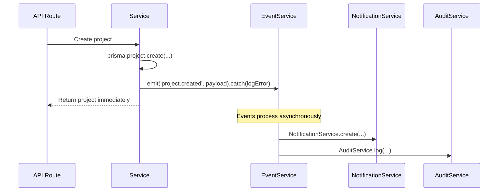
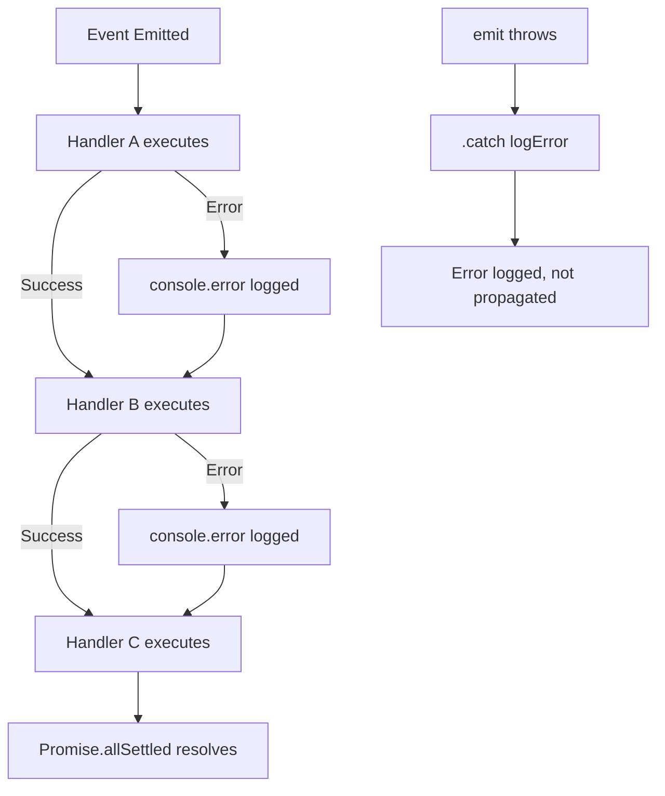
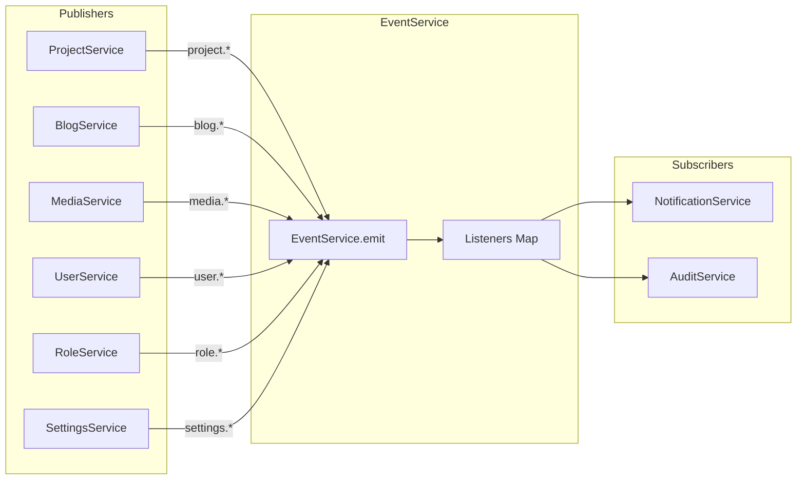
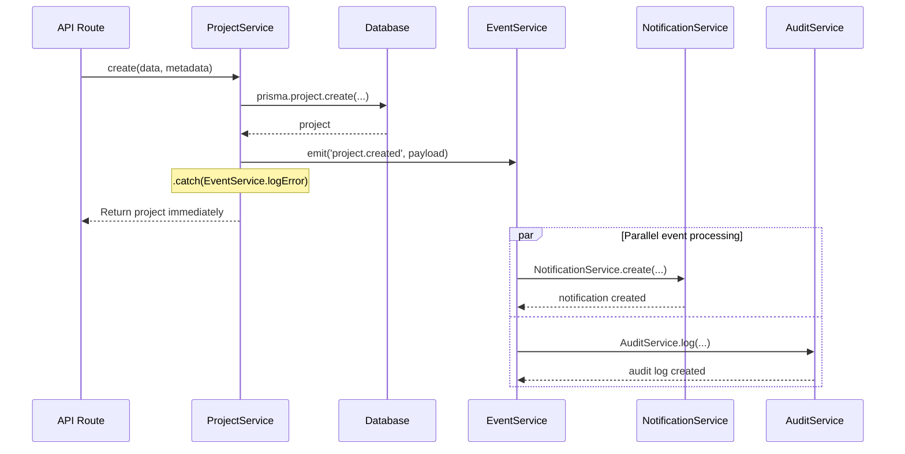
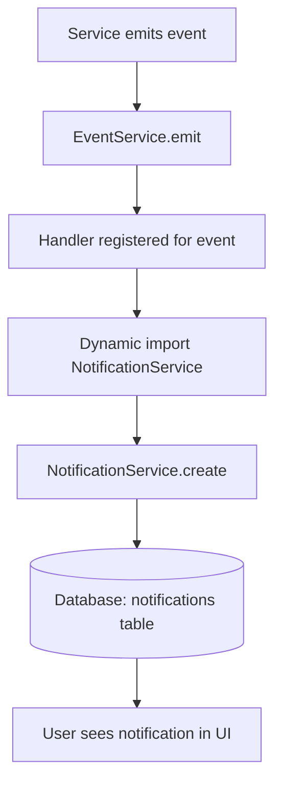
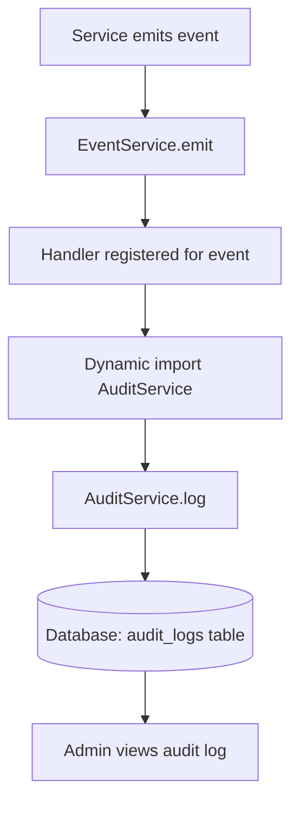
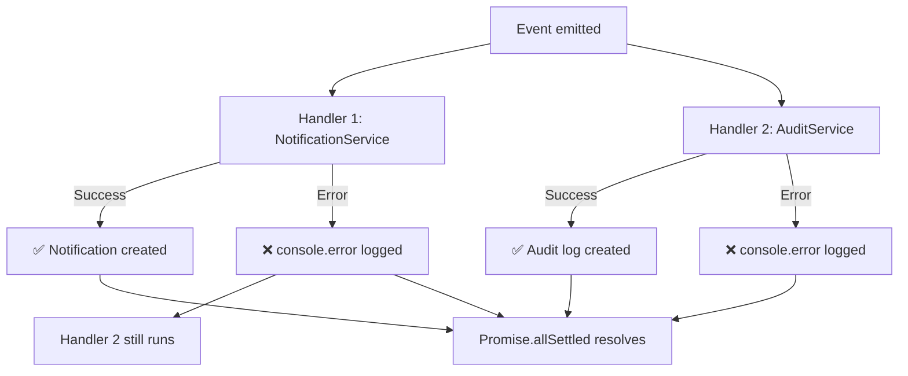

# 10 — Event System

> Complete documentation of the TASKILY CMS event-driven architecture,
> EventService, publisher/subscriber patterns, and integration with audit and notifications.

---

## Table of Contents

- [Why Event-Driven Architecture](#why-event-driven-architecture)
- [EventService Overview](#eventservice-overview)
- [Core Concepts](#core-concepts)
- [Map Storage](#map-storage)
- [Wildcard Listeners](#wildcard-listeners)
- [Promise.allSettled](#promiseallsettled)
- [Fire-and-Forget Behavior](#fire-and-forget-behavior)
- [Error Handling](#error-handling)
- [Handler Registration](#handler-registration)
- [Dynamic Imports & Circular Dependency Avoidance](#dynamic-imports--circular-dependency-avoidance)
- [Complete Event Catalog](#complete-event-catalog)
- [Audit Integration](#audit-integration)
- [Notification Integration](#notification-integration)
- [Adding a New Event](#adding-a-new-event)
- [Adding a New Listener](#adding-a-new-listener)
- [Best Practices](#best-practices)
- [Performance Considerations](#performance-considerations)
- [Limitations](#limitations)
- [Future Scalability](#future-scalability)
- [Diagrams](#diagrams)

---

## Why Event-Driven Architecture

The event system decouples **what happened** from **what should happen next**. When a service creates a project, it doesn't need to know about audit logging or notification delivery. It simply emits an event, and interested subscribers react independently.

### Benefits

| Benefit | Description |
|---|---|
| **Decoupling** | Services don't import each other |
| **Extensibility** | New subscribers can be added without modifying publishers |
| **Audit trail** | Every significant action automatically generates an audit log |
| **Notifications** | Users automatically receive notifications for relevant events |
| **Testability** | Services can be tested in isolation |
| **Performance** | Fire-and-forget pattern keeps API responses fast |

---

## EventService Overview

**File:** `lib/services/EventService.js`

```js
const listeners = new Map();
let handlersRegistered = false;

export class EventService {
  static on(eventType, handler) { ... }
  static off(eventType, handler) { ... }
  static async emit(eventType, payload = {}) { ... }
  static getRegisteredEvents() { ... }
  static logError(err) { ... }
}
```

### Singleton Pattern

`EventService` is a pure static class — no instantiation. The `listeners` Map is module-scoped, meaning it persists across all imports within the same Node.js process.

```js
const listeners = new Map();
```

---

## Core Concepts

### Publisher

A **publisher** is any service that calls `EventService.emit()`:

```js
// ProjectService.create() — Publisher
EventService.emit('project.created', {
  actorId: metadata.actorId,
  authorId,
  entityId: project.id,
  entityName: project.title,
  newValues: { title: project.title, status: project.status },
  ipAddress: metadata.ipAddress,
  userAgent: metadata.userAgent,
}).catch(EventService.logError);
```

### Subscriber

A **subscriber** is any handler registered via `EventService.on()`:

```js
// EventService.js — Subscriber
EventService.on('project.created', async (event) => {
  const { NotificationService } = await import('./NotificationService');
  const { AuditService } = await import('./AuditService');
  await Promise.all([
    NotificationService.create({ ... }),
    AuditService.log({ ... }),
  ]);
});
```

### Event Payload

Every event receives a standardized payload:

```js
{
  type: 'project.created',     // Added automatically by emit()
  timestamp: new Date(),        // Added automatically by emit()
  actorId: 'uuid',              // Who performed the action
  entityId: 'uuid',             // Which entity was affected
  entityName: 'Project Title',  // Human-readable entity name
  oldValues: { ... },           // Previous state (updates/deletes)
  newValues: { ... },           // New state (creates/updates)
  ipAddress: '192.168.1.1',    // Request IP
  userAgent: 'Mozilla/...'     // Request user agent
}
```

---

## Map Storage

Listeners are stored in a JavaScript `Map`:

```js
const listeners = new Map();
```

### Structure

```
Map {
  'project.created' => [handler1, handler2],
  'project.updated' => [handler3],
  'blog.created'    => [handler4, handler5],
  '*'               => [wildcardHandler],
}
```

### Key Characteristics

| Characteristic | Detail |
|---|---|
| Key | Event type string (e.g., `project.created`) |
| Value | Array of handler functions |
| Order | Handlers execute in registration order |
| Duplicates | Allowed — same handler can be registered multiple times |
| Performance | O(1) lookup by event type |

---

## Wildcard Listeners

The `*` key receives ALL events:

```js
EventService.on('*', async (event) => {
  console.log(`Event: ${event.type}`, event);
});
```

### How Wildcards Work

```js
static async emit(eventType, payload = {}) {
  const handlers = listeners.get(eventType) || [];
  const wildcardHandlers = listeners.get('*') || [];
  const allHandlers = [...handlers, ...wildcardHandlers];
  // ...
}
```

Wildcard handlers are appended after type-specific handlers. They receive the full event payload including the `type` field.

### Use Cases

- Global logging
- Analytics tracking
- Debug monitoring
- Cross-cutting concerns

---

## Promise.allSettled

Every event emission uses `Promise.allSettled` to ensure one failing handler doesn't prevent others from executing:

```js
static async emit(eventType, payload = {}) {
  const handlers = listeners.get(eventType) || [];
  const wildcardHandlers = listeners.get('*') || [];
  const allHandlers = [...handlers, ...wildcardHandlers];

  const results = await Promise.allSettled(
    allHandlers.map(async (handler) => {
      try {
        await handler({ type: eventType, ...payload, timestamp: new Date() });
      } catch (err) {
        console.error(`EventService: Error in handler for "${eventType}":`, err);
      }
    })
  );

  return results;
}
```

### Why `Promise.allSettled`?

| Scenario | `Promise.all` | `Promise.allSettled` |
|---|---|---|
| Handler A succeeds, Handler B fails | Entire batch fails | Handler A succeeds, Handler B fails |
| Handler A fails, Handler B succeeds | Entire batch fails | Handler A fails, Handler B succeeds |
| All succeed | Success | Success |
| All fail | Failure | All reported individually |

> **Decision:** `Promise.allSettled` is used because audit logging failure should never prevent notification delivery, and vice versa.

---

## Fire-and-Forget Behavior

Publishers call `emit()` with `.catch(EventService.logError)` — they don't await the result:

```js
EventService.emit('project.created', {
  actorId: metadata.actorId,
  entityId: project.id,
  // ...
}).catch(EventService.logError);
```

### Why Fire-and-Forget?

| Concern | Explanation |
|---|---|
| **Response time** | API response is sent immediately, events process in background |
| **Reliability** | Event failures don't affect the user-facing operation |
| **Simplicity** | Publishers don't need try/catch blocks for events |
| **Error isolation** | `.catch(EventService.logError)` logs errors without crashing |

### Flow



---

## Error Handling

### Handler-Level Error Catching

Each handler is wrapped in a try/catch:

```js
allHandlers.map(async (handler) => {
  try {
    await handler({ type: eventType, ...payload, timestamp: new Date() });
  } catch (err) {
    console.error(`EventService: Error in handler for "${eventType}":`, err);
  }
})
```

### Publisher-Level Error Catching

```js
EventService.emit('project.created', payload).catch(EventService.logError);
```

### `EventService.logError`

```js
static logError(err) {
  console.error('[EventService] Event processing error:', err?.message || err);
}
```

### Error Handling Hierarchy



---

## Handler Registration

### When Handlers Are Registered

Handlers are registered at **module load time** — when `EventService.js` is first imported:

```js
if (!handlersRegistered) {
  handlersRegistered = true;

  EventService.on('project.created', async (event) => { ... });
  EventService.on('project.updated', async (event) => { ... });
  // ... all other handlers
}
```

### The `handlersRegistered` Guard

```js
let handlersRegistered = false;

if (!handlersRegistered) {
  handlersRegistered = true;
  // Register all handlers
}
```

This guard ensures handlers are registered exactly once, even if the module is imported multiple times (which can happen in Next.js hot reloading).

### Registration Order

1. `EventService` class is defined
2. `listeners` Map is created (module scope)
3. `handlersRegistered` guard runs
4. All event handlers are registered
5. Handlers persist for the lifetime of the process

---

## Dynamic Imports & Circular Dependency Avoidance

### The Problem

If `EventService` directly imported `NotificationService` and `AuditService` at the top level:

```js
// PROBLEMATIC — causes circular dependency
import { NotificationService } from './NotificationService';
import { AuditService } from './AuditService';
```

This creates a circular chain:
```
EventService → NotificationService → (potentially) EventService
```

### The Solution

Dynamic imports inside handler functions:

```js
EventService.on('project.created', async (event) => {
  const { NotificationService } = await import('./NotificationService');
  const { AuditService } = await import('./AuditService');
  await Promise.all([
    NotificationService.create({ ... }),
    AuditService.log({ ... }),
  ]);
});
```

### Why Dynamic Imports Work

| Aspect | Static Import | Dynamic Import |
|---|---|---|
| Load time | Module initialization | On-demand (when handler runs) |
| Circular dependency | Can cause undefined | Avoided entirely |
| Memory | Always loaded | Only when needed |
| Tree shaking | Difficult | Better |

> **Decision:** Dynamic imports ensure `EventService` has no compile-time dependencies on any service, making the dependency graph acyclic.

---

## Complete Event Catalog

### Projects

| Event | Notification | Audit | Payload Fields |
|---|:---:|:---:|---|
| `project.created` | ✅ | ✅ | actorId, authorId, entityId, entityName, newValues, ipAddress, userAgent |
| `project.updated` | ✅ | ✅ | actorId, entityId, entityName, changedFields, oldValues, newValues, ipAddress, userAgent |
| `project.deleted` | — | ✅ | actorId, entityId, entityName, oldValues, ipAddress, userAgent |
| `project.published` | ✅ | ✅ | actorId, entityId, entityName, ipAddress, userAgent |
| `project.restored` | — | ✅ | actorId, entityId, entityName, ipAddress, userAgent |
| `project.bulk_action` | — | ✅ | actorId, action, count, entityIds, ipAddress, userAgent |
| `project.permanently_deleted` | — | — | actorId, entityId, entityName, ipAddress, userAgent |

### Blogs

| Event | Notification | Audit | Payload Fields |
|---|:---:|:---:|---|
| `blog.created` | ✅ | ✅ | actorId, authorId, entityId, entityName, newValues, ipAddress, userAgent |
| `blog.updated` | — | ✅ | actorId, entityId, entityName, changedFields, oldValues, newValues, ipAddress, userAgent |
| `blog.published` | ✅ | ✅ | actorId, entityId, entityName, ipAddress, userAgent |
| `blog.deleted` | — | ✅ | actorId, entityId, entityName, oldValues, ipAddress, userAgent |
| `blog.restored` | — | ✅ | actorId, entityId, entityName, ipAddress, userAgent |
| `blog.bulk_action` | — | ✅ | actorId, action, count, entityIds, ipAddress, userAgent |
| `blog.permanently_deleted` | — | — | actorId, entityId, entityName, ipAddress, userAgent |

### Media

| Event | Notification | Audit | Payload Fields |
|---|:---:|:---:|---|
| `media.uploaded` | ✅ | ✅ | actorId, entityId, entityName, format, fileSize, ipAddress, userAgent |
| `media.updated` | — | ✅ | actorId, entityId, entityName, oldValues, newValues, ipAddress, userAgent |
| `media.deleted` | — | ✅ | actorId, entityId, entityName, ipAddress, userAgent |
| `media.bulk_action` | — | ✅ | actorId, action, count, entityIds, ipAddress, userAgent |

### Users

| Event | Notification | Audit | Payload Fields |
|---|:---:|:---:|---|
| `user.created` | ✅ | ✅ | actorId, entityId, entityName, newValues, ipAddress, userAgent |
| `user.updated` | — | ✅ | actorId, entityId, entityName, oldValues, newValues, ipAddress, userAgent |
| `user.deleted` | — | ✅ | actorId, entityId, entityName, oldValues, ipAddress, userAgent |
| `user.restored` | — | ✅ | actorId, entityId, entityName, ipAddress, userAgent |
| `user.status_changed` | ✅ | ✅ | actorId, entityId, entityName, oldValues, newValues, ipAddress, userAgent |

### Roles

| Event | Notification | Audit | Payload Fields |
|---|:---:|:---:|---|
| `role.created` | ✅ | ✅ | actorId, entityId, entityName, newValues, ipAddress, userAgent |
| `role.updated` | — | ✅ | actorId, entityId, entityName, oldValues, newValues, ipAddress, userAgent |
| `role.deleted` | — | ✅ | actorId, entityId, entityName, oldValues, ipAddress, userAgent |
| `role.cloned` | — | ✅ | actorId, entityId, entityName, newValues, ipAddress, userAgent |

### Settings

| Event | Notification | Audit | Payload Fields |
|---|:---:|:---:|---|
| `settings.updated` | ✅ | ✅ | actorId, actorName, entityId, changedKeys, oldValues, newValues, ipAddress, userAgent |

---

## Audit Integration

Every audit event calls `AuditService.log()`:

```js
EventService.on('project.created', async (event) => {
  const { AuditService } = await import('./AuditService');
  await AuditService.log({
    userId: event.actorId,
    action: 'CREATE',
    module: 'projects',
    entityType: 'Project',
    entityId: event.entityId,
    newValues: event.newValues || null,
    ipAddress: event.ipAddress,
    userAgent: event.userAgent,
  });
});
```

### Action-to-Event Mapping

| Audit Action | Events That Produce It |
|---|---|
| `CREATE` | `*.created`, `*.bulk_action` (publish) |
| `UPDATE` | `*.updated`, `*.status_changed` |
| `DELETE` | `*.deleted`, `*.bulk_action` (delete) |
| `RESTORE` | `*.restored` |
| `PUBLISH` | `*.published` |

---

## Notification Integration

Notification events call `NotificationService.create()`:

```js
EventService.on('project.created', async (event) => {
  const { NotificationService } = await import('./NotificationService');
  await NotificationService.create({
    userId: event.authorId,  // Or event.actorId depending on event
    type: 'content',
    title: 'Project Created',
    message: `Project "${event.entityName}" has been created.`,
    entityType: 'Project',
    entityId: event.entityId,
    priority: 'LOW',
    metadata: { action: 'CREATE', authorName: event.actorName },
  });
});
```

### Notification Priority by Event

| Event | Priority | Reason |
|---|---|---|
| `*.created` | LOW | Routine creation |
| `*.published` | MEDIUM | Significant status change |
| `*.status_changed` | MEDIUM | Important state change |
| `settings.updated` | MEDIUM | System-level change |
| `role.created` | MEDIUM | Security-relevant |

### Notification Targeting

| Event | `userId` Target | Description |
|---|---|---|
| `project.created` | `event.authorId` | Notify the author |
| `user.status_changed` | `event.actorId` | Notify the admin who changed status |
| `settings.updated` | `event.actorId` | Notify the admin who changed settings |
| `role.created` | `event.actorId` | Notify the admin who created the role |

---

## Adding a New Event

### Step 1: Emit the Event in Your Service

```js
// In your service method
EventService.emit('yourmodule.action_name', {
  actorId: metadata.actorId,
  entityId: record.id,
  entityName: record.name,
  oldValues: { ... },   // For updates/deletes
  newValues: { ... },   // For creates/updates
  ipAddress: metadata.ipAddress,
  userAgent: metadata.userAgent,
}).catch(EventService.logError);
```

### Step 2: Register a Handler in EventService.js

```js
EventService.on('yourmodule.action_name', async (event) => {
  const { NotificationService } = await import('./NotificationService');
  const { AuditService } = await import('./AuditService');

  await Promise.all([
    NotificationService.create({
      userId: event.actorId,
      type: 'content',
      title: 'Action Performed',
      message: `Something happened to "${event.entityName}".`,
      entityType: 'YourEntity',
      entityId: event.entityId,
      priority: 'LOW',
      metadata: { action: 'ACTION_NAME' },
    }),
    AuditService.log({
      userId: event.actorId,
      action: 'CREATE',
      module: 'yourmodule',
      entityType: 'YourEntity',
      entityId: event.entityId,
      newValues: event.newValues || null,
      ipAddress: event.ipAddress,
      userAgent: event.userAgent,
    }),
  ]);
});
```

### Step 3: Add to the Handler Registration Guard

Ensure the handler is inside the `if (!handlersRegistered)` block.

---

## Adding a New Listener

### Runtime Registration

```js
import { EventService } from '@/lib/services';

// Register a custom listener
EventService.on('project.created', async (event) => {
  console.log('Custom handler:', event.type, event.entityName);
});

// Remove a listener
EventService.off('project.created', myHandler);
```

### Wildcard Listener

```js
// Listen to ALL events
EventService.on('*', async (event) => {
  console.log(`[${event.type}] ${event.entityName || 'N/A'}`);
});
```

---

## Best Practices

### Do

- **Always use `.catch(EventService.logError)`** on emit calls
- **Always use dynamic imports** in handlers to avoid circular dependencies
- **Keep event payloads small** — only include necessary data
- **Use descriptive event names** — `module.action` format
- **Always include `actorId`** for audit trail
- **Use `Promise.all`** inside handlers for parallel operations (notification + audit)

### Don't

- **Don't await emit in services** — Fire-and-forget pattern
- **Don't throw in handlers** — Errors are caught and logged
- **Don't import services statically** in EventService.js
- **Don't create infinite loops** — Handler A triggers Event B, which triggers Handler A
- **Don't rely on emit order** — Handlers may execute in any order
- **Don't put business logic in handlers** — Handlers are side effects only

---

## Performance Considerations

| Factor | Detail |
|---|---|
| **Handler count** | 26 event types, ~30 handlers total |
| **In-memory storage** | No database queries for event routing |
| **Dynamic imports** | First call per handler has import overhead; subsequent calls use cache |
| **Promise.allSettled** | Parallel execution of handlers per event |
| **Fire-and-forget** | No blocking of API responses |

### Memory Usage

The `listeners` Map holds function references. With ~30 handlers, memory overhead is negligible.

### Cold Start

Dynamic imports inside handlers execute on first event emission. After that, modules are cached by Node.js.

---

## Limitations

| Limitation | Description | Mitigation |
|---|---|---|
| **In-memory only** | Events are lost on server restart | Acceptable — events are for side effects, not data persistence |
| **No event replay** | Cannot replay missed events | Audit logs serve as the source of truth |
| **No event ordering guarantees** | Parallel handlers may complete out of order | Acceptable for audit/notification use cases |
| **Single-process only** | Events don't cross process boundaries | Sufficient for single-server deployment |
| **No dead letter queue** | Failed events are logged but not retried | Acceptable — failures are logged for manual investigation |

---

## Future Scalability

| Enhancement | Description |
|---|---|
| **Event persistence** | Store events in database for replay and analytics |
| **Event streaming** | Use Redis Pub/Sub or Kafka for multi-process events |
| **Retry mechanism** | Retry failed handlers with exponential backoff |
| **Event queue** | Use Bull/BullMQ for reliable background processing |
| **Event schema versioning** | Version event payloads for backward compatibility |
| **Webhook integration** | Forward events to external services |

---

## Diagrams

### Publisher → EventService → Subscribers



### Project Creation Event Flow



### Notification Flow



### Audit Flow



### Error Isolation



---

## See Also

- [09 — Services](./09-services.md) — Service layer that publishes events
- [06 — API Reference](./06-api-reference.md) — API routes that trigger services
- [02 — Architecture](./02-architecture.md) — System architecture overview
