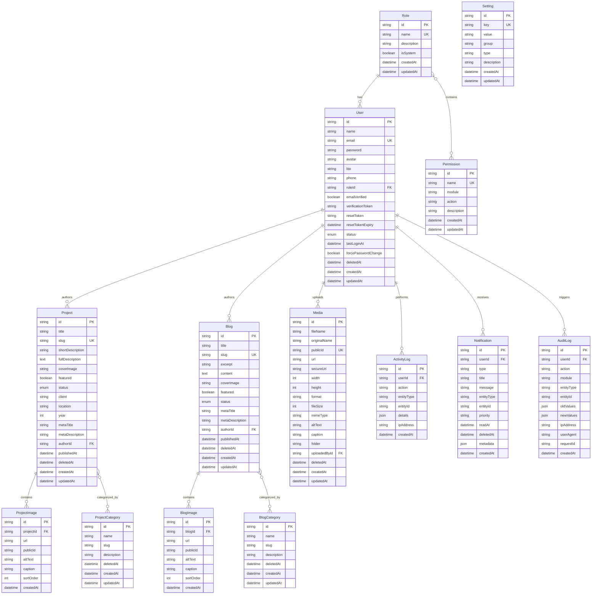

# 11 — Database Reference

> Complete reference for the TASKILY CMS PostgreSQL database schema,
> all Prisma models, relationships, indexes, and business rules.

---

## Table of Contents

- [Database Overview](#database-overview)
- [Technology Stack](#technology-stack)
- [Prisma Configuration](#prisma-configuration)
- [Enums](#enums)
- [Entity Relationship Diagram](#entity-relationship-diagram)
- [Models](#models)
  - [Role](#role)
  - [Permission](#permission)
  - [User](#user)
  - [Setting](#setting)
  - [ActivityLog](#activitylog)
  - [ProjectCategory](#projectcategory)
  - [Project](#project)
  - [ProjectImage](#projectimage)
  - [BlogCategory](#blogcategory)
  - [Blog](#blog)
  - [BlogImage](#blogimage)
  - [Media](#media)
  - [Notification](#notification)
  - [AuditLog](#auditlog)
- [Implicit Many-to-Many Relationships](#implicit-many-to-many-relationships)
- [Soft Delete Strategy](#soft-delete-strategy)
- [Indexing Strategy](#indexing-strategy)
- [Migration Strategy](#migration-strategy)
- [Seed Data](#seed-data)

---

## Database Overview

| Property | Value |
|---|---|
| **Provider** | PostgreSQL (Neon Serverless) |
| **ORM** | Prisma 5.x |
| **Total Models** | 14 |
| **Total Enums** | 3 |
| **Total Indexes** | 30+ |
| **Soft-deletable Models** | 7 |
| **Cascade-delete Models** | 2 (ProjectImage, BlogImage) |

---

## Technology Stack

| Component | Technology | Version |
|---|---|---|
| Database | PostgreSQL | 15+ (Neon) |
| ORM | Prisma | ^5.22.0 |
| Client | @prisma/client | ^5.22.0 |
| CLI | prisma (devDependency) | ^5.22.0 |
| Connection | Connection pooling via Neon | Serverless driver |

---

## Prisma Configuration

**File:** `prisma/schema.prisma`

```prisma
generator client {
  provider = "prisma-client-js"
}

datasource db {
  provider = "postgresql"
  url      = env("DATABASE_URL")
}
```

### Prisma Client Singleton

**File:** `lib/prisma.js`

```js
import { PrismaClient } from '@prisma/client';

const globalForPrisma = globalThis;

export const prisma = globalForPrisma.prisma ?? new PrismaClient({
  log: process.env.NODE_ENV === 'development' ? ['query', 'error', 'warn'] : ['error'],
});

if (process.env.NODE_ENV !== 'production') globalForPrisma.prisma = prisma;
```

> **Why a singleton?** In development, Next.js hot-reloads modules. Without a singleton, each reload creates a new PrismaClient, eventually exhausting database connections. The singleton is stored on `globalThis` and reused.

---

## Enums

### UserStatus

| Value | Description |
|---|---|
| `ACTIVE` | User can log in and access the system |
| `INACTIVE` | User account exists but is disabled |
| `SUSPENDED` | User is temporarily blocked (admin action) |

### ProjectStatus

| Value | Description |
|---|---|
| `DRAFT` | Project is not publicly visible |
| `PUBLISHED` | Project is live and visible |

### BlogStatus

| Value | Description |
|---|---|
| `DRAFT` | Blog post is not publicly visible |
| `PUBLISHED` | Blog post is live and visible |

> **Note:** All enum values are UPPERCASE. Status checks in code use exact string comparison (e.g., `status === 'DRAFT'`).

---

## Entity Relationship Diagram



---

## Models

---

### Role

**Table:** `roles`
**File:** `prisma/schema.prisma` (line 34)
**Service:** `lib/services/RoleService.js`

#### Purpose

Defines user roles that group permissions. Every user has exactly one role.

#### Fields

| Field | Type | Nullable | Default | Constraints |
|---|---|---|---|---|
| `id` | `String` (UUID) | No | `uuid()` | Primary key |
| `name` | `String` | No | — | `@unique` |
| `description` | `String` | Yes | `null` | — |
| `isSystem` | `Boolean` | No | `false` | System roles cannot be modified or deleted |
| `createdAt` | `DateTime` | No | `now()` | — |
| `updatedAt` | `DateTime` | No | `@updatedAt` | Auto-updated |

#### Relationships

| Relation | Type | Related Model | Cascade |
|---|---|---|---|
| `permissions` | Many-to-many | Permission | Implicit join table |
| `users` | One-to-many | User | Restrict |

#### Business Rules

- Role names are automatically uppercased on creation/update
- System roles (`isSystem: true`) cannot be modified or deleted
- Cannot delete a role that has assigned users
- 4 default roles seeded: ADMIN, EDITOR, AUTHOR, VIEWER

---

### Permission

**Table:** `permissions`
**File:** `prisma/schema.prisma` (line 47)
**Service:** `lib/services/RoleService.js`

#### Purpose

Defines granular permissions using `module.action` naming convention. 62 permissions across 12 modules.

#### Fields

| Field | Type | Nullable | Default | Constraints |
|---|---|---|---|---|
| `id` | `String` (UUID) | No | `uuid()` | Primary key |
| `name` | `String` | No | — | `@unique` (e.g., `projects.create`) |
| `module` | `String` | No | — | Module name (e.g., `projects`) |
| `action` | `String` | No | — | Action name (e.g., `create`) |
| `description` | `String` | Yes | `null` | — |
| `createdAt` | `DateTime` | No | `now()` | — |
| `updatedAt` | `DateTime` | No | `@updatedAt` | Auto-updated |

#### Unique Constraints

| Constraint | Fields |
|---|---|
| `@unique` | `name` |
| `@@unique` | `[module, action]` |

#### Indexes

| Index | Fields | Purpose |
|---|---|---|
| `module_idx` | `module` | Filter permissions by module |

#### Relationships

| Relation | Type | Related Model | Cascade |
|---|---|---|---|
| `roles` | Many-to-many | Role | Implicit join table |

---

### User

**Table:** `users`
**File:** `prisma/schema.prisma` (line 66)
**Service:** `lib/services/UserService.js`, `lib/services/AuthService.js`

#### Purpose

Represents a system user with authentication credentials, profile data, and role assignment.

#### Fields

| Field | Type | Nullable | Default | Constraints |
|---|---|---|---|---|
| `id` | `String` (UUID) | No | `uuid()` | Primary key |
| `name` | `String` | No | — | — |
| `email` | `String` | No | — | `@unique` |
| `password` | `String` | No | — | bcrypt hash (12 salt rounds) |
| `avatar` | `String` | Yes | `null` | URL to avatar image |
| `bio` | `String` | Yes | `null` | Max 500 chars |
| `phone` | `String` | Yes | `null` | Max 50 chars |
| `roleId` | `String` | No | — | Foreign key to Role |
| `emailVerified` | `Boolean` | No | `false` | Email verification status |
| `verificationToken` | `String` | Yes | `null` | Email verification token |
| `resetToken` | `String` | Yes | `null` | Password reset token |
| `resetTokenExpiry` | `DateTime` | Yes | `null` | Reset token expiration |
| `status` | `UserStatus` | No | `ACTIVE` | ACTIVE, INACTIVE, SUSPENDED |
| `lastLoginAt` | `DateTime` | Yes | `null` | Last login timestamp |
| `forcePasswordChange` | `Boolean` | No | `false` | Force password change on next login |
| `deletedAt` | `DateTime` | Yes | `null` | Soft delete timestamp |
| `createdAt` | `DateTime` | No | `now()` | — |
| `updatedAt` | `DateTime` | No | `@updatedAt` | Auto-updated |

#### Indexes

| Index | Fields | Purpose |
|---|---|---|
| `deletedAt_idx` | `deletedAt` | Filter active vs. deleted users |
| `status_roleId_idx` | `status`, `roleId` | Filter by status and role |
| `resetToken_idx` | `resetToken` | Lookup by reset token |
| `verificationToken_idx` | `verificationToken` | Lookup by verification token |

#### Relationships

| Relation | Type | Related Model | Cascade |
|---|---|---|---|
| `role` | Many-to-one | Role | Restrict |
| `projects` | One-to-many | Project | — |
| `blogs` | One-to-many | Blog | — |
| `media` | One-to-many | Media | — |
| `activityLogs` | One-to-many | ActivityLog | — |
| `notifications` | One-to-many | Notification | Cascade |
| `auditLogs` | One-to-many | AuditLog | — |

#### Business Rules

- Password is bcrypt-hashed (12 salt rounds) before storage
- Password never returned in API responses (stripped in service layer)
- `verificationToken` and `resetToken` are single-use (cleared after use)
- Soft-deleted users are excluded from all queries (`deletedAt: null`)
- `UserService.findById()` throws `Error('User not found')` — does NOT return null

---

### Setting

**Table:** `settings`
**File:** `prisma/schema.prisma` (line 104)
**Service:** `lib/services/SettingsService.js`

#### Purpose

Key-value store for system-wide configuration. Organized by groups (general, branding, seo, etc.).

#### Fields

| Field | Type | Nullable | Default | Constraints |
|---|---|---|---|---|
| `id` | `String` (UUID) | No | `uuid()` | Primary key |
| `key` | `String` | No | — | `@unique` |
| `value` | `String` | No | — | Stored as string regardless of type |
| `group` | `String` | No | — | Group name (e.g., `general`, `seo`) |
| `type` | `String` | No | `"text"` | UI hint: `text`, `textarea`, `select`, `image`, `url`, `email`, `password`, `number`, `boolean`, `datetime-local` |
| `description` | `String` | Yes | `null` | Human-readable description |
| `createdAt` | `DateTime` | No | `now()` | — |
| `updatedAt` | `DateTime` | No | `@updatedAt` | Auto-updated |

#### Indexes

| Index | Fields | Purpose |
|---|---|---|
| `group_idx` | `group` | Filter settings by group |

#### Business Rules

- Values are always stored as strings (even booleans: `"true"`, `"false"`)
- Sensitive fields (e.g., `smtpPassword`) are masked in API responses
- 47 default settings seeded across 10 groups
- Uses `upsert` for idempotent seeding

---

### ActivityLog

**Table:** `activity_logs`
**File:** `prisma/schema.prisma` (line 122)
**Service:** `lib/services/ActivityService.js`

#### Purpose

Records user activity events for the activity feed. Simpler than AuditLog — designed for user-facing activity displays.

#### Fields

| Field | Type | Nullable | Default | Constraints |
|---|---|---|---|---|
| `id` | `String` (UUID) | No | `uuid()` | Primary key |
| `userId` | `String` | No | — | Foreign key to User |
| `action` | `String` | No | — | Action performed |
| `entityType` | `String` | No | — | Entity type (e.g., `Project`) |
| `entityId` | `String` | No | — | Entity UUID |
| `details` | `Json` | Yes | `null` | Additional details |
| `ipAddress` | `String` | Yes | `null` | Request IP address |
| `createdAt` | `DateTime` | No | `now()` | — |

#### Indexes

| Index | Fields | Purpose |
|---|---|---|
| `userId_idx` | `userId` | Filter by user |
| `entityType_entityId_idx` | `entityType`, `entityId` | Lookup by entity |
| `createdAt_idx` | `createdAt` | Time-based queries |

#### Relationships

| Relation | Type | Related Model | Cascade |
|---|---|---|---|
| `user` | Many-to-one | User | Restrict |

> **Note:** ActivityLog does NOT have soft delete — records are permanent.

---

### ProjectCategory

**Table:** `project_categories`
**File:** `prisma/schema.prisma` (line 143)
**Service:** `lib/services/ProjectCategoryService.js`

#### Purpose

Categorization system for projects. Supports soft delete with unique name/slug constraints that allow reuse after deletion.

#### Fields

| Field | Type | Nullable | Default | Constraints |
|---|---|---|---|---|
| `id` | `String` (UUID) | No | `uuid()` | Primary key |
| `name` | `String` | No | — | — |
| `slug` | `String` | No | — | Auto-generated from name |
| `description` | `String` | Yes | `null` | — |
| `deletedAt` | `DateTime` | Yes | `null` | Soft delete timestamp |
| `createdAt` | `DateTime` | No | `now()` | — |
| `updatedAt` | `DateTime` | No | `@updatedAt` | Auto-updated |

#### Unique Constraints

| Constraint | Fields | Purpose |
|---|---|---|
| `@@unique` | `[name, deletedAt]` | Unique name among active categories |
| `@@unique` | `[slug, deletedAt]` | Unique slug among active categories |

> **Why `deletedAt` in unique constraints?** This allows the same name/slug to be reused after a category is soft-deleted. A deleted category named "Commercial" doesn't prevent a new active category with the same name.

#### Indexes

| Index | Fields | Purpose |
|---|---|---|
| `deletedAt_idx` | `deletedAt` | Filter active vs. deleted |

#### Relationships

| Relation | Type | Related Model | Cascade |
|---|---|---|---|
| `projects` | Many-to-many | Project | Implicit join table |

#### Business Rules

- Cannot delete a category that is assigned to active projects
- Slug is auto-generated from name using `slugify()`
- Name uniqueness is case-insensitive (checked in service layer)

---

### Project

**Table:** `projects`
**File:** `prisma/schema.prisma` (line 163)
**Service:** `lib/services/ProjectService.js`

#### Purpose

Core content model for project portfolio items. Supports images, categories, SEO metadata, and soft delete.

#### Fields

| Field | Type | Nullable | Default | Constraints |
|---|---|---|---|---|
| `id` | `String` (UUID) | No | `uuid()` | Primary key |
| `title` | `String` | No | — | Max 200 chars |
| `slug` | `String` | No | — | `@unique`, auto-generated |
| `shortDescription` | `String` | Yes | `null` | Max 500 chars |
| `fullDescription` | `Text` | Yes | `null` | Rich text (HTML) |
| `coverImage` | `String` | Yes | `null` | URL to cover image |
| `featured` | `Boolean` | No | `false` | Featured flag |
| `status` | `ProjectStatus` | No | `DRAFT` | DRAFT or PUBLISHED |
| `client` | `String` | Yes | `null` | Client name |
| `location` | `String` | Yes | `null` | Project location |
| `year` | `Int` | Yes | `null` | Project year (1900-2100) |
| `metaTitle` | `String` | Yes | `null` | SEO title |
| `metaDescription` | `String` | Yes | `null` | SEO description |
| `authorId` | `String` | No | — | Foreign key to User |
| `publishedAt` | `DateTime` | Yes | `null` | Set when status → PUBLISHED |
| `deletedAt` | `DateTime` | Yes | `null` | Soft delete timestamp |
| `createdAt` | `DateTime` | No | `now()` | — |
| `updatedAt` | `DateTime` | No | `@updatedAt` | Auto-updated |

#### Indexes

| Index | Fields | Purpose |
|---|---|---|
| `deletedAt_status_idx` | `deletedAt`, `status` | Filter by status within active/deleted |
| `deletedAt_featured_idx` | `deletedAt`, `featured` | Filter featured projects |
| `authorId_idx` | `authorId` | Filter by author |
| `createdAt_idx` | `createdAt` | Time-based sorting |

#### Unique Constraints

| Constraint | Fields |
|---|---|
| `@unique` | `slug` (global — not scoped to deletedAt) |

> **Note:** Project slugs are globally unique (not scoped by `deletedAt`). This is different from categories where slugs are scoped.

#### Relationships

| Relation | Type | Related Model | Cascade |
|---|---|---|---|
| `author` | Many-to-one | User | Restrict |
| `categories` | Many-to-many | ProjectCategory | Implicit join table |
| `images` | One-to-many | ProjectImage | Cascade |

#### Business Rules

- Slug auto-generated from title, collision handled with `-2`, `-3` suffixes
- `publishedAt` set automatically when status changes to PUBLISHED
- `publishedAt` cleared when status changes back to DRAFT
- Up to 50 images per project (enforced in Zod validation)

---

### ProjectImage

**Table:** `project_images`
**File:** `prisma/schema.prisma` (line 197)
**Service:** `lib/services/ProjectService.js`

#### Purpose

Stores image references for project galleries. Images are stored in Cloudinary; this table stores metadata and ordering.

#### Fields

| Field | Type | Nullable | Default | Constraints |
|---|---|---|---|---|
| `id` | `String` (UUID) | No | `uuid()` | Primary key |
| `projectId` | `String` | No | — | Foreign key to Project |
| `url` | `String` | No | — | Cloudinary URL |
| `publicId` | `String` | Yes | `null` | Cloudinary public ID |
| `altText` | `String` | Yes | `null` | Accessibility alt text |
| `caption` | `String` | Yes | `null` | Image caption |
| `sortOrder` | `Int` | No | `0` | Display order |
| `createdAt` | `DateTime` | No | `now()` | — |

#### Indexes

| Index | Fields | Purpose |
|---|---|---|
| `projectId_sortOrder_idx` | `projectId`, `sortOrder` | Ordered image retrieval |

#### Relationships

| Relation | Type | Related Model | Cascade |
|---|---|---|---|
| `project` | Many-to-one | Project | Cascade |

> **Cascade delete:** When a project is permanently deleted, all its images are automatically deleted.

---

### BlogCategory

**Table:** `blog_categories`
**File:** `prisma/schema.prisma` (line 216)
**Service:** `lib/services/BlogCategoryService.js`

#### Purpose

Categorization system for blog posts. Identical structure to ProjectCategory.

#### Fields

| Field | Type | Nullable | Default | Constraints |
|---|---|---|---|---|
| `id` | `String` (UUID) | No | `uuid()` | Primary key |
| `name` | `String` | No | — | — |
| `slug` | `String` | No | — | Auto-generated from name |
| `description` | `String` | Yes | `null` | — |
| `deletedAt` | `DateTime` | Yes | `null` | Soft delete timestamp |
| `createdAt` | `DateTime` | No | `now()` | — |
| `updatedAt` | `DateTime` | No | `@updatedAt` | Auto-updated |

#### Unique Constraints

| Constraint | Fields |
|---|---|
| `@@unique` | `[name, deletedAt]` |
| `@@unique` | `[slug, deletedAt]` |

#### Business Rules

- Cannot delete a category that is assigned to active blogs

---

### Blog

**Table:** `blogs`
**File:** `prisma/schema.prisma` (line 236)
**Service:** `lib/services/BlogService.js`

#### Purpose

Core content model for blog posts. Supports rich text content, images, categories, and SEO metadata.

#### Fields

| Field | Type | Nullable | Default | Constraints |
|---|---|---|---|---|
| `id` | `String` (UUID) | No | `uuid()` | Primary key |
| `title` | `String` | No | — | Max 200 chars |
| `slug` | `String` | No | — | `@unique`, auto-generated or custom |
| `excerpt` | `String` | Yes | `null` | Max 500 chars |
| `content` | `Text` | Yes | `null` | Rich text (HTML) |
| `coverImage` | `String` | Yes | `null` | URL to cover image |
| `featured` | `Boolean` | No | `false` | Featured flag |
| `status` | `BlogStatus` | No | `DRAFT` | DRAFT or PUBLISHED |
| `metaTitle` | `String` | Yes | `null` | SEO title |
| `metaDescription` | `String` | Yes | `null` | SEO description |
| `authorId` | `String` | No | — | Foreign key to User |
| `publishedAt` | `DateTime` | Yes | `null` | Set when status → PUBLISHED |
| `deletedAt` | `DateTime` | Yes | `null` | Soft delete timestamp |
| `createdAt` | `DateTime` | No | `now()` | — |
| `updatedAt` | `DateTime` | No | `@updatedAt` | Auto-updated |

#### Indexes

| Index | Fields | Purpose |
|---|---|---|
| `deletedAt_status_idx` | `deletedAt`, `status` | Filter by status |
| `deletedAt_featured_idx` | `deletedAt`, `featured` | Filter featured |
| `authorId_idx` | `authorId` | Filter by author |
| `createdAt_idx` | `createdAt` | Time-based sorting |

#### Relationships

| Relation | Type | Related Model | Cascade |
|---|---|---|---|
| `author` | Many-to-one | User | Restrict |
| `categories` | Many-to-many | BlogCategory | Implicit join table |
| `images` | One-to-many | BlogImage | Cascade |

#### Business Rules

- Unlike Projects, Blogs support user-provided custom slugs
- Slug auto-generated from title if not provided

---

### BlogImage

**Table:** `blog_images`
**File:** `prisma/schema.prisma` (line 267)
**Service:** `lib/services/BlogService.js`

#### Purpose

Stores image references for blog galleries. Identical structure to ProjectImage.

#### Fields

| Field | Type | Nullable | Default | Constraints |
|---|---|---|---|---|
| `id` | `String` (UUID) | No | `uuid()` | Primary key |
| `blogId` | `String` | No | — | Foreign key to Blog |
| `url` | `String` | No | — | Cloudinary URL |
| `publicId` | `String` | Yes | `null` | Cloudinary public ID |
| `altText` | `String` | Yes | `null` | Accessibility alt text |
| `caption` | `String` | Yes | `null` | Image caption |
| `sortOrder` | `Int` | No | `0` | Display order |
| `createdAt` | `DateTime` | No | `now()` | — |

#### Indexes

| Index | Fields | Purpose |
|---|---|---|
| `blogId_sortOrder_idx` | `blogId`, `sortOrder` | Ordered image retrieval |

#### Relationships

| Relation | Type | Related Model | Cascade |
|---|---|---|---|
| `blog` | Many-to-one | Blog | Cascade |

---

### Media

**Table:** `media`
**File:** `prisma/schema.prisma` (line 286)
**Service:** `lib/services/MediaService.js`

#### Purpose

Stores metadata for uploaded media files. Actual files are stored in Cloudinary; this table tracks references, organization, and usage.

#### Fields

| Field | Type | Nullable | Default | Constraints |
|---|---|---|---|---|
| `id` | `String` (UUID) | No | `uuid()` | Primary key |
| `fileName` | `String` | No | — | Processed file name |
| `originalName` | `String` | No | — | Original upload name |
| `publicId` | `String` | No | — | `@unique`, Cloudinary public ID |
| `url` | `String` | No | — | Cloudinary URL |
| `secureUrl` | `String` | No | — | HTTPS Cloudinary URL |
| `width` | `Int` | Yes | `null` | Image width in pixels |
| `height` | `Int` | Yes | `null` | Image height in pixels |
| `format` | `String` | No | — | File format (jpg, png, mp4, etc.) |
| `fileSize` | `Int` | No | — | File size in bytes |
| `mimeType` | `String` | No | — | MIME type (image, video, etc.) |
| `altText` | `String` | Yes | `null` | Accessibility alt text |
| `caption` | `String` | Yes | `null` | Image caption |
| `folder` | `String` | No | `"general"` | Organizational folder |
| `uploadedById` | `String` | No | — | Foreign key to User |
| `deletedAt` | `DateTime` | Yes | `null` | Soft delete timestamp |
| `createdAt` | `DateTime` | No | `now()` | — |
| `updatedAt` | `DateTime` | No | `@updatedAt` | Auto-updated |

#### Indexes

| Index | Fields | Purpose |
|---|---|---|
| `deletedAt_idx` | `deletedAt` | Filter active vs. deleted |
| `folder_idx` | `folder` | Filter by folder |
| `format_idx` | `format` | Filter by format |
| `uploadedById_idx` | `uploadedById` | Filter by uploader |
| `createdAt_idx` | `createdAt` | Time-based sorting |

#### Relationships

| Relation | Type | Related Model | Cascade |
|---|---|---|---|
| `uploadedBy` | Many-to-one | User | Restrict |

#### Business Rules

- `publicId` is globally unique (Cloudinary public ID)
- Usage tracking checks `ProjectImage`, `BlogImage`, `Project.coverImage`, and `Blog.coverImage`

---

### Notification

**Table:** `notifications`
**File:** `prisma/schema.prisma` (line 319)
**Service:** `lib/services/NotificationService.js`

#### Purpose

User-specific notifications generated by the event system. Each notification belongs to exactly one user.

#### Fields

| Field | Type | Nullable | Default | Constraints |
|---|---|---|---|---|
| `id` | `String` (UUID) | No | `uuid()` | Primary key |
| `userId` | `String` | No | — | Foreign key to User |
| `type` | `String` | No | — | `content`, `user`, or `system` |
| `title` | `String` | No | — | Notification title |
| `message` | `String` | No | — | Notification message |
| `entityType` | `String` | Yes | `null` | Related entity type |
| `entityId` | `String` | Yes | `null` | Related entity UUID |
| `priority` | `String` | No | `"LOW"` | `LOW`, `MEDIUM`, `HIGH` |
| `readAt` | `DateTime` | Yes | `null` | When marked as read |
| `deletedAt` | `DateTime` | Yes | `null` | Soft delete timestamp |
| `metadata` | `Json` | Yes | `null` | Additional data |
| `createdAt` | `DateTime` | No | `now()` | — |

#### Indexes

| Index | Fields | Purpose |
|---|---|---|
| `userId_readAt_idx` | `userId`, `readAt` | Unread notification count |
| `userId_createdAt_idx` | `userId`, `createdAt` | Chronological listing |
| `userId_deletedAt_idx` | `userId`, `deletedAt` | Active notifications per user |
| `entityType_entityId_idx` | `entityType`, `entityId` | Lookup by entity |
| `type_idx` | `type` | Filter by type |

#### Relationships

| Relation | Type | Related Model | Cascade |
|---|---|---|---|
| `user` | Many-to-one | User | Cascade |

> **Cascade delete:** When a user is deleted, all their notifications are automatically deleted.

#### Business Rules

- Notifications are user-scoped — users can only see their own
- `readAt` is set when notification is marked as read
- `null` in `readAt` means unread

---

### AuditLog

**Table:** `audit_logs`
**File:** `prisma/schema.prisma` (line 346)
**Service:** `lib/services/AuditService.js`

#### Purpose

Comprehensive audit trail for compliance and security. Records every significant system action with before/after values.

#### Fields

| Field | Type | Nullable | Default | Constraints |
|---|---|---|---|---|
| `id` | `String` (UUID) | No | `uuid()` | Primary key |
| `userId` | `String` | No | — | Foreign key to User (actor) |
| `action` | `String` | No | — | `CREATE`, `UPDATE`, `DELETE`, `RESTORE`, `PUBLISH` |
| `module` | `String` | No | — | `projects`, `blogs`, `media`, `users`, `roles`, `settings` |
| `entityType` | `String` | No | — | `Project`, `Blog`, `Media`, `User`, `Role`, `Setting` |
| `entityId` | `String` | Yes | `null` | Entity UUID (comma-separated for bulk) |
| `oldValues` | `Json` | Yes | `null` | Previous state (for updates/deletes) |
| `newValues` | `Json` | Yes | `null` | New state (for creates/updates) |
| `ipAddress` | `String` | Yes | `null` | Request IP address |
| `userAgent` | `String` | Yes | `null` | Request user agent |
| `requestId` | `String` | Yes | `null` | Request correlation ID |
| `createdAt` | `DateTime` | No | `now()` | — |

#### Indexes

| Index | Fields | Purpose |
|---|---|---|
| `userId_idx` | `userId` | Filter by actor |
| `module_idx` | `module` | Filter by module |
| `entityType_entityId_idx` | `entityType`, `entityId` | Lookup by entity |
| `action_idx` | `action` | Filter by action |
| `createdAt_idx` | `createdAt` | Time-based queries |
| `userId_createdAt_idx` | `userId`, `createdAt` | Actor activity timeline |
| `module_createdAt_idx` | `module`, `createdAt` | Module activity timeline |

#### Relationships

| Relation | Type | Related Model | Cascade |
|---|---|---|---|
| `user` | Many-to-one | User | Restrict |

> **Note:** AuditLog does NOT have soft delete — records are permanent and immutable.

#### Business Rules

- Records are append-only — never updated or deleted
- `oldValues` and `newValues` store JSON snapshots of state changes
- `entityId` is stored as a string (supports comma-separated IDs for bulk operations)
- Generated by EventService handlers, not directly by services

---

## Implicit Many-to-Many Relationships

Prisma uses implicit many-to-many join tables for three relationships:

### Role ↔ Permission

```
Role ←→ _RolePermissions ←→ Permission
```

- Join table: `_RolePermissions` (auto-created by Prisma)
- Permission assignment uses full replacement: `{ set: [...] }`
- A role can have 0 to 62 permissions
- A permission can belong to 0 to many roles

### Project ↔ ProjectCategory

```
Project ←→ _ProjectToProjectCategory ←→ ProjectCategory
```

- Join table: `_ProjectToProjectCategory` (auto-created)
- Category assignment uses full replacement: `{ set: [...] }`
- A project can have 0 to many categories
- A category can belong to 0 to many projects

### Blog ↔ BlogCategory

```
Blog ←→ _BlogToBlogCategory ←→ BlogCategory
```

- Join table: `_BlogToBlogCategory` (auto-created)
- Identical pattern to Project-Category

### Why Implicit Many-to-Many?

| Aspect | Implicit | Explicit Join Model |
|---|---|---|
| Schema simplicity | No extra model | Requires join model |
| Prisma API | `{ connect: [...] }` | More complex queries |
| Extra fields | Not supported | Supported |
| Performance | Identical | Identical |

> **Decision:** No extra fields are needed on the join tables, so implicit many-to-many is the right choice.

---

## Soft Delete Strategy

### Models with Soft Delete

| Model | Field | Unique Constraint Scope |
|---|---|---|
| User | `deletedAt` | Global unique on `email` |
| Project | `deletedAt` | Global unique on `slug` |
| Blog | `deletedAt` | Global unique on `slug` |
| ProjectCategory | `deletedAt` | Scoped: `@@unique([name, deletedAt])` |
| BlogCategory | `deletedAt` | Scoped: `@@unique([slug, deletedAt])` |
| Media | `deletedAt` | Global unique on `publicId` |
| Notification | `deletedAt` | User-scoped |

### Pattern

```js
// Soft delete
await prisma.project.update({
  where: { id },
  data: { deletedAt: new Date() },
});

// Query active records
const projects = await prisma.project.findMany({
  where: { deletedAt: null },
});

// Restore
await prisma.project.update({
  where: { id },
  data: { deletedAt: null },
});
```

### Permanent Delete

```js
// Only for trashed records
await prisma.projectImage.deleteMany({ where: { projectId: id } });
await prisma.project.delete({ where: { id } });
```

> **Warning:** Permanent delete requires deleting child records first (images) due to foreign key constraints.

---

## Indexing Strategy

### Index Summary

| Model | Indexes | Purpose |
|---|---|---|
| User | 4 | Deleted, status+role, resetToken, verificationToken |
| Permission | 1 | Module lookup |
| Role | 0 | Name is already unique |
| Setting | 1 | Group filtering |
| ActivityLog | 3 | User, entity, time |
| ProjectCategory | 1 | Deleted |
| Project | 4 | Status, featured, author, time |
| ProjectImage | 1 | Ordered retrieval |
| BlogCategory | 1 | Deleted |
| Blog | 4 | Status, featured, author, time |
| BlogImage | 1 | Ordered retrieval |
| Media | 5 | Deleted, folder, format, uploader, time |
| Notification | 5 | Read status, time, deleted, entity, type |
| AuditLog | 7 | User, module, entity, action, time, compound |

### Why These Indexes Exist

| Index Pattern | Reason |
|---|---|
| `deletedAt` | Every soft-delete query filters on this |
| `deletedAt, status` | Most common listing query: active published items |
| `authorId` | Filter content by author |
| `createdAt` | Default sort order |
| `userId` | User-scoped queries (notifications, activity, audit) |
| `module, action` | Audit log filtering |
| `entityType, entityId` | Entity-specific history lookup |
| `folder, format` | Media library filtering |

---

## Migration Strategy

### Current Approach

The project uses `prisma db push` instead of `prisma migrate dev`:

```bash
# Push schema changes to database (no migration files)
npx prisma db push

# Generate Prisma Client
npx prisma generate
```

### Why `db push`?

| Aspect | `db push` | `prisma migrate dev` |
|---|---|---|
| Migration files | None created | Creates migration files |
| Development speed | Faster | Slower |
| Production safety | Less safe | Safer |
| Rollback support | No | Yes |
| Team collaboration | Worse | Better |

> **Current decision:** `db push` is used for rapid development. For production deployments with team collaboration, `prisma migrate dev` is recommended.

### Migration Commands

```bash
# Create a new migration
npx prisma migrate dev --name add_new_field

# Apply pending migrations
npx prisma migrate deploy

# Reset database (development only)
npx prisma migrate reset

# View migration status
npx prisma migrate status
```

---

## Seed Data

**File:** `prisma/seed.js`

### What Gets Seeded

| Entity | Count | Description |
|---|---|---|
| Permissions | 62 | 12 modules × varying actions |
| Roles | 4 | ADMIN, EDITOR, AUTHOR, VIEWER |
| Role-Permission assignments | ~150 | All roles get appropriate permissions |
| Admin user | 1 | `admin@taskily.com` / `Admin123!` |
| Settings | 47 | 10 groups of system configuration |

### Seed Command

```bash
npx prisma db seed
```

### Seed Script Configuration

```json
{
  "prisma": {
    "seed": "node prisma/seed.js"
  }
}
```

> **Note:** The seed script uses `upsert` for idempotency — running it multiple times doesn't create duplicates.

---

## See Also

- [09 — Services](./09-services.md) — How services interact with the database
- [02 — Architecture](./02-architecture.md) — System architecture overview
- [13 — Environment Reference](./13-environment-reference.md) — DATABASE_URL configuration
- [12 — Deployment Guide](./12-deployment-guide.md) — Database setup and migration
