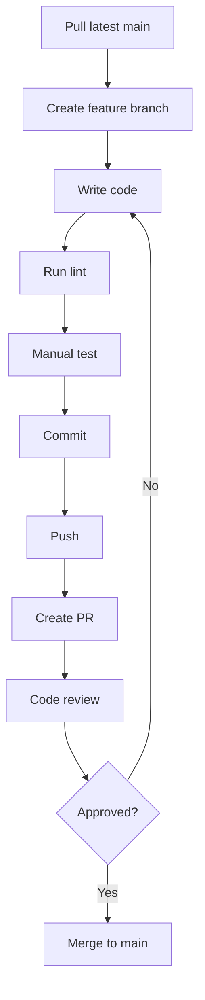
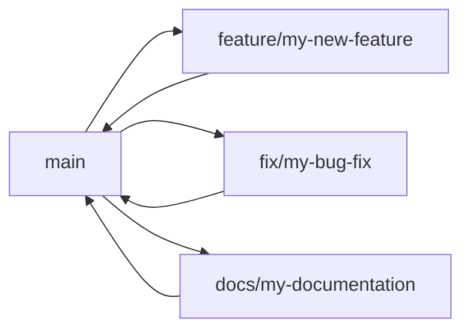

# 15 — Contributing Guide

> Complete contributor guide for TASKILY CMS,
> covering coding standards, conventions, workflows,
> and step-by-step guides for extending the system.

---

## Table of Contents

- [Project Philosophy](#project-philosophy)
- [Repository Workflow](#repository-workflow)
- [Coding Standards](#coding-standards)
- [Folder Conventions](#folder-conventions)
- [Naming Conventions](#naming-conventions)
- [Component Conventions](#component-conventions)
- [Service Conventions](#service-conventions)
- [API Conventions](#api-conventions)
- [Validation Conventions](#validation-conventions)
- [Permission Conventions](#permission-conventions)
- [Event Conventions](#event-conventions)
- [Commit Message Conventions](#commit-message-conventions)
- [Git Workflow](#git-workflow)
- [Branch Naming](#branch-naming)
- [Pull Request Checklist](#pull-request-checklist)
- [Code Review Checklist](#code-review-checklist)
- [Definition of Done](#definition-of-done)
- [How to Add a New CMS Module](#how-to-add-a-new-cms-module)
- [How to Add a New API Endpoint](#how-to-add-a-new-api-endpoint)
- [How to Add a New Service](#how-to-add-a-new-service)
- [How to Add a New Event](#how-to-add-a-new-event)
- [How to Add a New Permission](#how-to-add-a-new-permission)
- [How to Add a New Role](#how-to-add-a-new-role)
- [How to Add a New Prisma Model](#how-to-add-a-new-prisma-model)
- [How to Add a New Dashboard Widget](#how-to-add-a-new-dashboard-widget)
- [How to Add a New Notification](#how-to-add-a-new-notification)
- [How to Add a New Audit Event](#how-to-add-a-new-audit-event)
- [Common Mistakes](#common-mistakes)
- [Best Practices](#best-practices)
- [Architecture Rules](#architecture-rules)

---

## Project Philosophy

Before contributing, understand these non-negotiable principles:

| Principle | Meaning |
|---|---|
| **Pattern consistency** | Every module follows the same structure. Do not invent new patterns. |
| **Service layer supremacy** | All business logic lives in `lib/services/`. API routes are thin controllers. |
| **Security as architecture** | Auth, CSRF, RBAC, and validation are structural — not patches. |
| **Soft delete by default** | All major entities support trash/restore. |
| **Event-driven side effects** | Services emit events. Audit logs and notifications are automatic. |
| **Zero external state libraries** | No Redux, no Zustand. Context + useState only. |

---

## Repository Workflow

### Clone and Setup

```bash
git clone git@github.com:mostafa-akajdid/Pcontrole.git
cd Pcontrole
npm install
cp .env.example .env.local
# Configure .env.local (see 13-environment-reference.md)
npx prisma generate
npx prisma db push
npx prisma db seed
npm run dev
```

### Development Flow



---

## Coding Standards

### JavaScript Style

| Rule | Standard |
|---|---|
| Semicolons | Required |
| Quotes | Single quotes for strings |
| Indentation | 2 spaces |
| Trailing commas | Yes (ES5+) |
| Line length | No hard limit (keep readable) |
| `const` / `let` | Prefer `const`. Use `let` only when reassignment needed. Never `var`. |
| Arrow functions | Use for callbacks and short functions. Named `function` for top-level exports. |
| Template literals | Use for string interpolation |
| Destructuring | Use for objects and arrays |
| Spread operator | Use for immutable operations |

### Import Order

```javascript
// 1. React/Next imports
import { useState, useEffect } from 'react';
import { useRouter } from 'next/router';

// 2. Third-party libraries
import { Search, Plus } from 'lucide-react';

// 3. Internal components
import DashboardLayout from '@/components/layout/DashboardLayout';
import Button from '@/components/ui/Button';

// 4. Contexts and hooks
import { useToast } from '@/contexts/ToastContext';
import { useDebounce } from '@/hooks/useDebounce';

// 5. Services and utilities
import { formatDate } from '@/lib/utils';
```

### Error Handling

Every API route MUST wrap logic in `try/catch`:

```javascript
// ✅ Correct
export default async function handler(req, res) {
  try {
    const data = await SomeService.doSomething();
    return successResponse(res, data);
  } catch (error) {
    console.error('Route error:', error);
    return errorResponse(res, 'Something went wrong');
  }
}

// ❌ Wrong — no error handling
export default async function handler(req, res) {
  const data = await SomeService.doSomething();
  return successResponse(res, data);
}
```

---

## Folder Conventions

### Component Organization

| Folder | Rule |
|---|---|
| `components/layout/` | Only layout-level components (DashboardLayout, Sidebar, Navbar) |
| `components/modals/` | Only overlay dialogs. Must use `useModalAnimation` hook. |
| `components/sections/` | Only dashboard content sections. Receive data via props. Never fetch. |
| `components/ui/` | Only presentation primitives. No business logic. |
| `components/settings/` | Only settings page sections. One file per settings group. |
| `components/notifications/` | Only notification UI components. |

### File Locations

| Type | Location | Rule |
|---|---|---|
| Services | `lib/services/` | Static methods only. No instantiation. |
| Hooks | `hooks/` | Shared across 3+ components. |
| Contexts | `contexts/` | Global state only. Max 3-5 providers. |
| Utilities | `lib/` | Pure functions. No React dependencies. |
| Validation | `lib/validation.js` | Zod schemas. All write-endpoint schemas. |
| API routes | `pages/api/` | Thin controllers only. No business logic. |
| Dashboard pages | `pages/dashboard/` | Wrapped in `DashboardLayout`. |
| Styles | `styles/` | Global CSS only. Tailwind handles component styles. |

### Forbidden Locations

| Never Put | Here | Because |
|---|---|---|
| Business logic | `pages/api/` | Must delegate to services |
| Database queries | `components/` | Frontend never touches DB |
| Prisma imports | `pages/` or `components/` | Only services use Prisma |
| `localStorage` for auth | Anywhere | JWT lives in HTTP-only cookies only |

---

## Naming Conventions

### Files

| Type | Convention | Example |
|---|---|---|
| React components | PascalCase | `ProjectFormModal.jsx` |
| Hooks | camelCase with `use` prefix | `useDebounce.js` |
| Services | PascalCase | `ProjectService.js` |
| Utilities | camelCase | `slugify.js` |
| API routes | camelCase (file-based) | `pages/api/projects/index.js` |
| Contexts | PascalCase + Context suffix | `AuthContext.jsx` |
| Modals | PascalCase + Modal suffix | `ProjectFormModal.jsx` |

### Variables and Functions

| Type | Convention | Example |
|---|---|---|
| Variables | camelCase | `projectTitle` |
| Constants | UPPER_SNAKE_CASE | `STATUS_COLORS` |
| Functions | camelCase | `formatDate()` |
| Service methods | camelCase | `ProjectService.findById()` |
| React components | PascalCase | `<ProjectCard />` |
| Boolean variables | `is`, `has`, `should` prefix | `isLoading`, `hasPermission` |

### Database

| Type | Convention | Example |
|---|---|---|
| Models | PascalCase | `Project`, `BlogCategory` |
| Table names | snake_case (via `@@map`) | `projects`, `blog_categories` |
| Fields | camelCase | `createdAt`, `authorId` |
| Enums | PascalCase | `ProjectStatus`, `UserStatus` |
| Enum values | UPPER_SNAKE_CASE | `DRAFT`, `PUBLISHED` |

---

## Component Conventions

### Component Structure

```jsx
// 1. Imports
import { useState, useEffect } from 'react';
import { useAppearance } from '@/contexts/AppearanceContext';

// 2. Component definition
export default function MyComponent({ data }) {
  // 3. Hooks
  const { accentColor } = useAppearance();

  // 4. State
  const [loading, setLoading] = useState(false);

  // 5. Effects
  useEffect(() => { ... }, []);

  // 6. Handlers
  const handleClick = () => { ... };

  // 7. Render
  return (
    <div>...</div>
  );
}
```

### Modal Rules

- Always use `useModalAnimation` hook
- Backdrop click closes the modal
- Close button in header
- `shouldRender` prevents rendering when not open
- Form modals handle validation and API calls internally

### Empty States

Every list view MUST handle empty state:

```jsx
{items.length === 0 ? (
  <div className="text-center py-8">
    <Icon size={32} className="mx-auto text-gray-300 mb-2" />
    <p className="text-gray-500 text-sm">No items yet</p>
  </div>
) : (
  // render items
)}
```

---

## Service Conventions

### Service Pattern

```javascript
export class MyEntityService {
  static async findAll(options) { ... }
  static async findById(id) { ... }
  static async create(data, metadata = {}) { ... }
  static async update(id, data, metadata = {}) { ... }
  static async delete(id, metadata) { ... }
  static async restore(id, metadata) { ... }
  static async permanentDelete(id, metadata) { ... }
  static async bulkAction(action, ids, metadata) { ... }
}
```

### Rules

| Rule | Detail |
|---|---|
| Static methods only | No instantiation needed |
| Throw errors, not responses | Services throw `Error`; API routes catch and format |
| Emit events | Every state-changing method emits via `EventService` |
| Fire-and-forget | Event emissions use `.catch(EventService.logError)` |
| Metadata passing | Accept `metadata` parameter for audit logging |
| Soft delete | Set `deletedAt` timestamp, not `DELETE FROM` |
| No direct Prisma in API | API routes call services; services call Prisma |

### Barrel Export

Always add new services to `lib/services/index.js`:

```javascript
export { MyNewService } from './MyNewService';
```

---

## API Conventions

### Route Structure

Every API route file follows this order:

1. Import services, auth, validation, response helpers
2. Export default async handler function
3. Check HTTP method
4. Authenticate the user
5. Authorize the action
6. Validate input
7. Call the service
8. Return standardized response

### Template

```javascript
import { MyService, UserService } from '@/lib/services';
import { getUserFromRequest } from '@/lib/auth';
import { hasPermission } from '@/lib/auth';
import { validateRequest, mySchema } from '@/lib/validation';
import { successResponse, errorResponse, methodNotAllowed, unauthorizedResponse, forbiddenResponse } from '@/lib/api';
import { extractRequestMetadata } from '@/lib/api';

export default async function handler(req, res) {
  if (req.method === 'GET') {
    try {
      const tokenPayload = getUserFromRequest(req);
      if (!tokenPayload) return unauthorizedResponse(res);

      const user = await UserService.findById(tokenPayload.id);
      if (!user || user.status !== 'ACTIVE') return forbiddenResponse(res);
      if (!hasPermission(user, 'module.read')) return forbiddenResponse(res);

      const data = await MyService.findAll(req.query);
      return successResponse(res, data);
    } catch (error) {
      console.error('Error:', error);
      return errorResponse(res, 'Failed to fetch');
    }
  }

  if (req.method === 'POST') {
    try {
      const tokenPayload = getUserFromRequest(req);
      if (!tokenPayload) return unauthorizedResponse(res);

      const user = await UserService.findById(tokenPayload.id);
      if (!user || user.status !== 'ACTIVE') return forbiddenResponse(res);
      if (!hasPermission(user, 'module.create')) return forbiddenResponse(res);

      const validation = validateRequest(mySchema, req.body);
      if (!validation.success) {
        const { validationErrorResponse } = require('@/lib/api');
        return validationErrorResponse(res, validation.errors);
      }

      const metadata = extractRequestMetadata(req, user.id);
      const result = await MyService.create(validation.data, metadata);
      return successResponse(res, result, 'Created successfully', 201);
    } catch (error) {
      console.error('Error:', error);
      return errorResponse(res, 'Failed to create');
    }
  }

  return methodNotAllowed(res);
}
```

---

## Validation Conventions

### Schema Definition

All schemas in `lib/validation.js`:

```javascript
import { z } from 'zod';

export const createMyEntitySchema = z.object({
  title: z.string().min(1, 'Title is required').max(200),
  description: z.string().max(500).optional(),
  status: z.enum(['DRAFT', 'PUBLISHED']).optional(),
});
```

### Rules

| Rule | Detail |
|---|---|
| Every write endpoint | Must validate with Zod |
| Read endpoints | Validate query params via `parsePagination`, `parseSort`, `parseSearch` |
| Password validation | Use shared `passwordSchema` |
| Bulk actions | Cap at 100 items |
| Error format | `{ field, message }` per error |

---

## Permission Conventions

### Naming Pattern

```
{module}.{action}
```

### 12 Modules

`projects`, `blogs`, `media`, `users`, `roles`, `settings`, `dashboard`, `audit`, `notifications`, `project-categories`, `blog-categories`, `system`

### Adding Permissions

1. Add to `PERMISSIONS` array in `prisma/seed.js`
2. Assign to appropriate roles in the seed script
3. Add to `hasPermission()` checks in API routes
4. Add `PermissionGuard` wrappers in frontend

---

## Event Conventions

### Naming Pattern

```
{module}.{action}
```

Examples: `project.created`, `blog.updated`, `media.deleted`

### Emitting Events

```javascript
EventService.emit('myentity.created', {
  entityType: 'MyEntity',
  entityId: entity.id,
  entityName: entity.title,
  userId: metadata.actorId,
  newValues: { title: entity.title },
  ipAddress: metadata.ipAddress,
  userAgent: metadata.userAgent,
}).catch(EventService.logError);
```

### Registering Handlers

In `EventService.js`, add handlers in the `registerHandlers()` function:

```javascript
EventService.on('myentity.created', async (event) => {
  try {
    const { NotificationService } = await import('./NotificationService.js');
    const { AuditService } = await import('./AuditService.js');
    await NotificationService.create({ ... });
    await AuditService.log({ ... });
  } catch (error) {
    EventService.logError(error);
  }
});
```

---

## Commit Message Conventions

### Format

```
<type>(<scope>): <description>
```

### Types

| Type | Usage |
|---|---|
| `feat` | New feature |
| `fix` | Bug fix |
| `refactor` | Code restructuring without behavior change |
| `docs` | Documentation only |
| `test` | Adding or updating tests |
| `chore` | Build, config, dependency updates |
| `style` | CSS/styling changes |
| `perf` | Performance improvements |

### Examples

```
feat(projects): add image reorder API endpoint
fix(auth): resolve JWT expiry sync with cookie maxAge
refactor(services): extract duplicate slug logic to shared util
docs(api): add reorder endpoint to API reference
chore(deps): update Prisma to 5.22.0
```

---

## Git Workflow

### Branch Strategy



### Branch Naming

| Pattern | Usage | Example |
|---|---|---|
| `feature/<name>` | New features | `feature/events-module` |
| `fix/<name>` | Bug fixes | `fix/jwt-expiry-sync` |
| `docs/<name>` | Documentation | `docs/api-reference` |
| `refactor/<name>` | Code cleanup | `refactor/service-patterns` |
| `chore/<name>` | Maintenance | `chore/dependency-updates` |

### Workflow Steps

1. `git checkout main`
2. `git pull origin main`
3. `git checkout -b feature/my-feature`
4. Make changes
5. `npm run lint` — fix any issues
6. Manual testing per [14 — Testing Guide](./14-testing-guide.md)
7. `git add .`
8. `git commit -m "feat(scope): description"`
9. `git push origin feature/my-feature`
10. Create Pull Request on GitHub
11. Review and merge

---

## Pull Request Checklist

Before submitting a PR, verify:

### Code Quality

- [ ] `npm run lint` passes
- [ ] `npm run build` succeeds
- [ ] No console errors in browser
- [ ] No React warnings

### Functionality

- [ ] Feature works as described
- [ ] All CRUD operations tested
- [ ] Empty states handled
- [ ] Error messages are user-friendly

### Security

- [ ] API routes have auth checks
- [ ] API routes have RBAC checks
- [ ] Input validated with Zod
- [ ] No secrets in code

### Conventions

- [ ] Files named correctly (PascalCase components, camelCase functions)
- [ ] Files in correct folders
- [ ] Services use static methods
- [ ] Events emitted for state changes
- [ ] Response helpers used (not raw `res.json()`)

### Documentation

- [ ] Commit message follows conventions
- [ ] PR description explains the change
- [ ] Related docs updated if applicable

---

## Code Review Checklist

When reviewing a PR:

### Architecture

- [ ] Business logic is in services, not API routes
- [ ] API routes follow the auth → RBAC → validate → service → response pattern
- [ ] No Prisma imports outside of services
- [ ] Events emitted for all state changes

### Security

- [ ] Authentication required on protected routes
- [ ] RBAC enforced with correct permissions
- [ ] Input validated with Zod
- [ ] No secrets or credentials in code
- [ ] CSRF protection intact

### Code Quality

- [ ] Error handling in all API routes (try/catch)
- [ ] Response helpers used consistently
- [ ] No unused imports or variables
- [ ] Consistent naming conventions

### Testing

- [ ] Manual testing completed per checklist
- [ ] Edge cases considered
- [ ] Empty states handled

---

## Definition of Done

A feature is "done" when:

- [ ] Code is written and follows all conventions
- [ ] `npm run lint` passes
- [ ] `npm run build` succeeds
- [ ] All CRUD operations work
- [ ] RBAC enforced correctly
- [ ] CSRF protection works
- [ ] Events emit correctly
- [ ] Audit logs created
- [ ] Notifications created (where applicable)
- [ ] Empty states handled
- [ ] Error messages are user-friendly
- [ ] Cross-browser tested (Chrome minimum)
- [ ] PR submitted and reviewed
- [ ] Documentation updated

---

## How to Add a New CMS Module

Follow this step-by-step guide to add a new module (e.g., "Events" or "FAQ").

### Step 1: Database Model

Add to `prisma/schema.prisma`:

```prisma
model Faq {
  id          String    @id @default(uuid())
  question    String
  answer      String
  sortOrder   Int       @default(0)
  isActive    Boolean   @default(true)
  authorId    String
  author      User      @relation(fields: [authorId], references: [id])
  deletedAt   DateTime?
  createdAt   DateTime  @default(now())
  updatedAt   DateTime  @updatedAt

  @@index([deletedAt])
  @@index([authorId])
}
```

### Step 2: Push Schema

```bash
npx prisma db push
npx prisma generate
```

### Step 3: Create Service

Create `lib/services/FaqService.js`:

```javascript
import { prisma } from '@/lib/prisma';
import EventService from './EventService';

export class FaqService {
  static async findAll({ page = 1, perPage = 10, search = '' }) { ... }
  static async findById(id) { ... }
  static async create(data, metadata = {}) {
    const faq = await prisma.faq.create({ data: { ... } });
    EventService.emit('faq.created', {
      entityType: 'Faq',
      entityId: faq.id,
      entityName: faq.question,
      userId: metadata.actorId,
      newValues: data,
      ipAddress: metadata.ipAddress,
      userAgent: metadata.userAgent,
    }).catch(EventService.logError);
    return faq;
  }
  static async update(id, data, metadata = {}) { ... }
  static async delete(id, metadata) { ... }
  static async restore(id, metadata) { ... }
  static async permanentDelete(id, metadata) { ... }
  static async bulkAction(action, ids, metadata) { ... }
}
```

### Step 4: Add to Barrel Export

```javascript
// lib/services/index.js
export { FaqService } from './FaqService';
```

### Step 5: Add Validation Schemas

```javascript
// lib/validation.js
export const createFaqSchema = z.object({
  question: z.string().min(1).max(500),
  answer: z.string().min(1),
  sortOrder: z.number().int().min(0).optional(),
});
```

### Step 6: Add API Routes

Create `pages/api/faqs/index.js` and `pages/api/faqs/[id].js` following the standard template from [API Conventions](#api-conventions).

### Step 7: Add Permissions

```javascript
// prisma/seed.js — add to PERMISSIONS array
{ name: 'faqs.create', module: 'faqs', action: 'create' },
{ name: 'faqs.read', module: 'faqs', action: 'read' },
{ name: 'faqs.update', module: 'faqs', action: 'update' },
{ name: 'faqs.delete', module: 'faqs', action: 'delete' },
```

### Step 8: Add Events

```javascript
// lib/services/EventService.js — add to registerHandlers()
EventService.on('faq.created', async (event) => {
  try {
    const { NotificationService } = await import('./NotificationService.js');
    const { AuditService } = await import('./AuditService.js');
    await AuditService.log({
      userId: event.userId,
      action: 'CREATE',
      module: 'faqs',
      entityType: event.entityType,
      entityId: event.entityId,
      newValues: event.newValues,
      ipAddress: event.ipAddress,
      userAgent: event.userAgent,
    });
  } catch (error) {
    EventService.logError(error);
  }
});
```

### Step 9: Create Dashboard Page

Create `pages/dashboard/faqs.jsx` with `DashboardLayout` wrapper.

### Step 10: Register in Global Search

```javascript
// lib/services/GlobalSearchService.js
const faqResults = await prisma.faq.findMany({
  where: { deletedAt: null, question: { contains: query, mode: 'insensitive' } },
  take: 5,
});
```

---

## How to Add a New API Endpoint

1. Create file in `pages/api/` following folder structure
2. Import services, auth, validation, response helpers
3. Check HTTP method
4. Authenticate via `getUserFromRequest(req)`
5. Load user via `UserService.findById()`
6. Check permission via `hasPermission(user, 'module.action')`
7. Validate input with Zod if POST/PUT/PATCH
8. Call service method
9. Return response via helpers
10. Wrap in try/catch

---

## How to Add a New Service

1. Create `lib/services/MyService.js`
2. Follow the static-method pattern (findAll, findById, create, update, delete, restore, permanentDelete, bulkAction)
3. Import `prisma` from `@/lib/prisma`
4. Emit events via `EventService.emit()` with `.catch(EventService.logError)`
5. Throw errors, don't return error responses
6. Accept `metadata` parameter in state-changing methods
7. Add to barrel export in `lib/services/index.js`

---

## How to Add a New Event

1. Define event name: `{module}.{action}` (e.g., `faq.created`)
2. Emit in service: `EventService.emit('faq.created', { ... }).catch(EventService.logError)`
3. Register handler in `EventService.js` `registerHandlers()`
4. Use dynamic imports in handlers to avoid circular dependencies
5. Create notification and/or audit log in handler

---

## How to Add a New Permission

1. Add to `PERMISSIONS` array in `prisma/seed.js`
2. Format: `{ name: 'module.action', module: 'module', action: 'action' }`
3. Assign to roles in seed script
4. Re-run seed: `npx prisma db seed`
5. Add `hasPermission(user, 'module.action')` check in API routes
6. Add `PermissionGuard` wrapper in frontend components

---

## How to Add a New Role

1. Add to `ROLES` array in `prisma/seed.js`
2. Set `isSystem: true` for default roles (cannot be modified/deleted)
3. Assign permissions in seed script
4. Re-run seed: `npx prisma db seed`

---

## How to Add a New Prisma Model

1. Add model to `prisma/schema.prisma`
2. Follow conventions: UUID PK, timestamps, soft delete, indexes
3. Run `npx prisma db push`
4. Run `npx prisma generate`
5. Create service in `lib/services/`
6. Add API routes in `pages/api/`
7. Add permissions to seed script
8. Add events to EventService
9. Create dashboard page

---

## How to Add a New Dashboard Widget

1. Create section component in `components/sections/MyWidget.jsx`
2. Receive data via props (never fetch)
3. Handle empty state
4. Use `useAppearance` for accent color
5. Add to dashboard page in `pages/dashboard/index.jsx`
6. Fetch data from dashboard API endpoint
7. Wrap in error boundary if critical

---

## How to Add a New Notification

1. Emit event in service: `EventService.emit('entity.action', { ... })`
2. Register handler in EventService that calls `NotificationService.create()`
3. Notification appears in dropdown automatically
4. Badge polls for unread count automatically

---

## How to Add a New Audit Event

1. Emit event in service
2. Register handler in EventService that calls `AuditService.log()`
3. Include `oldValues` for updates/deletes, `newValues` for creates/updates
4. Include `ipAddress` and `userAgent` from metadata

---

## Common Mistakes

| Mistake | Why It's Wrong | Correct Approach |
|---|---|---|
| Business logic in API routes | Violates service layer principle | Delegate to `lib/services/` |
| Prisma in components | Frontend never touches DB | Use API routes + fetch |
| `localStorage` for JWT | XSS vulnerability | HTTP-only cookies only |
| Raw `res.json()` | Inconsistent responses | Use `successResponse()` / `errorResponse()` |
| No try/catch in API routes | Unhandled errors crash server | Always wrap in try/catch |
| Missing RBAC check | Security hole | Always check permissions |
| Missing Zod validation | Input not validated | Validate all write endpoints |
| Not emitting events | No audit log or notification | Emit events for state changes |
| Hardcoded values | Not configurable | Use environment variables |
| `jsonwebtoken` in middleware | Doesn't work in Edge Runtime | Use `jose` exclusively |

---

## Best Practices

| Practice | Reason |
|---|---|
| Test one module thoroughly, then verify others by pattern | Consistent architecture means patterns repeat |
| Check existing code before writing new code | Follow established patterns |
| Use `useModalAnimation` for all modals | Consistent UX and behavior |
| Use `useDebounce` for search inputs | Prevents excessive API calls |
| Use `PermissionGuard` for button visibility | Consistent RBAC enforcement |
| Handle empty states in every list | Better UX for new/empty datasets |
| Use `extractRequestMetadata()` for audit | Consistent IP and user agent capture |

---

## Architecture Rules

These rules MUST never be broken:

| # | Rule | Consequence of Violation |
|---|---|---|
| 1 | Business logic in `lib/services/` only | Inconsistent behavior, untestable code |
| 2 | API routes use response helpers from `lib/api.js` | Inconsistent API responses |
| 3 | JWT in HTTP-only cookies only | XSS token theft vulnerability |
| 4 | CSRF validation on all state-changing requests | CSRF attack vulnerability |
| 5 | RBAC on every protected endpoint | Unauthorized access |
| 6 | Zod validation on all write endpoints | Invalid data in database |
| 7 | Events emitted for all state changes | Missing audit logs and notifications |
| 8 | Soft delete for major entities | Data loss, no restore capability |
| 9 | Services use static methods only | No state leakage between requests |
| 10 | No Prisma imports in `pages/` or `components/` | Backend logic in wrong layer |

---

## See Also

- [01 — Project Overview](./01-project-overview.md) — What TASKILY is
- [03 — Folder Structure](./03-folder-structure.md) — Where everything lives
- [05 — Coding Principles](./05-coding-principles.md) — Development rules
- [06 — API Reference](./06-api-reference.md) — API endpoint patterns
- [09 — Services](./09-services.md) — Service layer reference
- [10 — Event System](./10-event-system.md) — Event-driven architecture
- [14 — Testing Guide](./14-testing-guide.md) — Testing checklists
- [17 — Architecture Decisions](./17-architecture-decisions.md) — Why decisions were made
