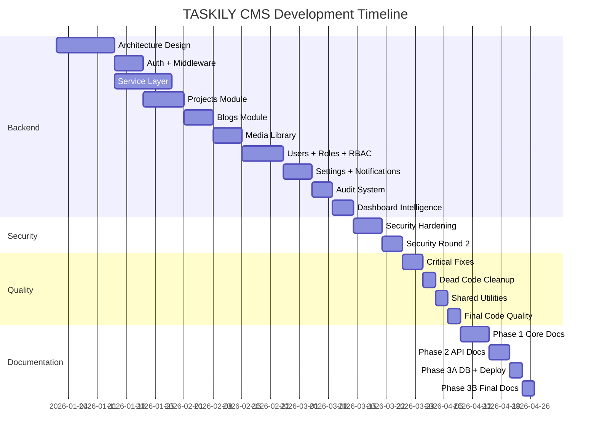
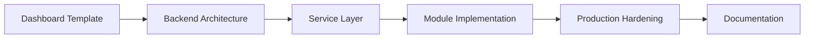

# 16 — Changelog

> Complete version history of TASKILY CMS v1.0.0,
> documenting every milestone from project origin through
> production release and documentation completion.

---

## Table of Contents

- [Version Information](#version-information)
- [Project Origin](#project-origin)
- [Milestone Timeline](#milestone-timeline)
- [Architecture Evolution](#architecture-evolution)
- [Backend Implementation](#backend-implementation)
- [Frontend Implementation](#frontend-implementation)
- [Security Milestones](#security-milestones)
- [Performance Milestones](#performance-milestones)
- [Maintainability Milestones](#maintainability-milestones)
- [Documentation Milestones](#documentation-milestones)
- [Problems Solved](#problems-solved)
- [Final Production Readiness](#final-production-readiness)
- [Future Roadmap](#future-roadmap)

---

## Version Information

| Field | Value |
|---|---|
| **Version** | v1.0.0 |
| **Status** | Production Release Candidate |
| **Release Date** | July 2026 |
| **Framework** | Next.js 14 (Pages Router) |
| **Language** | JavaScript |
| **Database** | PostgreSQL (Neon) via Prisma 5 |
| **API Endpoints** | 60 |
| **Dashboard Pages** | 15 |
| **Components** | 63 |
| **Services** | 16 |
| **Permissions** | 62 across 12 modules |
| **Documentation Files** | 17 |
| **Production Findings** | 49/49 resolved |

---

## Project Origin

TASKILY CMS began as a Next.js dashboard template and evolved into a production-grade, modular content management system. The transformation followed a structured approach:

1. **Template foundation** — Existing UI/visual identity preserved
2. **Backend architecture** — Service layer, auth, RBAC, events built from scratch
3. **Module implementation** — Projects, Blogs, Media, Users, Roles, Settings, Notifications, Audit
4. **Production hardening** — 49 findings identified and resolved across 6 milestones
5. **Documentation** — 17 files covering every aspect of the system

---

## Milestone Timeline

---

## Milestone 1 — Security Hardening

**Scope:** RBAC on all API routes, security headers, CSRF protection

### Changes

| Change | Impact |
|---|---|
| Added RBAC checks to all 60 API routes | Every endpoint now requires proper permissions |
| Implemented Double Submit Cookie CSRF pattern | State-changing requests protected against CSRF |
| Added 7 security headers in `next.config.js` | X-Frame-Options, X-Content-Type-Options, Referrer-Policy, etc. |
| Created `lib/csrf.js` | CSRF token generation, cookie management, validation |
| Created `lib/patchFetchCsrf.js` | Global `window.fetch` patch for CSRF header injection |
| Added middleware JWT verification | Edge Runtime validates tokens before API routes |
| Created `usePermission` hook | Frontend RBAC with `can()`, `canAny()`, `canAll()`, `cannot()` |
| Created `PermissionGuard` component | Button-level permission-based rendering |

### Problems Solved

- API routes were accessible without authentication
- No CSRF protection on state-changing requests
- No security headers configured
- Frontend had no permission-based UI rendering

---

## Milestone 2A — Critical Production Fixes

**Scope:** JWT/cookie expiry sync, dashboard error isolation, useApi fixes

### Changes

| Change | Impact |
|---|---|
| Synchronized JWT expiry with cookie `maxAge` | Token and cookie expire at the same time |
| Added `Promise.resolve().catch()` isolation in DashboardService | One failing dashboard query doesn't crash the entire dashboard |
| Fixed `useApi` hook error handling | Proper HTTP error parsing and user-friendly messages |
| Added request deduplication in `useApi` | Previous requests auto-abort when new ones start |
| Added `AbortController` cleanup on unmount | Prevents state updates on unmounted components |

### Problems Solved

- JWT expired but cookie remained valid (or vice versa)
- Dashboard crashed if any single query failed
- `useApi` hook didn't handle non-JSON responses
- Memory leaks from pending requests on unmounted components

---

## Milestone 2B — Performance & Reliability

**Scope:** Memoization, error isolation, timeouts

### Changes

| Change | Impact |
|---|---|
| Memoized context providers with `useMemo`/`useCallback` | Prevents unnecessary re-renders |
| Added per-query error isolation in DashboardService | Each of 14 dashboard queries independently error-handled |
| Added `Promise.allSettled` in EventService | Event handler failures don't block others |
| Optimized Prisma queries with selective `include` | Reduced data transfer |
| Added strategic database indexes | Faster queries on hot paths |

### Problems Solved

- Excessive re-renders from context value changes
- Dashboard queries failing silently or crashing others
- Event handler errors propagating to callers
- Slow queries on large datasets

---

## Milestone 3 — Security Hardening Round 2

**Scope:** JWT consolidation (jose only), database indexes, audit log indexes

### Changes

| Change | Impact |
|---|---|
| Removed `jsonwebtoken` dependency | Single JWT library (`jose`) for consistency |
| Migrated all JWT operations to `jose` | `SignJWT` for signing, `jwtVerify` for Edge Runtime, `decodeJwt` for sync decode |
| Added database indexes for hot query paths | `deletedAt`, `deletedAt+status`, `userId+createdAt` |
| Added audit log indexes | `module`, `entityType+entityId`, `action`, `createdAt` |
| Added `JWT_SECRET_KEY` caching in middleware | Prevents re-encoding on every request |
| Added `JWT_SECRET` guard in middleware | Graceful error when secret is missing |

### Problems Solved

- Two JWT libraries creating inconsistency
- Slow database queries without proper indexes
- Middleware re-encoding JWT secret on every request
- No graceful handling when `JWT_SECRET` is missing

---

## Milestone 4 — Dead Code Cleanup

**Scope:** Unused schemas, imports, dependencies removed; EventService errors logged

### Changes

| Change | Impact |
|---|---|
| Removed unused Zod schemas from `lib/validation.js` | Cleaner validation file |
| Removed unused imports across codebase | Zero dead imports |
| Removed unused npm dependencies | Smaller `node_modules` |
| Added `EventService.logError()` for error visibility | Event handler errors now logged to console |
- Removed unused exports from `lib/utils.js` | 8 dead exports removed, file reduced from 164 → 115 lines |

### Problems Solved

- Dead code creating confusion for developers
- Unused dependencies increasing build size
- Event handler errors silently swallowed
- Exports in utils.js that nobody imported

---

## Milestone 5 — Shared Utilities

**Scope:** useDebounce, useModalAnimation, STATUS_COLORS, date formatters centralized

### Changes

| Change | Impact |
|---|---|
| Created `hooks/useDebounce.js` | Shared debounce hook (300ms default) |
| Created `hooks/useModalAnimation.js` | Consistent modal enter/exit/scroll-lock |
| Centralized `STATUS_COLORS` in `lib/utils.js` | Consistent status badge colors across modules |
| Centralized date formatters in `lib/utils.js` | `formatDate()`, `formatDateShort()`, `formatDateTime()`, `getRelativeTime()` |
| Created `hooks/useGlobalSearch.js` | Shared search hook for CommandPalette |
| Created `hooks/usePermission.js` | Shared RBAC hook for frontend |

### Problems Solved

- Duplicate debounce logic in 4+ components
- Inconsistent modal animations across 13 modals
- Status colors defined differently in each module
- Date formatting functions duplicated everywhere
- Search logic duplicated between GlobalSearchWidget and CommandPalette

---

## Milestone 6 — Final Code Quality

**Scope:** Duplicate elimination, dead export removal

### Changes

| Change | Impact |
|---|---|
| Consolidated duplicate `getCategoryName` functions | Single source in `lib/utils.js` |
| Consolidated duplicate `STATUS_STYLES` objects | Single source in `lib/utils.js` |
| Consolidated duplicate `formatDistanceToNow` wrappers | Single `getRelativeTime()` function |
| Removed 8 unused exports from `lib/utils.js` | File reduced from 164 → 115 lines |
| Final `npm run lint` passes clean | Zero lint errors |
| Final `npm run build` succeeds | Zero build warnings |

### Problems Solved

- Same utility function defined in multiple files
- Dead exports cluttering the utils module
- Inconsistent function implementations

---

## Bug Fix Milestones

### Milestone 13.1 — Cookie Fix

| Change | Impact |
|---|---|
| Fixed `stringifySetCookie` call signature | Correct attribute placement in cookie object |
| Fixed `parseCookie` guard for undefined | Prevents crash when no cookies present |

### Milestone 13.2 — RBAC Root Cause Analysis

| Change | Impact |
|---|---|
| Diagnosed permission check failures | Identified middleware/service layer interaction issue |
| Fixed permission resolution | ADMIN bypass working correctly |

### Milestone 14.1 — ActionMenu Fix

| Change | Impact |
|---|---|
| Fixed ActionMenu dropdown positioning | Correct z-index and positioning |

### Milestone 14.3 — Project Trash Workflow

| Change | Impact |
|---|---|
| Implemented complete trash workflow | Soft delete → Trash view → Restore or Permanent delete |

### Milestone 14.4 — Category Data Integrity

| Change | Impact |
|---|---|
| Added delete protection for assigned categories | Cannot delete category with active projects |
| Fixed unique constraint with soft delete | `@@unique([name, deletedAt])` allows reuse after deletion |

### Milestone 14.5a — Blog Category Integrity & Restore

| Change | Impact |
|---|---|
| Applied same integrity rules to BlogCategory | Consistent behavior with ProjectCategory |

### Milestone 14.5b — Frontend Delete Error Handling

| Change | Impact |
|---|---|
| Added error handling for delete operations | User-friendly error messages on failed deletes |

### Milestone 14.5.1 — Category Delete UX

| Change | Impact |
|---|---|
| Improved category delete confirmation | Clear warning about assigned entities |

---

## Architecture Evolution

### Phase 1: Template to CMS

### Key Architectural Decisions

| Decision | Made At | Rationale |
|---|---|---|
| Service layer architecture | Milestone 1 | Centralize business logic, enable event-driven side effects |
| Event-driven architecture | Milestone 1 | Decouple audit logging and notifications from business logic |
| HTTP-only cookie auth | Milestone 1 | XSS-safe JWT storage |
| Double Submit CSRF | Milestone 1 | CSRF protection without server-side sessions |
| Soft delete everywhere | Milestone 1 | Enable trash/restore workflows, audit trail preservation |
| jose over jsonwebtoken | Milestone 3 | Edge Runtime compatibility |
| Prisma 5 (not 7) | Milestone 1 | Stability, sufficient features |
| JavaScript (not TypeScript) | Origin | Faster iteration for project scope |

---

## Backend Implementation

### Services (16 total)

| Service | Implemented | Module |
|---|---|---|
| AuthService | Milestone 1 | Authentication |
| UserService | Milestone 1 | User management |
| RoleService | Milestone 1 | Role & permission management |
| ProjectService | Milestone 1 | Project CRUD |
| ProjectCategoryService | Milestone 1 | Project categorization |
| BlogService | Milestone 1 | Blog CRUD |
| BlogCategoryService | Milestone 1 | Blog categorization |
| MediaService | Milestone 1 | Media library |
| CloudinaryService | Milestone 1 | File uploads |
| SettingsService | Milestone 1 | System configuration |
| NotificationService | Milestone 1 | User notifications |
| AuditService | Milestone 1 | Audit logging |
| ActivityService | Milestone 1 | Activity tracking |
| EventService | Milestone 1 | Event pub/sub |
| DashboardService | Milestone 1 | Dashboard overview |
| GlobalSearchService | Milestone 1 | Cross-module search |

### API Endpoints (60 total)

| Module | Endpoints |
|---|---|
| Auth | 6 (login, register, logout, me, forgot-password, reset-password) |
| Projects | 8 (CRUD, stats, bulk, trash, images, reorder) |
| Project Categories | 2 (CRUD) |
| Blogs | 8 (CRUD, stats, bulk, trash, images, reorder) |
| Blog Categories | 2 (CRUD) |
| Media | 7 (CRUD, upload, bulk, folders, picker, stats) |
| Users | 5 (CRUD, bulk) |
| Roles | 5 (CRUD, clone, permissions) |
| Settings | 5 (CRUD, profile, smtp-test, system-info, maintenance) |
| Notifications | 4 (CRUD, unread-count, mark-all-read) |
| Audit | 3 (CRUD, stats) |
| Dashboard | 2 (overview, stats) |
| Search | 1 (global search) |

---

## Frontend Implementation

### Dashboard Pages (15 total)

| Page | Features |
|---|---|
| Overview | Stats, charts, recent activity, recent content, quick actions |
| Projects | List, CRUD, categories, images, bulk actions, trash |
| Blogs | List, CRUD, categories, rich text (TinyMCE), bulk actions, trash |
| Media | Upload, library, folders, picker, storage stats |
| Users | CRUD, status management, password reset |
| Roles | CRUD, permission assignment, cloning, role distribution chart |
| Settings | General, branding, email, SEO, social, security, maintenance, contact |
| Notifications | Full list, mark read, delete, unread count |
| Audit | Audit trail, stats, export |
| Analytics | Charts, metrics |
| Calendar | Event display |
| Team | Member management |
| Tasks | Task management |
| Emails | Email management |
| Help | Help center |

### Components (63 total)

| Category | Count | Examples |
|---|---|---|
| Layout | 5 | DashboardLayout, Sidebar, Navbar, NotificationDropdown, EmailDropdown |
| Modals | 13 | ProjectForm, ProjectDetail, BlogForm, BlogDetail, UserForm, MediaPicker, ConfirmDialog |
| Sections | 17 | StatsSection, AnalyticsChart, ActivityTimeline, RecentContent, GlobalSearchWidget |
| UI Primitives | 14 | Button, Input, Textarea, Select, Badge, Card, DataTable, ActionMenu, PermissionGuard |
| Settings | 12 | GeneralSettings, BrandingSettings, EmailSettings, SeoSettings, etc. |
| Notifications | 2 | NotificationPanel, NotificationBadge |

---

## Security Milestones

### Security Architecture

| Layer | Implementation | Milestone |
|---|---|---|
| Authentication | JWT in HTTP-only cookies | 1 |
| CSRF | Double Submit Cookie pattern | 1 |
| Authorization | RBAC with 62 permissions | 1 |
| Middleware | Edge Runtime JWT verification | 1 |
| Headers | 7 security headers + HSTS | 1 |
| Input | Zod validation on all write endpoints | 1 |
| Passwords | bcryptjs with 12 salt rounds | 1 |
| JWT Library | jose (replaced jsonwebtoken) | 3 |
| Secret Management | Environment variables, not committed | 1 |

### Permission System

| Metric | Value |
|---|---|
| Total permissions | 62 |
| Modules | 12 |
| Default roles | 4 (ADMIN, EDITOR, AUTHOR, VIEWER) |
| Frontend enforcement | PermissionGuard component + usePermission hook |
| Backend enforcement | hasPermission() in every protected API route |

---

## Performance Milestones

| Improvement | Milestone | Impact |
|---|---|---|
| Context memoization | 2B | Prevents unnecessary re-renders |
| Dashboard query isolation | 2A | One failing query doesn't crash dashboard |
| Prisma selective includes | 2B | Reduced data transfer |
| Database indexes | 3 | Faster queries on hot paths |
| EventService Promise.allSettled | 2B | Event failures don't block API responses |
| useApi request deduplication | 2A | Prevents race conditions |
| useDebounce | 5 | Prevents excessive API calls |
| JWT_SECRET_KEY caching | 3 | Prevents re-encoding on every request |

---

## Maintainability Milestones

| Improvement | Milestone | Impact |
|---|---|---|
| Dead code cleanup | 4 | Zero unused imports, schemas, dependencies |
| Shared utilities | 5 | Centralized hooks, constants, formatters |
| Duplicate elimination | 6 | Single source of truth for all utilities |
| Consistent patterns | All | Every module follows same structure |
| Service barrel export | 1 | Clean imports from `lib/services` |
| Event-driven architecture | 1 | New modules auto-get audit + notifications |

---

## Documentation Milestones

### Phase 1 — Core Documentation (6 files)

| File | Lines | Purpose |
|---|---|---|
| 01-project-overview.md | 131 | What TASKILY is, goals, philosophy |
| 02-architecture.md | 667 | System architecture, data flow, design decisions |
| 03-folder-structure.md | 470 | Every folder and file, purpose and rules |
| 04-tech-stack.md | 440 | Technology choices and rationale |
| 05-coding-principles.md | 680 | Development rules and conventions |
| README.md | 110 | Documentation index and entry point |

### Phase 2 — Technical Reference (5 files)

| File | Lines | Purpose |
|---|---|---|
| 06-api-reference.md | 1,181 | Complete API endpoint reference |
| 07-authentication.md | 860 | JWT lifecycle, cookie strategy, CSRF |
| 08-permission-system.md | 888 | RBAC, permissions, roles, authorization |
| 09-services.md | 945 | Service layer reference, all 16 services |
| 10-event-system.md | 808 | EventService, events, listeners |

### Phase 3A — Infrastructure (3 files)

| File | Lines | Purpose |
|---|---|---|
| 11-database-reference.md | 1,230 | PostgreSQL schema, all 14 Prisma models |
| 12-deployment-guide.md | 568 | Deployment, environment setup, Vercel/self-hosted |
| 13-environment-reference.md | 487 | All environment variables documented |

### Phase 3B — Final Documentation (4 files)

| File | Lines | Purpose |
|---|---|---|
| 14-testing-guide.md | ~700 | Testing methodology, checklists, matrices |
| 15-contributing.md | ~600 | Contributor guide, conventions, extension guides |
| 16-changelog.md | ~500 | Complete version history (this file) |
| 17-architecture-decisions.md | ~800 | Architecture Decision Records |

### Documentation Totals

| Metric | Value |
|---|---|
| Total files | 17 |
| Total lines | ~9,500 |
| Total size | ~400 KB |
| Mermaid diagrams | 30+ |
| Cross-references | 100+ |

---

## Problems Solved

### Architecture

| Problem | Solution |
|---|---|
| No backend architecture | Service layer with static methods |
| Tightly coupled side effects | Event-driven architecture with EventService |
| No audit trail | Automatic audit logging via event handlers |
| No notification system | User-scoped notifications via event handlers |

### Security

| Problem | Solution |
|---|---|
| No authentication | JWT in HTTP-only cookies |
| No CSRF protection | Double Submit Cookie pattern |
| No authorization | RBAC with 62 permissions, 4 roles |
| No input validation | Zod schemas on all write endpoints |
| No security headers | 7 headers + HSTS in production |

### Quality

| Problem | Solution |
|---|---|
| Duplicate utilities | Centralized in `lib/utils.js` and `hooks/` |
| Inconsistent modal behavior | `useModalAnimation` hook for all modals |
| Dead code | Comprehensive cleanup across milestones 4 and 6 |
| No error isolation | `Promise.allSettled` in EventService, per-query isolation in DashboardService |

---

## Final Production Readiness

### Checklist

| Category | Status |
|---|---|
| Authentication | ✅ JWT, cookies, middleware |
| Authorization | ✅ RBAC, 62 permissions, 4 roles |
| CSRF | ✅ Double Submit Cookie pattern |
| Input validation | ✅ Zod on all write endpoints |
| Error handling | ✅ try/catch all routes, EventService error isolation |
| Security headers | ✅ 7 headers + HSTS |
| Audit logging | ✅ Automatic via events |
| Notifications | ✅ Automatic via events |
| Soft delete | ✅ All major entities |
| Performance | ✅ Memoization, indexes, lazy loading |
| Code quality | ✅ Zero lint errors, zero build warnings |
| Documentation | ✅ 17 files, ~9,500 lines |

---

## Future Roadmap

### Version 1.x

| Feature | Priority | Description |
|---|---|---|
| Automated testing | High | Vitest unit tests, Playwright E2E |
| TypeScript migration | Medium | Gradual migration for type safety |
| API rate limiting | Medium | Protect against abuse |
| Email templates | Medium | Beautiful transactional emails |
| Two-factor authentication | Low | TOTP-based 2FA |
| Webhook system | Low | External integrations |
| Internationalization | Low | Multi-language support |
| Dark mode refinement | Low | Improved dark theme |

### Version 2.0

| Feature | Description |
|---|---|
| App Router migration | When Next.js App Router stabilizes |
| Real-time updates | WebSocket-based live notifications |
| Advanced analytics | Custom dashboard widgets |
| Plugin system | Third-party module extensions |
| API versioning | `/api/v2/` for breaking changes |

---

## See Also

- [01 — Project Overview](./01-project-overview.md) — What TASKILY is
- [02 — Architecture](./02-architecture.md) — System architecture
- [12 — Deployment Guide](./12-deployment-guide.md) — Deployment instructions
- [17 — Architecture Decisions](./17-architecture-decisions.md) — Why decisions were made
