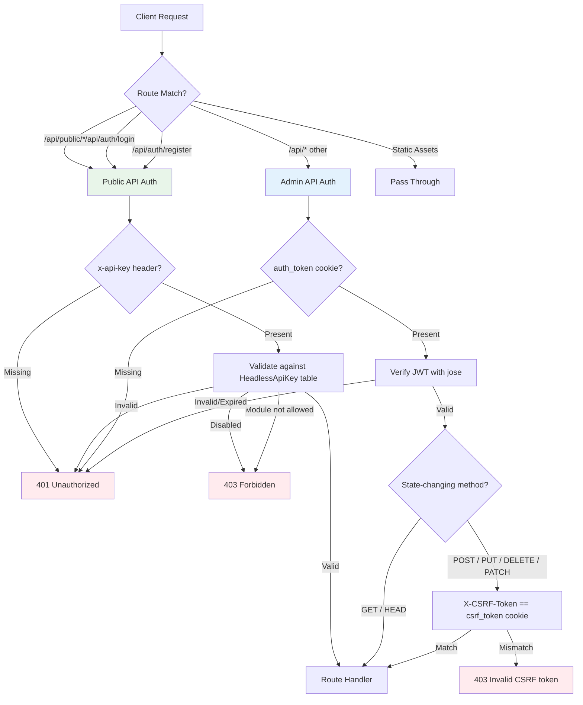
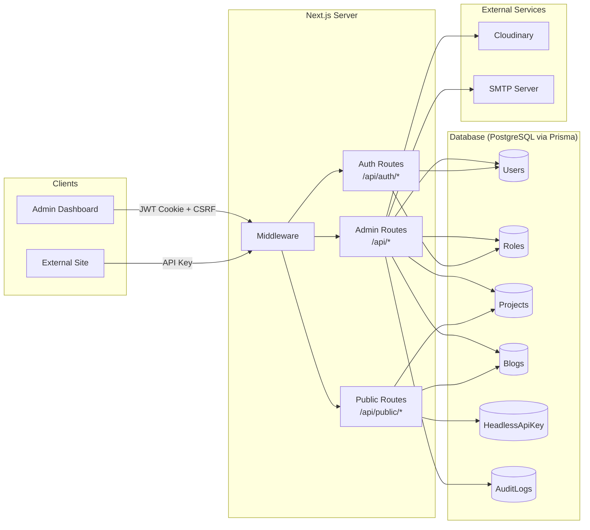

# TASKILY CMS API Reference

> Complete API documentation for the TASKILY content management system.

---

## Overview

The TASKILY CMS exposes two distinct API surfaces through a single Next.js server:

| API Surface | Purpose | Auth Method | Base Path |
|---|---|---|---|
| **Admin API** | Dashboard operations, content management, user/role administration | Cookie-based JWT + CSRF | `/api/*` |
| **Public API** | External site consumption of published content | API Key (`x-api-key`) | `/api/public/*` |

Both surfaces return **JSON exclusively** with a consistent response envelope.

---

## Base URL

| Environment | URL |
|---|---|
| Development | `http://localhost:3000` |
| Production | `https://your-domain.com` |

All endpoints are relative to the base URL. Example:

```
POST http://localhost:3000/api/auth/login
GET  http://localhost:3000/api/projects?page=1&perPage=10
GET  http://localhost:3000/api/public/projects?limit=12
```

---

## Response Envelope

Every response follows a consistent structure:

```typescript
{
  success: boolean;
  data: any;
  message: string;
  details?: any; // present on errors or validation failures
}
```

### Success Response

```json
{
  "success": true,
  "data": {
    "id": "a1b2c3d4-e5f6-7890-abcd-ef1234567890",
    "title": "My First Project",
    "status": "PUBLISHED"
  },
  "message": "Project created successfully"
}
```

### Paginated Response

```json
{
  "success": true,
  "data": {
    "items": [
      { "id": "...", "title": "Project 1" },
      { "id": "...", "title": "Project 2" }
    ],
    "pagination": {
      "page": 1,
      "perPage": 10,
      "total": 42,
      "totalPages": 5,
      "hasNext": true,
      "hasPrev": false
    }
  },
  "message": "Success"
}
```

### Error Response

```json
{
  "success": false,
  "message": "Validation failed",
  "details": [
    { "field": "title", "message": "Title is required" },
    { "field": "email", "message": "Invalid email address" }
  ]
}
```

---

## Authentication

TASKILY uses **two independent authentication systems** depending on the API surface:



### Admin API Authentication

Uses HTTP-only cookies with JWT + CSRF double-submit pattern. See [authentication.md](./authentication.md) for full details.

| Component | Details |
|---|---|
| JWT Algorithm | HS256 (HMAC-SHA256) via `jose` library |
| JWT Library | [`jose`](https://github.com/panva/jose) |
| Token Cookie | `auth_token`, httpOnly, secure (prod), sameSite: lax |
| Token Lifetime | 7 days (configurable via `JWT_EXPIRES_IN`) |
| CSRF Cookie | `csrf_token`, **readable** by JavaScript, sameSite: strict |
| CSRF Lifetime | 24 hours |
| CSRF Header | `X-CSRF-Token` (auto-attached by `patchFetchCsrf.js`) |
| CSRF Scope | POST, PUT, DELETE, PATCH requests only |

### Public API Authentication

API key-based, no cookies or JWT involved. See [authentication.md](./authentication.md#api-key-authentication-public-apis) for details.

| Component | Details |
|---|---|
| Header | `x-api-key` |
| Key Format | `tk_` prefix + 64 hex characters |
| Validation | Checked against `HeadlessApiKey` table |
| Scope | Module-level: each key has `allowedModules[]` |

---

## HTTP Status Codes

| Code | Meaning | When Used |
|---|---|---|
| `200` | OK | Successful retrieval or update |
| `201` | Created | Resource successfully created |
| `204` | No Content | Successful deletion (no body returned) |
| `304` | Not Modified | ETag match on public API (caching) |
| `400` | Bad Request | Validation failed, malformed request body |
| `401` | Unauthorized | Missing or invalid JWT/API key |
| `403` | Forbidden | Valid auth but insufficient permissions or CSRF failure |
| `404` | Not Found | Resource does not exist |
| `405` | Method Not Allowed | Wrong HTTP method for the endpoint |
| `422` | Unprocessable Entity | Semantically invalid request |
| `500` | Internal Server Error | Unexpected server failure |

---

## Versioning Strategy

The API is currently at **v1** (implicit). Versioning is not applied to URL paths at this time.

When breaking changes are introduced, URL-based versioning will be adopted:

```
/api/v1/projects    (current, will become explicit)
/api/v2/projects    (breaking changes)
```

All breaking changes will be announced with a deprecation notice and a migration window.

---

## Rate Limiting

Rate limiting is **not currently enforced**. This is planned as a future improvement:

- Admin APIs: Per-user rate limits (configurable)
- Public APIs: Per-API-key rate limits (configurable per key)
- Auth endpoints: Stricter brute-force protection

---

## API Endpoints

### Authentication

| Method | Endpoint | Auth | Description |
|---|---|---|---|
| `POST` | `/api/auth/login` | None | Authenticate and receive cookies |
| `POST` | `/api/auth/register` | None | Create a new user account |
| `POST` | `/api/auth/logout` | JWT | Clear auth and CSRF cookies |
| `POST` | `/api/auth/forgot-password` | None | Request password reset token |
| `POST` | `/api/auth/reset-password` | None | Reset password with token |
| `GET` | `/api/auth/me` | JWT | Get current authenticated user |

### Projects

| Method | Endpoint | Auth | Description |
|---|---|---|---|
| `GET` | `/api/projects` | JWT | List all projects (paginated) |
| `POST` | `/api/projects` | JWT + `projects.create` | Create a new project |
| `GET` | `/api/projects/[id]` | JWT | Get project by ID |
| `PUT` | `/api/projects/[id]` | JWT + `projects.update` | Update a project |
| `DELETE` | `/api/projects/[id]` | JWT + `projects.delete` | Soft-delete a project |
| `GET` | `/api/projects/stats` | JWT | Project statistics |
| `POST` | `/api/projects/trash` | JWT + `projects.delete` | Manage trashed projects |
| `POST` | `/api/projects/bulk` | JWT + `projects.*` | Bulk actions on projects |
| `POST` | `/api/projects/[id]/images` | JWT + `projects.update` | Add images to project |
| `PUT` | `/api/projects/[id]/reorder` | JWT + `projects.update` | Reorder project images |

### Project Categories

| Method | Endpoint | Auth | Description |
|---|---|---|---|
| `GET` | `/api/project-categories` | JWT | List all categories |
| `POST` | `/api/project-categories` | JWT + `project-categories.create` | Create category |
| `GET` | `/api/project-categories/[id]` | JWT | Get category by ID |
| `PUT` | `/api/project-categories/[id]` | JWT + `project-categories.update` | Update category |
| `DELETE` | `/api/project-categories/[id]` | JWT + `project-categories.delete` | Delete category |

### Blogs

| Method | Endpoint | Auth | Description |
|---|---|---|---|
| `GET` | `/api/blogs` | JWT | List all blog posts (paginated) |
| `POST` | `/api/blogs` | JWT + `blogs.create` | Create a new blog post |
| `GET` | `/api/blogs/[id]` | JWT | Get blog post by ID |
| `PUT` | `/api/blogs/[id]` | JWT + `blogs.update` | Update blog post |
| `DELETE` | `/api/blogs/[id]` | JWT + `blogs.delete` | Soft-delete blog post |
| `GET` | `/api/blogs/stats` | JWT | Blog statistics |
| `POST` | `/api/blogs/trash` | JWT + `blogs.delete` | Manage trashed blogs |
| `POST` | `/api/blogs/bulk` | JWT + `blogs.*` | Bulk actions on blogs |
| `POST` | `/api/blogs/[id]/images` | JWT + `blogs.update` | Add images to blog |
| `PUT` | `/api/blogs/[id]/reorder` | JWT + `blogs.update` | Reorder blog images |

### Blog Categories

| Method | Endpoint | Auth | Description |
|---|---|---|---|
| `GET` | `/api/blog-categories` | JWT | List all categories |
| `POST` | `/api/blog-categories` | JWT + `blog-categories.create` | Create category |
| `GET` | `/api/blog-categories/[id]` | JWT | Get category by ID |
| `PUT` | `/api/blog-categories/[id]` | JWT + `blog-categories.update` | Update category |
| `DELETE` | `/api/blog-categories/[id]` | JWT + `blog-categories.delete` | Delete category |

### Media

| Method | Endpoint | Auth | Description |
|---|---|---|---|
| `GET` | `/api/media` | JWT | List all media (paginated) |
| `POST` | `/api/media/upload` | JWT + `media.create` | Upload a file |
| `GET` | `/api/media/[id]` | JWT | Get media by ID |
| `PUT` | `/api/media/[id]` | JWT + `media.update` | Update media metadata |
| `DELETE` | `/api/media/[id]` | JWT + `media.delete` | Delete media |
| `GET` | `/api/media/stats` | JWT | Media statistics |
| `GET` | `/api/media/folders` | JWT | List media folders |
| `GET` | `/api/media/picker` | JWT | Media picker (select) |
| `POST` | `/api/media/bulk` | JWT + `media.*` | Bulk actions on media |

### Users

| Method | Endpoint | Auth | Description |
|---|---|---|---|
| `GET` | `/api/users` | JWT + `users.read` | List all users (paginated) |
| `POST` | `/api/users` | JWT + `users.create` | Create a new user |
| `GET` | `/api/users/[id]` | JWT + `users.read` | Get user by ID |
| `PUT` | `/api/users/[id]` | JWT + `users.update` | Update user |
| `DELETE` | `/api/users/[id]` | JWT + `users.delete` | Soft-delete user |
| `GET` | `/api/users/stats` | JWT + `users.read` | User statistics |
| `PUT` | `/api/users/[id]/status` | JWT + `users.manage` | Update user status |
| `PUT` | `/api/users/[id]/reset-password` | JWT + `users.manage` | Admin reset password |
| `PUT` | `/api/users/[id]/force-password-change` | JWT + `users.manage` | Toggle force password change |
| `POST` | `/api/users/bulk` | JWT + `users.*` | Bulk actions on users |

### Roles & Permissions

| Method | Endpoint | Auth | Description |
|---|---|---|---|
| `GET` | `/api/roles` | JWT + `roles.read` | List all roles |
| `POST` | `/api/roles` | JWT + `roles.create` | Create a new role |
| `GET` | `/api/roles/[id]` | JWT + `roles.read` | Get role by ID |
| `PUT` | `/api/roles/[id]` | JWT + `roles.update` | Update role |
| `DELETE` | `/api/roles/[id]` | JWT + `roles.delete` | Delete role |
| `GET` | `/api/roles/stats` | JWT + `roles.read` | Role statistics |
| `GET` | `/api/roles/permissions` | JWT + `roles.read` | List all permissions |
| `GET` | `/api/roles/permissions-by-module` | JWT + `roles.read` | Permissions grouped by module |
| `POST` | `/api/roles/[id]/clone` | JWT + `roles.clone` | Clone a role |

### Settings

| Method | Endpoint | Auth | Description |
|---|---|---|---|
| `GET` | `/api/settings` | JWT + `settings.read` | Get all settings |
| `PUT` | `/api/settings` | JWT + `settings.update` | Update settings |
| `POST` | `/api/settings/smtp-test` | JWT + `settings.update` | Test SMTP connection |
| `GET` | `/api/settings/system-info` | JWT + `settings.system-info` | Get system info |
| `PUT` | `/api/settings/maintenance` | JWT + `settings.maintenance` | Toggle maintenance mode |
| `GET` | `/api/settings/profile` | JWT | Get current user profile |
| `PUT` | `/api/settings/profile` | JWT | Update profile |
| `GET` | `/api/settings/headless-api` | JWT + `headless.view` | List API keys |
| `POST` | `/api/settings/headless-api` | JWT + `headless.create` | Create API key |
| `PUT` | `/api/settings/headless-api` | JWT + `headless.update` | Update API key |
| `DELETE` | `/api/settings/headless-api` | JWT + `headless.delete` | Delete API key |

### Notifications

| Method | Endpoint | Auth | Description |
|---|---|---|---|
| `GET` | `/api/notifications` | JWT + `notifications.read` | List notifications |
| `GET` | `/api/notifications/[id]` | JWT + `notifications.read` | Get notification |
| `PUT` | `/api/notifications/[id]` | JWT + `notifications.manage` | Mark as read |
| `PUT` | `/api/notifications/mark-all-read` | JWT + `notifications.manage` | Mark all as read |
| `GET` | `/api/notifications/unread-count` | JWT + `notifications.read` | Unread count |

### Dashboard & Audit

| Method | Endpoint | Auth | Description |
|---|---|---|---|
| `GET` | `/api/dashboard/overview` | JWT + `dashboard.read` | Dashboard overview |
| `GET` | `/api/dashboard/stats` | JWT + `dashboard.read` | Dashboard statistics |
| `GET` | `/api/audit` | JWT + `audit.view` | List audit logs (paginated) |
| `GET` | `/api/audit/[id]` | JWT + `audit.view` | Get audit log detail |
| `GET` | `/api/audit/stats` | JWT + `audit.view` | Audit statistics |

### Search

| Method | Endpoint | Auth | Description |
|---|---|---|---|
| `GET` | `/api/search` | JWT | Global search across all modules |

### Public API (External Consumption)

| Method | Endpoint | Auth | Description |
|---|---|---|---|
| `GET` | `/api/public/projects` | API Key | List published projects |
| `GET` | `/api/public/projects/[slug]` | API Key | Get published project by slug |

---

## Permission System

RBAC with **44 permissions** across **13 modules**:

| Module | Permissions |
|---|---|
| `dashboard` | `read` |
| `projects` | `create`, `read`, `update`, `delete`, `publish` |
| `project-categories` | `create`, `read`, `update`, `delete` |
| `blogs` | `create`, `read`, `update`, `delete`, `publish` |
| `blog-categories` | `create`, `read`, `update`, `delete` |
| `media` | `create`, `read`, `update`, `delete`, `restore` |
| `users` | `create`, `read`, `update`, `delete`, `restore`, `manage` |
| `roles` | `create`, `read`, `update`, `delete`, `clone`, `manage` |
| `settings` | `read`, `update`, `maintenance`, `system-info` |
| `notifications` | `read`, `manage`, `delete` |
| `audit` | `view`, `export` |
| `headless` | `view`, `create`, `update`, `delete`, `regenerate` |

### Default Roles

| Role | Description | Access Level |
|---|---|---|
| `ADMIN` | Full system access | All 44 permissions |
| `EDITOR` | Manage all content | All content permissions, no role/user management |
| `AUTHOR` | Create and edit own content | CRUD on own projects, blogs, media |
| `VIEWER` | Read-only access | Read-only across all modules |

---

## Quick Start

### 1. Start the Development Server

```bash
npm run dev
```

### 2. Authenticate (Admin API)

```bash
# Login and capture cookies
curl -X POST http://localhost:3000/api/auth/login \
  -H "Content-Type: application/json" \
  -d '{"email":"admin@taskily.com","password":"Admin123!"}' \
  -c cookies.txt
```

### 3. Make an Authenticated Request

```bash
# Use saved cookies for subsequent requests
curl http://localhost:3000/api/projects \
  -b cookies.txt
```

### 4. Public API (External Site)

```bash
# Use API key for public endpoints
curl http://localhost:3000/api/public/projects \
  -H "x-api-key: tk_your_api_key_here"
```

---

## Architecture Diagram



---

## Reading Order

| Document | Description |
|---|---|
| [**authentication.md**](./authentication.md) | Complete auth system: JWT cookies, CSRF protection, API keys, RBAC permissions, middleware |
| [**error-reference.md**](./error-reference.md) | Every error type, status code, validation format, and common error messages |
