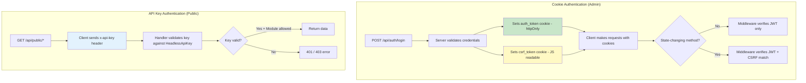
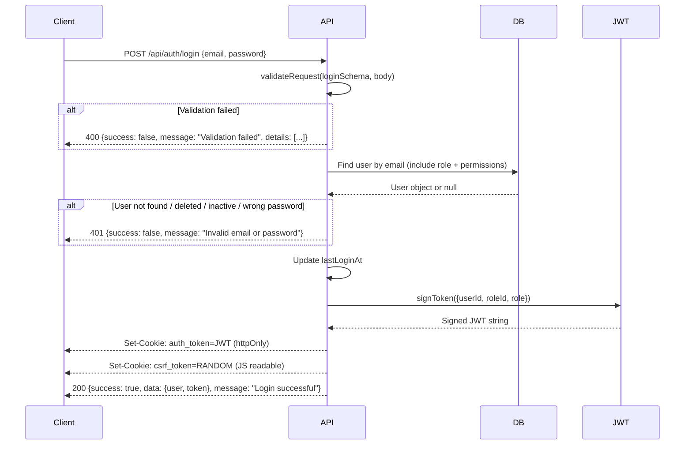
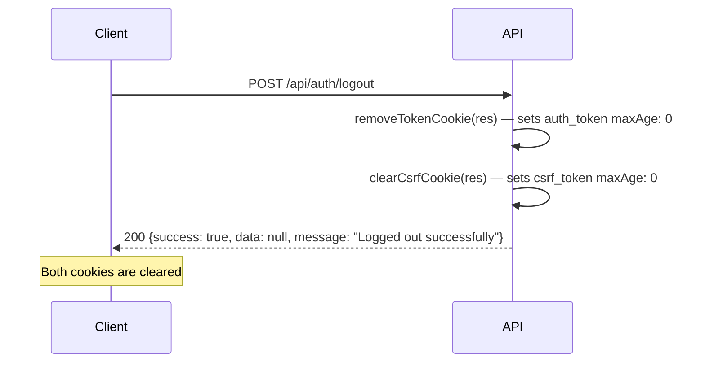
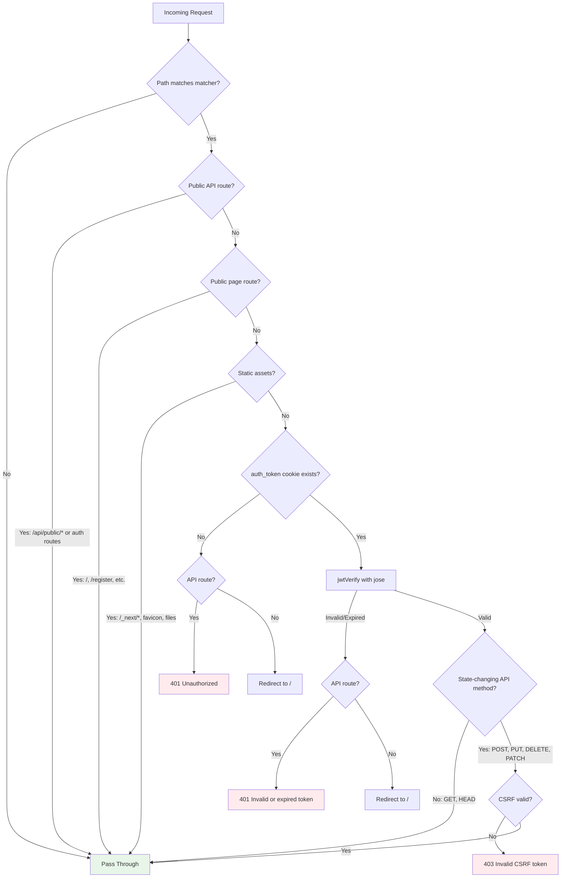
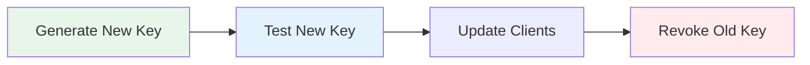

# Authentication

> Complete reference for the TASKILY CMS authentication and authorization system.

---

## Overview

TASKILY uses **two independent authentication systems**:

| System | Used By | Mechanism | Tokens |
|---|---|---|---|
| **Cookie Authentication** | Admin Dashboard | JWT in HTTP-only cookie + CSRF double-submit | `auth_token` + `csrf_token` |
| **API Key Authentication** | External/Public APIs | Static API key in header | `x-api-key` |



---

## Cookie Authentication (Admin APIs)

### JWT Configuration

| Property | Value |
|---|---|
| Algorithm | HS256 (HMAC-SHA256) |
| Library | [`jose`](https://github.com/panva/jose) (Edge Runtime compatible) |
| Secret Source | `JWT_SECRET` environment variable |
| Signing Function | `SignJWT` from `jose` |
| Expiration Config | `JWT_EXPIRES_IN` environment variable (default: `7d`) |

### JWT Payload

```typescript
{
  userId: string;    // UUID of the authenticated user
  roleId: string;    // UUID of the user's role
  role: string;      // Role name (e.g., "ADMIN", "EDITOR")
  iat: number;       // Issued at (Unix timestamp, set automatically)
  exp: number;       // Expiration (Unix timestamp, set automatically)
}
```

### Auth Token Cookie

| Property | Value |
|---|---|
| Name | `auth_token` |
| httpOnly | `true` (not accessible via JavaScript) |
| secure | `true` in production, `false` in development |
| sameSite | `lax` |
| path | `/` |
| maxAge | Configured via `JWT_EXPIRES_IN` (parsed to seconds) |

### Token Extraction

The `getUserFromRequest(req)` function extracts and verifies the JWT:

```javascript
// lib/auth.js
export function getUserFromRequest(req) {
  const token = getTokenFromRequest(req);
  if (!token) return null;
  return verifyToken(token);  // Returns decoded payload or null
}
```

If the token is missing, expired, or invalid, `getUserFromRequest` returns `null` and the API handler returns `401 Unauthorized`.

---

## CSRF Protection (Double Submit Cookie Pattern)

TASKILY implements the **Double Submit Cookie Pattern** for CSRF protection. This is enforced by the Next.js middleware for all state-changing API requests.

### How It Works

```mermaid
sequenceDiagram
    participant Browser
    participant Server
    participant Middleware

    Note over Browser,Server: === Login Flow ===
    Browser->>Server: POST /api/auth/login {email, password}
    Server->>Server: Validate credentials
    Server-->>Browser: Set-Cookie: auth_token=JWT (httpOnly)
    Server-->>Browser: Set-Cookie: csrf_token=RANDOM (JS readable)
    Server-->>Browser: 200 {success, user, token}

    Note over Browser,Server: === Subsequent Request ===
    Browser->>Browser: Read csrf_token from document.cookie
    Browser->>Server: POST /api/projects {title: "..."}
    Note right of Browser: X-CSRF-Token: RANDOM<br>Cookie: auth_token=JWT; csrf_token=RANDOM
    Server->>Middleware: Check JWT + CSRF
    Middleware->>Middleware: cookie[csrf_token] === header[X-CSRF-Token]
    Middleware->>Server: Request OK
    Server-->>Browser: 201 {success, data}

    Note over Browser,Server: === CSRF Attack (blocked) ===
    Attacker->>Server: POST /api/projects {title: "evil"}
    Note right of Attacker: Only has auth_token cookie<br>No X-CSRF-Token header
    Server->>Middleware: Check JWT + CSRF
    Middleware->>Middleware: cookie[csrf_token] != null, header[X-CSRF-Token] = null
    Middleware-->>Attacker: 403 Invalid CSRF token
```

### CSRF Token Properties

| Property | Value |
|---|---|
| Cookie Name | `csrf_token` |
| httpOnly | `false` (**must** be readable by JavaScript) |
| secure | `true` in production |
| sameSite | `strict` |
| path | `/` |
| maxAge | 24 hours (`60 * 60 * 24` seconds) |
| Token Length | 32 random bytes (64 hex characters) |
| Generation | `crypto.getRandomValues()` |

### Client-Side Auto-Attachment

The `patchFetchCsrf.js` module patches the global `window.fetch` to automatically attach the CSRF token on state-changing requests:

```javascript
// lib/patchFetchCsrf.js
const STATE_CHANGING_METHODS = new Set(['POST', 'PUT', 'DELETE', 'PATCH']);

function getCsrfToken() {
  if (typeof document === 'undefined') return null;
  const match = document.cookie.match(/(?:^|;\s*)csrf_token=([^;]*)/);
  return match ? decodeURIComponent(match[1]) : null;
}

window.fetch = async function csrfFetch(input, init = {}) {
  const method = (init.method || 'GET').toUpperCase();
  const csrfToken = getCsrfToken();

  if (STATE_CHANGING_METHODS.has(method) && csrfToken) {
    init.headers = {
      ...init.headers,
      'X-CSRF-Token': csrfToken,
    };
  }

  return originalFetch(input, init);
};
```

**You do not need to manually attach the CSRF header** when using `fetch` from the browser. The patch handles it automatically.

### Middleware Validation

The Next.js middleware (`middleware.js`) validates CSRF on every state-changing API request:

```javascript
// middleware.js
const STATE_CHANGING_METHODS = ['POST', 'PUT', 'DELETE', 'PATCH'];

// For state-changing requests, CSRF is required
if (pathname.startsWith('/api/') && STATE_CHANGING_METHODS.includes(req.method)) {
  if (!validateCsrf(req, cookies)) {
    return NextResponse.json(
      { success: false, message: 'Invalid CSRF token' },
      { status: 403 }
    );
  }
}
```

The validation is a **strict equality check**: `cookie[csrf_token] === header[X-CSRF-Token]`.

---

## Login Flow

### Step-by-Step



### Request

```http
POST /api/auth/login
Content-Type: application/json

{
  "email": "admin@taskily.com",
  "password": "Admin123!"
}
```

### Success Response

```json
{
  "success": true,
  "data": {
    "user": {
      "id": "a1b2c3d4-...",
      "name": "Admin User",
      "email": "admin@taskily.com",
      "role": {
        "id": "...",
        "name": "ADMIN",
        "permissions": [
          { "name": "dashboard.read", "module": "dashboard", "action": "read" },
          { "name": "projects.create", "module": "projects", "action": "create" }
        ]
      },
      "permissions": [
        "dashboard.read",
        "projects.create",
        "projects.read"
      ]
    },
    "token": "eyJhbGciOiJIUzI1NiIsInR5cCI6IkpXVCJ9..."
  },
  "message": "Login successful"
}
```

> **Note:** The `token` in the response body is informational. Authentication is handled by the `auth_token` cookie, which is HTTP-only and cannot be read by JavaScript.

### Validation Errors

```json
{
  "success": false,
  "message": "Validation failed",
  "details": [
    { "field": "email", "message": "Invalid email address" },
    { "field": "password", "message": "Password is required" }
  ]
}
```

---

## Logout Flow

### Request

```http
POST /api/auth/logout
Cookie: auth_token=JWT; csrf_token=RANDOM
```

### What Happens



### Response

```json
{
  "success": true,
  "data": null,
  "message": "Logged out successfully"
}
```

---

## API Key Authentication (Public APIs)

API keys are used for external sites to consume published content (projects, blogs, etc.) without requiring user authentication.

### API Key Format

```
tk_a1b2c3d4e5f6a1b2c3d4e5f6a1b2c3d4e5f6a1b2c3d4e5f6a1b2c3d4e5f6a1b2
```

| Property | Value |
|---|---|
| Prefix | `tk_` |
| Length | 64 hex characters (after prefix) |
| Generation | `crypto.randomBytes(32).toString('hex')` |
| Storage | `HeadlessApiKey.apiKey` column (unique, indexed) |

### Using API Keys

Pass the key via the `x-api-key` header on any `/api/public/*` request:

```http
GET /api/public/projects?page=1&limit=12
x-api-key: tk_a1b2c3d4e5f6...
```

### HeadlessApiKey Model

```prisma
model HeadlessApiKey {
  id            String   @id @default(uuid())
  siteName      String
  domain        String
  apiKey        String   @unique
  enabled       Boolean  @default(true)
  allowedModules Json    // Array of module strings
  createdAt     DateTime @default(now())
  updatedAt     DateTime @updatedAt
}
```

### Validation Rules

Each API key is validated against three criteria:

| Check | Description | Error Response |
|---|---|---|
| **Key exists** | API key found in database | `401` — "Invalid API key" |
| **Key enabled** | `enabled` field is `true` | `403` — "API access is disabled for this key" |
| **Module allowed** | Requested module is in `allowedModules[]` | `403` — "[Module] is not enabled for this API key" |

### Allowed Modules

| Module | Description |
|---|---|
| `projects` | Published projects listing and detail |
| `blogs` | Published blog posts (when available) |
| `categories` | Project and blog categories |
| `media` | Public media assets |
| `settings` | Public site settings |

### Creating API Keys

API keys are created through the Admin Dashboard at **Settings > Headless API**:

```http
POST /api/settings/headless-api
Content-Type: application/json
Cookie: auth_token=JWT

{
  "siteName": "My Portfolio Site",
  "domain": "https://myportfolio.com",
  "enabled": true,
  "allowedModules": ["projects"]
}
```

### Response

```json
{
  "success": true,
  "data": {
    "id": "a1b2c3d4-...",
    "siteName": "My Portfolio Site",
    "domain": "https://myportfolio.com",
    "apiKey": "tk_a1b2c3d4e5f6...",
    "enabled": true,
    "allowedModules": ["projects"],
    "createdAt": "2025-01-15T10:30:00.000Z"
  },
  "message": "API key created successfully"
}
```

> **Important:** The full API key is only shown once at creation time. Store it securely.

### Regenerating Keys

```http
PUT /api/settings/headless-api
Content-Type: application/json

{
  "action": "regenerate",
  "id": "a1b2c3d4-..."
}
```

---

## Permission System (RBAC)

### Overview

TASKILY implements **Role-Based Access Control** with fine-grained permissions at the module level.

```mermaid
flowchart TD
    User[User] -->|has| Role[Role]
    Role -->|has many| Perm[Permission]
    Perm -->|identified by| Module[Module + Action]
    
    subgraph "Example: Permission Naming"
        Module -->|"projects" + "create"| P1[projects.create]
        Module -->|"blogs" + "publish"| P2[blogs.publish]
        Module -->|"users" + "manage"| P3[users.manage]
    end
```

### Complete Permission List

| Module | Permission | Description |
|---|---|---|
| **dashboard** | `dashboard.read` | View dashboard overview and statistics |
| **projects** | `projects.create` | Create new projects |
| | `projects.read` | View projects (own or all) |
| | `projects.update` | Edit project details |
| | `projects.delete` | Delete/restore projects |
| | `projects.publish` | Publish/unpublish projects |
| **project-categories** | `project-categories.create` | Create project categories |
| | `project-categories.read` | View project categories |
| | `project-categories.update` | Edit project categories |
| | `project-categories.delete` | Delete project categories |
| **blogs** | `blogs.create` | Create new blog posts |
| | `blogs.read` | View blog posts |
| | `blogs.update` | Edit blog posts |
| | `blogs.delete` | Delete/restore blog posts |
| | `blogs.publish` | Publish/unpublish blog posts |
| **blog-categories** | `blog-categories.create` | Create blog categories |
| | `blog-categories.read` | View blog categories |
| | `blog-categories.update` | Edit blog categories |
| | `blog-categories.delete` | Delete blog categories |
| **media** | `media.create` | Upload media files |
| | `media.read` | View media library |
| | `media.update` | Edit media metadata |
| | `media.delete` | Delete media files |
| | `media.restore` | Restore deleted media |
| **users** | `users.create` | Create new users |
| | `users.read` | View user profiles |
| | `users.update` | Edit user details |
| | `users.delete` | Soft-delete users |
| | `users.restore` | Restore deleted users |
| | `users.manage` | Change user status, force password reset |
| **roles** | `roles.create` | Create new roles |
| | `roles.read` | View roles and permissions |
| | `roles.update` | Edit role details |
| | `roles.delete` | Delete custom roles |
| | `roles.clone` | Clone existing roles |
| | `roles.manage` | Full role administration |
| **settings** | `settings.read` | View CMS settings |
| | `settings.update` | Update CMS settings |
| | `settings.maintenance` | Toggle maintenance mode |
| | `settings.system-info` | View system information |
| **notifications** | `notifications.read` | View notifications |
| | `notifications.manage` | Mark notifications as read |
| | `notifications.delete` | Delete notifications |
| **audit** | `audit.view` | View audit logs |
| | `audit.export` | Export audit logs |
| **headless** | `headless.view` | View API keys |
| | `headless.create` | Create API keys |
| | `headless.update` | Update/toggle API keys |
| | `headless.delete` | Delete API keys |
| | `headless.regenerate` | Regenerate API keys |

### Default Roles

#### ADMIN

Full system access. All 44 permissions assigned.

#### EDITOR

Content management without user/role administration.

| Granted | Denied |
|---|---|
| All `dashboard.*` | All `roles.*` |
| All `projects.*` | `users.manage` |
| All `project-categories.*` | `users.restore` |
| All `blogs.*` | `users.delete` |
| All `blog-categories.*` | `settings.maintenance` |
| All `media.*` | `audit.view` |
| `users.create`, `users.read`, `users.update` | `audit.export` |
| All `settings.read`, `settings.update` | All `headless.*` |
| All `notifications.*` | |

#### AUTHOR

Content creation for own content.

```
dashboard.read
projects.create, projects.read, projects.update
blogs.create, blogs.read, blogs.update
media.create, media.read, media.update
project-categories.read
blog-categories.read
settings.read
notifications.read
```

#### VIEWER

Read-only access across all modules.

```
dashboard.read
projects.read
blogs.read
media.read
project-categories.read
blog-categories.read
settings.read
notifications.read
```

---

## Middleware

The Next.js middleware (`middleware.js`) runs at the **Edge Runtime** and handles authentication before any route handler executes.

### Processing Order



### Bypassed Routes

The following routes bypass JWT and CSRF validation entirely:

| Route Pattern | Reason |
|---|---|
| `/api/auth/login` | Authentication entry point |
| `/api/auth/register` | New user registration |
| `/api/auth/forgot-password` | Password reset request |
| `/api/auth/reset-password` | Password reset execution |
| `/api/public/*` | Public API (uses API key auth instead) |
| `/_next/*` | Next.js static assets |
| `/favicon*` | Favicon |
| `*.*` (file extensions) | Static files |

### Edge Runtime

The middleware runs on the **Edge Runtime** (not Node.js). This is why:

- `jose` is used instead of `jsonwebtoken` (Edge-compatible)
- The `crypto` API is used for CSRF token generation (Web Crypto API)
- No Prisma calls are made in middleware (Prisma requires Node.js)

---

## Security Best Practices

### For Admin API Consumers

1. **Never store JWT in localStorage** — The cookie-based approach prevents XSS from stealing tokens
2. **Always use HTTPS in production** — Ensures cookies are transmitted securely
3. **The CSRF token is handled automatically** — `patchFetchCsrf.js` attaches it to all `fetch` calls
4. **Logout clears both cookies** — `auth_token` and `csrf_token` are both invalidated

### For Public API Consumers

1. **Store API keys securely** — Never expose keys in client-side code
2. **Rotate keys periodically** — Use the regenerate endpoint to cycle keys
3. **Use least-privilege modules** — Only request access to modules you actually need
4. **Respect caching headers** — The API returns `ETag` and `Cache-Control` headers; use them

### Key Rotation



API keys can be **regenerated** without deleting the record, preserving the `siteName` and `domain` configuration:

```bash
# Via Admin API
curl -X PUT http://localhost:3000/api/settings/headless-api \
  -H "Content-Type: application/json" \
  -b cookies.txt \
  -d '{"action":"regenerate","id":"KEY_ID_HERE"}'
```

The old key is immediately invalidated when the new key is generated.
